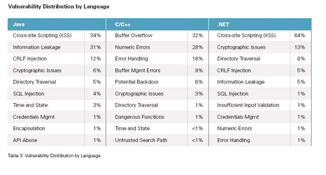

 
Un reciente estudio de la empresa Veracode afirma que **"la densidad de
vulnerabilidades (fallos promedio por megabyte de código analizado) para
.Net fue 27.2 y para Java la densidad genera fue de 30.0."**

OK, la diferencia puede estar dentro del error muestral, pero [el
estudio](http://www.veracode.com/reports/index.html) arroja una tabla
interesante donde se clasifican los errores:

La mayor parte de los problemas en .Net y JAva están en los cross site
scripting y sobretodo con los controles más antiguos, parece que la cosa
mejora con ASP MVC.

Esto no es suficiente para inclinar la balanza, ni para tomar
decisiones, pero no deja de llamarme la atención la distribución de
estas vulnerabilidades.
