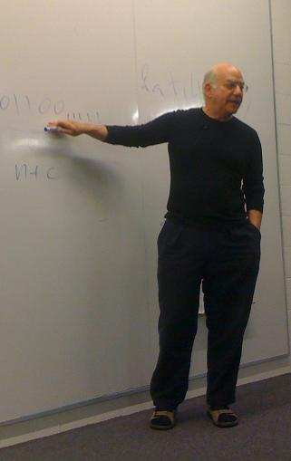
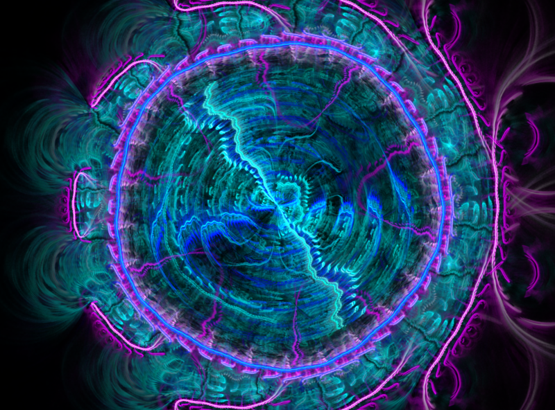

Como [vimos](/blog/2010/06/leibniz-y-la-simplicidad-de-las-leyes-de-la-naturaleza.html)
Leibniz plantea que la naturaleza ha de obedecer leyes simples, bellas y
elegantes, es decir, leyes comprensibles, sino la ciencia no es posible.
El problema filosófico es saber qué entendemos por leyes simples, ¿la
simplicidad de las ecuaciones que las describen? y ¿qué pasa con todo el
conocimiento previo que hay que tener para comprender esas ecuaciones?

Gregory Chaitin propone una respuesta desde el punto de vista de la
[Teoría Algoritmica de la Información](http://es.wikipedia.org/wiki/Teor%C3%ADa_algor%C3%ADtmica_de_la_informaci%C3%B3n) (TAI).

En la década de 1960 tres matemáticos, Solomonoff, Kolmogorov, y Chaitin
propusieron esta teoría (Chaitin era adolescente cuando formulo estas
teorías).

Para Chaitin la TAI da una respuesta precisa a la definición de ley,
exigida por los filósofos de la ciencia. Esta respuesta se obtiene
cambiando el contexto. En vez de considerar que los datos experimentales
son puntos, y las leyes deban ser ecuaciones, en la TAI se hace todo
digital, todo pasa a ser combinaciones de 0s y 1s. Para la TAI una ley
de la naturaleza es una pieza de software, un algoritmo de computador, y
en vez de tratar de medir la complejidad de la ley por el tamaño de las
ecuaciones, consideramos el tamaño de los programas, el número de bits
en el software que implementan nuestra teoría.

Esto se expresa en el siguiente diagrama:

**Ley:** Ecuación → Software,

**Complejidad:** Tamaño de las ecuaciones → Tamaño del programa, Bits de
software.

Para la Teoría Algorítmica de la Información la labor científica se
modela así:

Teoría (01100\...11) → **COMPUTADOR** → Datos Experimentales (110\...0).

En este modelo, ambas la teoría y la data son cadenas finitas de bits.
Una teoría es el software para explicar la data, y esto significa que el
software produce o calcula la data en forma exacta, sin errores. En
otras palabras, en este modelo una teoría científica es un programa cuya
salida (output) es la data, software auto contenido, sin ningúna entrada
(input).

Comparado con las observaciones de Leibniz, en que siempre había la
posibilidad de obtener una ecuación complicada para cualquier conjunto
arbitrario de datos, con este modelo siempre hay una teoría con el mismo
conjunto de bits que la data que explica, porque el software siempre
contiene la data que está tratando de calcular como constante, evitando
cualquier cálculo. En ese caso no hay una ley, no es una teoría real. En
este modelo decimos que la data sigue una ley, puede ser entendidad,
sólo si el programa para calcularla es más pequeño que la data que este
explica.

En palabras de Chaitin: **\"entendimiento es compresión, comprensión es
compresión, una teoría científica unifica muchos fenómenos que parecen
disparatados y muestra que estos reflejan un mecanismo interno
común\".**

Si el mundo que observamos, la complejidad que observamos, es producto
de las leyes de la naturaleza, y estas son software, entonces todo es
producto del software, esa es una idea que me agrada mucho, ¿qué les
puedo decir?, ¡creo que elegí la carrera ideal! :)

Bueno, si esto es así, entonces la mejor teoría es aquella con el
programa más corto que produzca, en forma precisa, la data observada.
Esta sería la versión en términos de la teor{ia algoritmica de la
información, de la [Navaja de
Ockham](https://es.wikipedia.org/wiki/Navaja_de_Ockham). Con estas
nociones se puede definir la complejidad en términos matemáticos, y
empezar a probar cosas con respecto a las leyes de la naturaleza.

Lo primero que se nota es que las cadenas más finitas de bits no tienen
leyes, son irreducibles algorítmicamente, son aleatorios en sentido
algorítmico, porque no hay una teoría substancialmente más pequeña que
la data en si misma. Es decir, el programa más pequeño que produce la
salida es del mismo tamaño que la salida.

Lo segundo que se nota, es que no se puede estar seguro de que se ha
encontrado la mejor teoría. Para entender esto último necesitamos
conocer mejor uno de los grandes logros del pensamiento lógico, y eso lo
dejaremos para un próximo artículo. Creo que con estas ideas les he
dejado bastante para reflexionar.

Una última cosa, creo que lo he expresado más de una vez, aprender a
programar es más fácil que aprender matemáticas, y además programando
[podemos aprender mucho mejor matemáticas](/blog/2009/02/un-programa-para-ensenar-matematicas.html),
y quizás con mayor profundidad, así que el camino de Chaitin nos abre
las puertas para entender las leyes de la naturaleza mediante la
programación.

Alrededor del minuto 4 de [este
video](http://www.vivamerica.com/madrid/programacion/innovacion/atomos-versus-bits/ricardo-galli-las-seducciones-de-la-informatica),
[Ricardo Galli
expresa](http://gallir.wordpress.com/2009/10/13/anotaciones-cientificas-de-seducciones-de-la-informatica/)
que en el código del compresor de sonido se sintetiza todo lo que
sabemos sobre la audición humana, y tiene mucha razón. En ese código
está la física del audio y la biología de nuestro oido unidas.

La computación, no sólo es una ciencia natural, es una ciencia
fundamental.

(\*) La imagen es una electric sheep y fue tomada desde
[acá](https://v2d7c.sheepserver.net/cgi/dead.cgi?id=1371).
