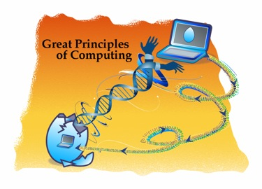

 

**¿Qué es Información?**

**¿Qué es la computación?**

**¿Qué podemos saber a través de la computación?**

**¿Qué no podemos saber?**

> Estas preguntas una vez eran sólo del interés de los especialistas en
> computación, pero estas preguntas ahora son preocupación de gente en
> todos los campos de la ciencia, ingeniería y aún en la política
> ([menos en
> Chile](http://www.alejandrobarros.com/content/view/849049/La-modernizacion-del-Estado-sigue-con-una-pata-coja.html#content-top),
> claro).

> La computación es la ciencia de los procesos de información. Se han
> descubierto procesos de información en las estructuras profundas de
> todos estos campos.

> Descifrar los misterios de estos procesos permitirá lograr grandes
> avances en estos campos. Los principsio de la computación están
> ayudando en esta tarea.

> La computación necesita un nuevo lenguaje para sus principios básicos.
> La forma tradicional de enfocar las ideas en las tecnologías de
> computación coloca al computador, mas que a la computación, en el
> centro. El computador es la herramienta, la computación el principio.

> El proyecto [Great Principles of
> Computing](http://cs.gmu.edu/cne/pjd/GP/GP-site/welcome.html) está
> desarrollando un lenguaje para discutir los principios fundamentales
> de la computación. Este marco de referencia está ayudando a fomentar
> la colaboración entre la computación y otros campos. Está ayudando a
> las innovaciones exponiendo las conexiones antes no vistas entre las
> tecnologías. Está ayudando a comunicar la alegría, el placer de la
> computación a la gente jóven, quienes pueden ver ahora como estos
> principios les sirven en su vida diaria, aún cuando se encuentren
> desconectados de sus computadores.

El texto anterior viene del sitio [Great Principles of Computing](http://cs.gmu.edu/cne/pjd/GP/GP-site/welcome.html), una iniciativa liderada por Peter Denning.

Peter Denning, Image via
[Wikipedia](http://commons.wikipedia.org/wiki/File:PJD.jpg)

Cuando entendemos los principios de la computación no nos enredamos más
con terminologías erróneas, y tenemos claros los conceptos (por qué
hablamos de TI y no de TIC, por ejemplo). Entendemos por qué es
importante entender el poder de la computación, y por qué ésta es una
[ciencia fundamental](/blog/2010/06/todo-es-software.html).

Denning y su equipo han desarrollado un marco conceptual, tras analizar
varias tecnologías de la computación para identificar los principios en
que están basadas, y estudiando cómo los aspectos de la computación
están influenciando otros campos. De este análisis han conluido que los
principios de la computación pueden ser agrupados en siete categorías:

> **Computación** (sentido y límites de la computación)
>
> **Comunicación** (transmisión confiables de los datos)
>
> **Coordinación** (cooperación entre las entidades en red)
>
> **Recolección** (almacenamiento y recuperación de la información)
>
> **Automatización** (sentido y límites de la automatización)
>
> **Evaluación** (predicción del desempeño y planificación de la
> capacidad)
>
> **Diseño**(construcción de sistemas de software confiables)

Estas categorías son el resultado de un anáñisis funcional de muchas
tecnologías y aplicaciones de la computación.

> 1.  Los sistemas computacionales se construyen de "elementos de
>     procesamiento" que procesas y almacenan información (computación,
>     recolección).
> 2.  Los elementos de procesamiento intercambian información
>     (comunicación).
> 3.  Los elementos de procesamiento cooperan hacia una meta común
>     (coordinación)
> 4.  Los humanos delegan las tareas a los sistemas de elementos de
>     procesamiento (automatización).
> 5.  Los humanos predicen la velocidad y capacidad de los sistemas
>     (evaluación) y
> 6.  Los humanos descomponen los sistemas en elementos de procesamiento
>     y organizan su construcción (diseño).

Estas categorías son ventanas para observar el espacio de conocimiento
de la computación, más que zonas o separaciones. Cada ventana ve el
espacio de una manera distintiva, pero la misma cosa puede ser observada
por más de una ventana. Por ejemplos, los protoco\
los de internet, a veces son vistos como comunicación de datos, a veces
como mecanismos de coordinación y a veces como medios para la
recolección.

Cuando estudié el ramo de física moderna en la escuela de ingeniería, me
contaron una historia, que partió con el intento de Planck de explicar
la radiación de cuerpo negro con un modelo más adecuado, compatible con
lo observado y que no llevara a los absurdos predichos por el modelo
clásico, esta historia seguía con el trabajo de Einstein y la
confirmación de la existencia de los cuantos de energía.

La ciencia explica sus principios de esta manera, mediante historías,
donde en una narrativa se cuenta como el pincipio evolucionó y alcanzó
una mayor aceptación con el tiempo. Se nombran los principales
contribuyentes a esta ideas. Se explican los errores iniciales, y
finalmente como operan estos principios, y cómo afectan a todo el resto.
En computación las historias que narren los principios de nuestra
ciencia son relativamente poco comunes.

Lamentablemente en la formación de los ingenieros de la computación,
estas narrativas los principios, de cómo evolucionaron las principales
ideas de nuestro campo, no están presentes. He visto ingenieros de
computación que ignoran totalmente quién fue Alan Turing, Knuth, Parnas,
o el mismo Denning, cuales son los principios que ellos aportaron al
campo.

Esas narrativas son las que debemos recoger, difundir, entre los
especialistas, y los jóvenes que queremos formar, y entre los que no son
especialistas, pero se ven afectados por nuestro trabajo. Esa es otra
misión de este blog difundir estas narrativas, y estos principios de la
computación.
