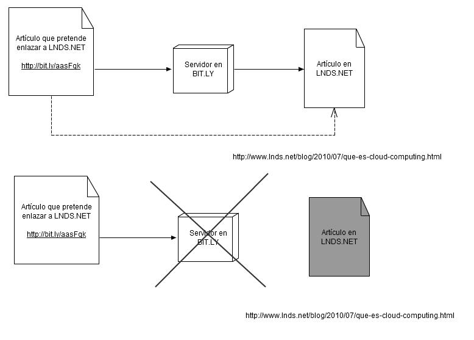

> "All those... moments will be lost in time like tears in rain." -- Roy Batty, Blade Runner

Recientemente un artículo mío fue enlazado , pero no directamente, sino
que usando un link generado por el servicio bit.ly, un "acortador de
urls".  He hablado antes del [problema con estos
servicios](/blog/2009/04/el-problema-de-tinyurl-y-otros-servicios-similares-reciclando.html)(\*),
ahora, reflexionando me he dado cuenta que estos acortadores de urls
están introduciendo un *problema  bibliográfico*, que no es menor.

Es natural que se usen los "url shorters" en twitter dada la
restricción de 140 caracteres por mensaje, eso está muy bien en ese
contexto, pero es inadecuado usar un enlace corto en artículo en un
blog. Twitter es un servicio en tiempo real, está pensado para sostener
conversaciones efímeras, pero un post o artículo en un blog es algo que
dura mucho más tiempo, y por lo tanto lo correcto es que en estos texto
se coloque el enlace directo y completo, no el resultado intermedio
proporcionado por bit.ly, tinyurl u otro servicio similar.

El siguiente diagrama ilustra el problema:

Si el día de mañana bit.ly desaparece como servicio, o por algún error
ese enlace se pierde dentro de sus bases de datos, se pierde el enlace
entre ambos artículos.

Consideren que el algoritmo PageRank usa los enlaces entre páginas como
uno de los elementos fundamentales para decidir la popularidad de una
página, usando acortadores de urls estamos afectando este índice, lo que
es una pérdida de beneficio para el que es referenciado (LNDS en este
caso), pero también es un problema para el que referencia, porque va
quedando aislado del resto de la web. No sé cómo están manejando estos
enlaces cortos los buscadores, pero sospecho que les dan menos peso.

Este uso de los url shorters en blogs y wikis lo que hace es afectar la
calidad "bibliográfica" de nuestros enlaces, los hace depender de un
tercero, de un servicio que perfectamente puede desaparecer al acabarse
el "venture capital" que lo mantiene operando. Si queremos escribir
artículos serios, y de valor, no debemos usar url cortas para nuestros
enlaces.

Lo que va a pasar es que, parafraseando a Roy Batty, *"All those...
**links** will be lost in time like tears in rain." ("Todos esos..
enlaces se perderán en el tiempo como lágrimas en la lluvia.")*

(\*) en ese [artículo](/blog/2009/04/el-problema-de-tinyurl-y-otros-servicios-similares-reciclando.html)
menciono a dev.cl que fue popular entre los twiteros chilenos y que
ahora ya no da este servicio, esos enlces se perdieron.
