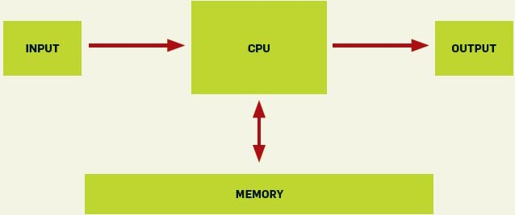

El siguiente diagrama es el modelo de computador que se enseña a cada
estudiante de ingeniería en computación o informática:

]

El problema es que este modelo estaba bien hace unos 40 años atrás, pero
no tiene nada que ver con las modernas arquitecturas de computadores.

En un [interesante
análisis](http://cacm.acm.org/magazines/2010/7/95061-youre-doing-it-wrong/fulltext)
Poul-Henning Kamp muestra cómo un algoritmo, que se ha considerado como
eficiente por 47 años, que incluso ha sido analizado por grandes
lumbreras, como Donald Knuth, puede ser optimizado en un orden de
magnitud, si se consideran los efectos de la arquitectura donde se
ejecuta.

Consideren lo siguiente, hace 30 o 40 años atrás cuando un acceso a
memoria virtual  provocaba un "[page fault](http://en.wikipedia.org/wiki/Page_fault)", se requería un acceso a disco, que tomaba unos 2 milisegundos, en ese tiempo una cpu ejecuta
una instrucción en 2 microsegundos, es decir, en los 2 milisegundos que
duraba el acceso a disco se perdían 1.000 instrucciones.

En un computador moderno, donde la frecuencia del reloj se mide en GHz,
el peor caso significa que se pierden  10 millones de instrucciones en
un page fault (considerando discos de estado sólido SSD, con un disco
normal el número es cercano a los 100 millones).

> *¿Que hay de bueno en un algoritmo O(log2(n)) si estas operaciones
> causan page faults y operaciones de disco lentas? Para muchos
> conjuntos de datos un algoritmo O(n) o incluso O(n^2),  que evite
> page faults, correría mucho más rápido.*

> *El análisis de desempeño de los algoritmos siempre será una piedra
fundamental en los logros de la ciencia de la computación. Pero los
resultados que vienen del departamento de ciencias de la computación
serían mas interesante y útiles se se aplicaran a computadores reales, y
no de juguete.*
>
> -- Poul-Henning Kamp [You're doing it wrong](http://cacm.acm.org/magazines/2010/7/95061-youre-doing-it-wrong/fulltext).\_
