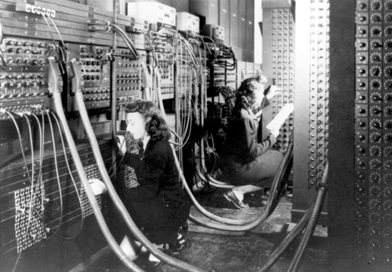

La fotografía muestra a dos de las seis programadoras iniciales del
[ENIAC](httpss://en.wikipedia.org/wiki/ENIAC), el primer computador
electrónico de uso general:

Las seis programadoras originales del ENIAC eran: [Kay
Antonelli](http://en.wikipedia.org/wiki/Kathleen_Antonelli), [Jean
Bartik](http://en.wikipedia.org/wiki/Jean_Bartik), [Betty
Holberton](http://en.wikipedia.org/wiki/Betty_Holberton), [Marlyn
Meltzer](http://en.wikipedia.org/wiki/Marlyn_Meltzer), [Frances
Spence](http://en.wikipedia.org/wiki/Frances_Spence) y [Ruth
Teitelbaum](http://en.wikipedia.org/wiki/Ruth_Teitelbaum).

Durante la segunda guerra mundial el ENIAC fue desarrollado para
facilitar  cálculos balísticos, aunque su principal uso estuvo en la
computación de los parámetros para la primera bomba de hidrógeno. Empezó
a construirse en 1943, y fue aceptado formalmente por la marina
norteamericana en julio de 1946, y operó continuamente hasta las 11:45
pm del 2 de octubre de 1955.

Y aunque sus inventores [John Mauchly](https://en.wikipedia.org/wiki/John_Mauchly) y 
[J. Presper Eckert](http://en.wikipedia.org/wiki/J._Presper_Eckert) se hicieron
famosos, la historia de las 6 primeras programadoras de esta máquina no
fue conocida hasta muchos años después, y se empezó a hacerse pública en
la segunda mitad de la década de 1980, gracias al trabajo de
investigación de Kathy Kleiman. En 1997 estas seis mujeres fueron
ingresadas al salón de la fama de la [WITI](http://www.witi.com/) (Women
In Technology International).

Si quieres saber más puedes visitar el sitio de Kathy Kleiman
<https://www.eniacprogrammers.org/>

