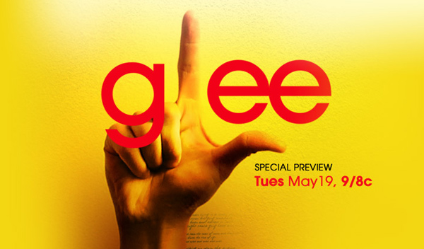

Gracias a [Rock Band](/blog/2010/02/fake-plastic-rock.html) y a
[Glee](http://es.wikipedia.org/wiki/Glee_(serie_de_televisi%C3%B3n)), puedo
decir que en términos de gustos musicales, entre mis hijos y yo hay
bastante en común, con una gran excepción, nunca tragué a Madonna, pero
con respecto a Journey, no hay dos opiniones en mi familia.

Glee es una serie de televisión bastante entretenida y  popular entre
los jóvenes, donde los héroes son los jóvenes del Glee Club, un grupo de
Losers (perdedores), por eso la L en la frente, que tienen el valor de
cantar y salir adelante como coro.

En este contexto el show  toca temas como el embarazo adolescente, y el
abuso del alcohol. Pero hay un tema que Glee elude,  el problema del
copyright, como 
[lo hace notar Christina Mulligan](http://balkin.blogspot.com/2010/06/copyright-elephant-in-middle-of-glee.html).

En un episodio de Glee el club se encarga de preparar una copia del
video clip Vogue de Madonna(\*), el problema que la multa por hacer esto
es de 150.000 dolares. Mulligan nos sigue dando antecedentes, en otro
episodio un personaje (Sue) publica en internet su propia versión de
Physical de Olivia Newton John, si eso sucediera en el mundo real, Sue
tendría que pagar 300.000 dolares en daños y perjucios a la industria
discográfica norteamericana. Por cada mezcla que los personajes de Glee
realizan, deberían pagar 150.000 dolares cada vez.

Pero eso no se muestra en el programa. En Glee se enseña que remezclar o
reversionar temas famosos es algo bueno, y legítimo y nadie va a ponerte
problemas por eso.

Creeran que exagero, pero en Estados Unidos sí se persigue a los
adolescentes cuando hacen lo mismo que sale en Glee, por ejemplo,  la
 American Society of Composers, Authors and Publishers (ASCAP) les pidió
a la asociación de campamentos norteamericana, incluyendo a las chicas
Girl Scout, ¡[que pagaran royalties para poder cantar canciones con
copyright en sus campamentos](http://www.nytimes.com/1996/12/17/nyregion/ascap-asks-royalties-from-girl-scouts-and-regrets-it.html?pagewanted=all)!

Es habitual que los dueños de los derechos de autor retiren videos de
youtube que muestran a adolescentes bailando canciones pop.

Hay una tensión, y una contradicción en esta serie, que no tiene que ver
con la serie en si misma. El problema es, como dice Doctorow, comentando
el artículo de Mulligan,que la industria manda el mensaje
contradictorio: "[hagan lo que yo digo, no lo que yo
hago](https://boingboing.net/2010/06/09/glee-vs-copyright-do.html)".
Por un lado los mismos que producen este programa, que promueve el trato
justo, la mezcla, acusan a los que copian de ladrones.

Es casi como si nos dijieran: " chicos, vean en televisión lo bonito
que es mezclar, reversionar y copiar canciones, porque ustedes no pueden
hacerlo, losers!"

(\*) el [enlace de este video](http://www.youtube.com/watch?v=GuJQSAiODqI), provisto por
Chistina Mulligan no es visible en Chile, debido a protección de
derechos de autor.
