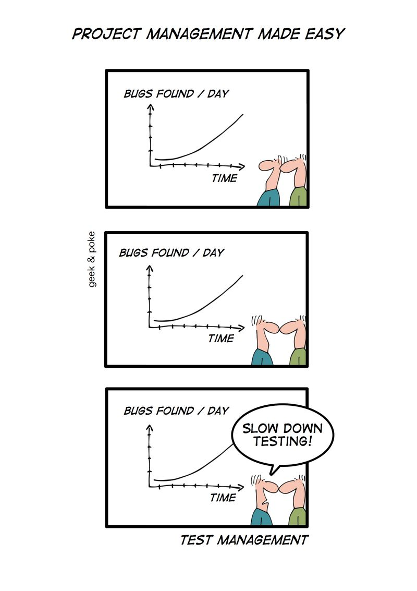

Un buen consejo para gestionar al equipo de QA: si la cantidad de bugs
aumenta con el tiempo, pídale al equipo de QA que deje de hacer pruebas.

(Por cierto, este tipo de estrategia también la han aplicado ex ministros de
educación  respecto a aplicar test internacionales de calidad de la
educación en nuestro país)
