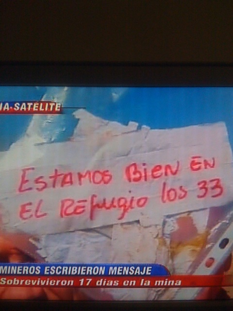

 
> "Estamos bien en el refugio los 33"

33 mineros han sobrevido durante 17  días a más de 680 metros de
profundidad. Ese mensaje, tan simple, amarrado en el extremo de una
sonda ha sido una de las noticias más alegres que he presenciado y que
recuerde.

Bien por los viejos. [Nací en zona minera](/blog/2007/08/adios-chuquicamata.html), mi
viejo, aunque no era minero, también a veces tenía que ingresar a la
mina en Chuqui, me acuerdo de él en este momento, y de tantos otros
"viejos" que he conocido.

Es emocionante, es esperanzador, un momento hermoso e inolvidable.
