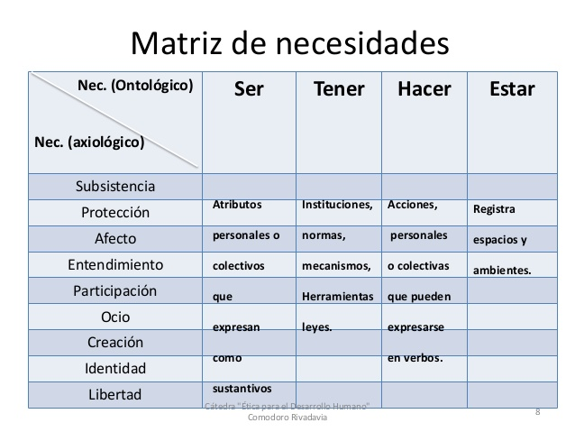
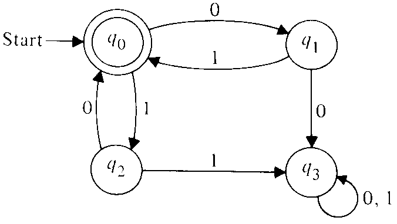

"Soy Feliz" dicen algunos. A los que me conocen, y quiero,  les digo 
_"no se puede ser feliz"_, y la razón es muy simple, la felicidad es
un estado. Tu puedes **estar** feliz, pero no **ser** feliz.

Sin embargo decimos "estoy enamorado", no tenemos problemas en admitir
la temporalidad del amor, pero no la de la felicidad.

El español tiene esa ventaja de separar el verbo ser del verbo estar,
algo que no tienen otros lenguajes. Esa es una herramienta muy poderosa,
porque le da al pensamiento filosófico dinamismo. Si la lengua materna
de  Heiddeger hubiera sido el castellano su filosofía habría sido más
simple, pero su juicio con respecto a la ontología es muy válido, y
tiene que ver con la naturaleza estática de esta. Por eso que desconfío
de las ontologías, porque no dan cuenta de la naturaleza dinámica de lss
proceso, y llevan a un pensamiento estático, rígido.

Trataré de explicarme. Con respecto a la felicidad, la visión general es
estática,ontológica y esto se refleja en el uso del verbo ser para
referirse a esta cualidad: "uno debe ser feliz", "hay que aspirar a
la felicidad", "hay que buscar la felicidad", "tú me haces feliz",
"soy feliz", etc. Pero la vida no es estática. Con una
mirada dinámica, como es la vida, una mirada de proceso, el
 entendimiento es posible. Las  cosas siempre cambian y no puedes
controlar ese cambio, al entender eso las angustias empiezan a
desaparecer.

Hoy estoy alegre, pero puede ocurrir  algo en mi entorno que me saque de
ese estado, y por supuesto mi reacción va a depender del estado en que
me encuentre en ese momento. Si estoy estresado voy a reaccionar peor a
una mala noticia, que si me encuentro calmado, o si estoy feliz el golpe
puede ser más demoledor.

Cuando conversamos, el entendimiento de las palabras de nuestros
interlocutores se afectan por nuestros estados internos, llevándonos a
los malentendidos, o a los juicios incorrectos.

Veamos otro ejemplo. Hay un modelo de la motivación humana que se enseña
actualmente sobretodo en las universidades, me refiero a la [Pirámide de
Maslow](http://es.wikipedia.org/wiki/Pir%C3%A1mide_de_Maslow).

Esta teoría intenta explicar la motivación humana. Es un modelo estático
y jerárquico, que defiende que "conforme se satisfacen las necesidades
más básicas (parte inferior de la pirámide), los seres humanos
desarrollan necesidades y deseos más elevados (parte superior de la
pirámide)." Este modelo además se enseña mal, pero esa es harina de
otro costal.

Lo que este modelo crea, inconscientemente, en quienes lo estudian, es
una necesidad, la idea de que hay que ir quemando etapas para llegar a
la cúspide de la "autorealización". Es una ilusión dada por la
naturaleza estática del modelo.

Sin embargo, si vemos las cosas en forma más dinámica, estas presiones
por alcanzar el éxito desaparecen. El economista chileno, Manfred
Max-Neef propone una lista más interesante para entender las
motivaciones humanas: subsistencia, protección, afecto, entendimiento,
participación, ocio, creación identidad y libertad (más tarde agregó la
trascendencia), y propone organizarla en una matriz:

Es interesante el modelo de Max-Neef, es más tranquilizador, no impone
esa presión de que hay que ser rico para ser feliz. Es un paso adelante
hacia esta idea de dinamismo.

En informática usamos  [las máquinas de
estado](http://es.wikipedia.org/wiki/M%C3%A1quina_de_estados), las  que
nos permiten modelar las distintas etapas por las que se pasa en la
ejecución de una secuencia de acciones.

Una máquina de estados es un modelo de comportamiento de un sistema con
entradas y salidas. En este modelo las salidas no sólo dependen de las
entradas, sino que del estado actual en que se encuentre la máquina.

Quizás un modelo de máquina de estado, o [autómata no
determinista](http://es.wikipedia.org/wiki/Aut%C3%B3mata_finito#Aut.C3.B3mata_finito_no_determinista)
puedan llegar a ser un mejor modelo de las motivaciones humanas. Les
dejo tirada la idea, pero creo que es bueno partir del concepto de que
 estamos felices, o estamos tristes, en distintos tiempos, y que vamos
cambiando y reaccionando  a nuestro entorno, creo que ese pensamiento
más dinámico es más sano a la larga, y permite enfrentar mejor la vida,
al menos a mi me sirve.

Al final, y de acuerdo a la máxima mentat, no se puede entender la vida
teorizando sobre ella,  [hay que moverse con el flujo del
proceso](/blog/lnds/2010/05/27/sobre-los-procesos), es
decir, hay que vivir.

    