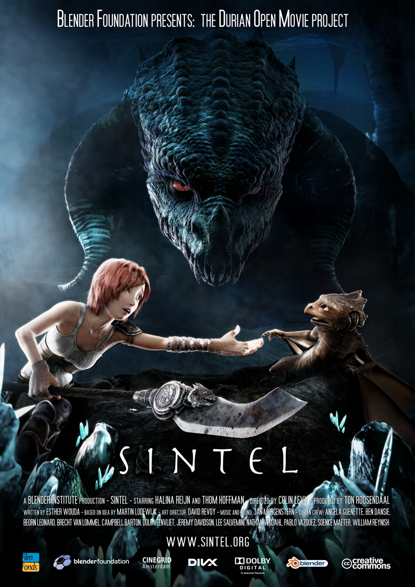

Bien, ahora que tengo algo de su atención con respecto al 
[estado del software libre en Chile](/blog/2010/09/analisis-de-chileforge.html),
déjenme hablarles de un par de casos que quizás traiga un poco de
[entendimiento](/blog/2010/05/inteligencia-educacion-y-entendimiento.html)
con respecto al tema.

Les quiero hablar de 2 proyectos que deben su existencia a esta idea
poderosa del software libre, y quiero, a través de estos ejemplos,
descifrar cuál es el secreto del éxito de un proyecto de software libre,
o basado en software libre. Mi intención es encontrar los fundamentos
que hacen que estos proyectos funcionen. Soy un convencido de que mucha
gente que habla del software libre no tiene idea de que habla, y por lo
tanto se crean expectativas e ideas incorrectas, las que mal aplicadas
pueden ser desastrosas.

En este primer post nos vamos a enfocar en un proyecto que usa software
libre, donde el foco no es desarrollar código (aunque sí fue necesario
hacerlo), acá el foco es usar el software libre disponible para
construir una pieza de arte y compartirla, y por supuesto armar una
industria sustentable que permita ganar dinero con el proyecto.

Hablamos del cortometraje [Sintel](http://www.sintel.org/), de cuya
existencia me entero gracias a este
[post](http://www.bitacoravirtual.cl/2010/09/30/estreno-on-line-de-sintel-open-movie-de-la-fundacion-blender/)
en la excelente Bitácora Virtual de [Andrés Moya](http://www.bitacoravirtual.cl/curriculum/).

Sintel es una OpenMovie, lo que quiere decir que todo el material de
producción está disponible mediante una licencia Creative Commons, por
lo tanto se pueden crear obras derivadas de esta película.

En las propias palabras del equipo:

> "Sintel" es un cortometraje producido en forma independiente, iniciado
> por la Blender Foundation como un medio para mejorar y validar la
> suite de creación 3D free/open source 3D Blender. Con fondos iniciales
> provistor por miles de donaciones vía la comunidad de internet, ha
> probado nuevavemente ser un modelo de desarrollo viable para la
> tecnología 3D y para la animación de películas independientes."

Blender es un software de modelamiento 3D, creado por 
[Ton Roosendaal](http://en.wikipedia.org/wiki/Ton_Roosendaal), un programador
y empredor holandés. En 1998 Roosendaal había creado una empresa llamada
NaN para vender y distribuir el software. Hacia el 2002 NaN se
encontraba en bancarrota.

A pesar de la quiebra Roosendal quería seguir el desarrollo del
software, la solución fue pagarle a sus acreedores 100.000 euros por el
código fuente de Blender. Para lograr este objetivo crea la Blender
Foundation, cuya primera meta fue conseguir el dinero para liberar el
código, acá estamos literalmente de liberar el código fuente ;).

La fundación se mantiene mediante donaciones, cuyo principal fin es
emplear a Roosendal como desarrollador lider a tiempo completo. La meta
principal de la fundación es "darle a la comunidad de internet mundial
acceso a la tecnología 3D en general, con Blender como núcleo".

La Fundación Blender ha producido [varios
proyectoso](http://www.blender.org/features-gallery/blender-open-projects/)
independientes antes, que incluyen cortos y juegos. Blender mismo ha
sido usado en películas comerciales, como Spiderman 2, y el reciente
film argentino [Plumíferos](http://www.plumiferos.com/).

Acá les dejo el film Sintel, espero que lo disfuten:

