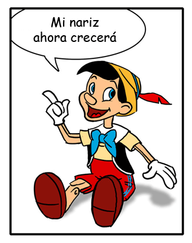

 

Si Pinocho dice que su nariz crecerá, pero no lo hace, estaría mintiendo,
pero cuando Pinocho miente su nariz crece, pero al crecer su nariz
entonces estaría diciendo la verdad. Luego, ¿qué diablos debería pasar
después de que Pinocho dice esta frase?

Esta es una reformulación de la vieja [Paradoja del Mentiroso](http://es.wikipedia.org/wiki/Paradoja_del_mentiroso), lo
interesante es que esta paradoja juega un papel fundamental en la
solución de un importante problema de la lógica matemática, y de paso en
el desarrollo de la computación moderna (y sin esta no existirían los
computadores, la web,  este blog, twitter, y no estaríamos contando este
cuento).

A principios del siglo XX los matemáticos estaban tratando de construir
los fundamentos de las matemáticas, para convertirla en la más hermosa y
pura de las ciencias. Sobre estas fundaciones de roca sólida, las otra
áreas más complejas de las matemáticas descansarían, y se extenderían.
Eventualmente todas las proposiciones de las matemáticas podrían
declararse en forma única y diafana como falsas o verdaderas, y cuando
un matemático demostrara un teorema sonarían campanitas en el cielo, y
un angel obtendría sus alas. ¡Que lindo!

Uno de los trabajos más grandes que representaban este ideal era el de
Whitehead y Russell, plasmado en su magna obra de tres
volúmenes [Principa Mathematica](http://es.wikipedia.org/wiki/Principia_mathematica). El
tremendo esfuerzo  de estos dos pensadores, que les llevó años, alcanza
su cima cuando en la página 379 del primer volumen se establece la
prueba de que 1+1 = 2, ¡la que se termina de demostrar en la página 86
del segundo volumen! (menos mal)

En ese tiempo existía un gran matemático llamado Hilbert que planteó una
serie de problemas a sus colegas matemáticos.  Se sospecha que al
quedarse dormido leyendo los Principia decidió que otros aficionados le
resumieran los tres pesados volúmenes, y planteó lo que se conoce con el
rimbombante nombre del **[Segundo Problema de Hilbert](http://en.wikipedia.org/wiki/Hilbert's_second_problem)**, que
términos sencillos se puede traducir como: "¿¡alguien me puede explicar
si esta m\***** de WhiteHead y Russell es consistente!?"

Es decir, lo que quería Hilbert, era que algún memorista espinilludo le
dijiera si esos tres mamotretos llenos de galimatías matemáticas
presentaba contradicciones internas.

Y el bueno de Kurt Gödel resolvió el problema, y encontró que la
respuesta era 42\..... nooo, broma, la respuesta al segundo problema de
Hilbert es negativa.

Gödel, considerado el más grande lógico del siglo XX, y a quien vemos en
la foto  paseando con uno de sus amigotes,
era un tipo bien especial. 

Se dice que sus amigos científicos le
consiguieron asilo en Estados Unidos para sacarlo de Austria y huir del
régimen nazi. Con el tiempo le convencieron de que aceptara la
ciudadanía norteamericana. Con lo riguroso que era decidió hacer un
análisis lógico de la constitución de los Estados Unidos, y descubrió
que sin salirse de la constitución era posible establecer una dictadura
de corte facista en ese país (que cosa más rara, ¿no creen?). Preocupado
les dijo a sus amigos que se negaba a jurar lealtad a este país en esas
condiciones, a no ser que se introdujieran algunos cambios a la
constitución. Costó convencerlo, pero lograron que retomara la confianza
y aceptó jurar fidelidad a la constitución norteamericana, requisito
previo para otorgarle la nacionalidad. Pues bien, el oficial que le
debía tomar el juramento le preguntó su origen, al oir su respuesta, el
administrativo comentó lo bueno que era estar en una nación donde la
democracía los protegía de que se estableciera una tiranía. ¡Craso
error!, el pobre Gödel al oir esto saltó como quique y empezó a
explicarle que se equivocaba, y que la constitución tenía una serie de
fallos lógicos, y en ese momento sus amigos tuvieron que intervenir,
taparle la boca, tranquilizarlo para que la ceremonia continuara.

Bueno, antes de que pasara esta anécdota, y siendo un memorista timido,
Kurt Gödel demostró sus famosos teoremas de incompletitud. Y para esto
usó una variante de la paradoja del mentiroso. Basicamente lo que hizo
Gödel fue formular una proposición que dice "Esta proposición es
indemostrable". Si la proposición es indemostrable, entonces es cierta,
y por lo tanto el la formulación de la aritmética es incompleta (porque
hay una proposición no demostrada), por otro lado, si la proposición se
puede demostrar, es decir, es falsa, entonces la formulación de la
teoría es inconsistente.

Lo interesante es que la prueba de Gödel involucra la construcción de
una suerte de máquina lógica, un computador rudimentario que escribe
sentencias lógicas siguiendo ciertas reglas, lo que hace que la prueba
original de Gödel sea larga en intrincada.

Actualmente el resultado de Gödel abarca mucho más que la teoría de
números y la aritmética, gracias a la introducción precisa de algoritmo
computacional introducido por Alan Turing. En la actualidad el teorema
de Gödel se considera aplicable a todo sistema axiomático formal.

Lo que nos interesa, como resumen, es que los trabajos de Gódel,  Turing
y otros lógicos y matemáticos de principios del siglo XX, que pretendían
resolver estos abstractos problemas fundamentales de las matemáticas
llevaron al desarrollo de los conceptos de algoritmos, y de máquinas
automáticas que derivaron en el desarrollo de la computación moderna.

Para los más técnicos, les recomiendo leer 
[World's shortest explanation of Gödel\'s theorem](http://blog.plover.com/math/Gdl-Smullyan.html).
