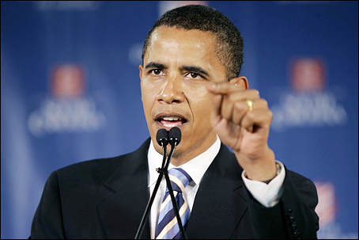
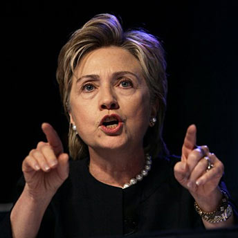

> "Mientras más libre fluye la información, más fuerte se vuelve la
> sociedad,
> porqueciudadanos
> de todos los países del mundo pueden empujar a sus gobiernos a que
> rindan cuentas. Ellos pueden comenzar a pensar por si mismos."
> \[\...\] Puedo decirles que en EEUU, el hecho de tener una internet
> libre, o acceso sin restricciones a internet, es una fuente de fuerza,
> y creo que debe ser fomentada."
> -- Barack Obama en [un discurso en China](http://forum.bodybuilding.com/archive/index.php/t-120390411.html) ([video](http://www.youtube.com/watch?v=J9zytXNgKMs)).

> "La censura no debe ser aceptada de ninguna forma, proveniente de ninguna
compañía de ninguna parte del mundo. Y en America (EEUU), empresas
Americanas necesitan apoyar esta postura\... Esto necesita ser una marca
distintiva de nuestra nación. Tengo confianza de que los consumidores
del mundo entero recompensarán a las compañías que sigan estos
principios."
>
> -- Hillary Clinton, [discurso para la liberta de expresión en internet](http://www.indexoncensorship.org/2010/01/hilary-clintons-internet-freedom/comment-page-1/).

Tomado desde
<http://www.indexoncensorship.org/2010/12/wikileaks-internet-censorship-united-states/>,
existe [una traducción en Manzana Mecánica](http://www.manzanamecanica.org/2010/12/wikileaks_los_ideales_de_internet_triunfan.html).

