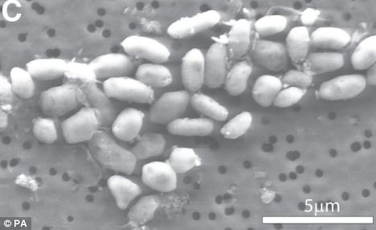

Como crecí en
[Chuquicamata](http://www.lnds.net/blog/2007/08/adios-chuquicamata.html),
durante una época en que la contaminación era bastante alta,
principalmente por las emanaciones de las chimeneas en la fundición de
cobre, siempre se me dijo que estuve expuesto a la contaminación por
arsénico, al menos durante los primeros 18 años de mi vida.

Así que se puede decir que soy una forma de vida tolerante al arsénico
:smile:

Durante mi paso por la [Escuela de Injeniería](http://ingenieria.uchile.cl/) (sí, se escribe con J), conocí
a Don José Tohá Castellá, que investigaba tecnología de biofiltros para
descontaminar, lo que terminó en un invento que se llama el [Sistema
Tohá](http://www.sistematoha.cl/), usado para descontaminar aguas.

Fue con este profesor que aprendí algo interesante, y que para
ilustrarlo voy a recurrir a una vieja conocida del nerd auténtico (algo
que todo geek que se precie de tal tiene en su escritorio, en alguna
pared o estampado en una polera), me refiero a la Tabla Periódica de los
Elementos, acá les va, con un retoque, un cuadrito que rodea a dos
elementos, el Fósforo (**P**) y el Arsénico (**As**):

Si tienen problemas para visualizar hagan click sobre la imagen.

Como pueden apreciar el fósforo y el arsénico están en el mismo grupo de
la tabla periódica (la columna 15). Esta versión de la tabla es un tanto
antigua, el arsénico y el fósforo son no metales, pero en la actualidad
el arsénico se clasifica como semi conductor (así es la moda).

Lo importante es que este hecho, de que estén tan cerca en la tabla
periódica nos indica algunas propiedades que estos elementos comparten.
Lo más importante, y lo que nos enseñó el profesor Tohá es que el
Arsénico puede desplazar al Fósforo y viceversa en la composición de
ciertas moléculas. Por eso que el arsénico es venenoso, porque el
fósforo es uno de los elementos esenciales de la vida, pero el arsénico
al tener esta propiedad de desplazar al fósforo afecta a los procesos
biológicos y provoca la muerte de los seres vivos.

**Rasputín y la Coca Cola**

Se dice que [Rasputín](http://es.wikipedia.org/wiki/Grigori_Rasput%C3%ADn),
el famoso y siniestro monje ruso, consumía pequeñas dosis de arsénico
diariamente lo que lo volvió virtualmente inmune a este veneno, lo que
aterrorizó a sus asesinos que no pudieron envenenarle, contribuyendo al
engrandecimiento de su leyenda.

Entonces, parece que se puede desarrollar una cierta tolerancia al
arsénico, y si es cierto lo que se decía de mi ciudad natal, el arsénico
está en mi cuerpo, o estaba, porque según Tohá, la Coca Cola, al
contener importantes cantidades de fósforo (en la forma de [ácido
fosfórico](http://es.wikipedia.org/wiki/%C3%81cido_fosf%C3%B3rico))
permite desplazar el arsénico del cuerpo (y con toda la Coca Cola que he
consumido yo creo que ya me libré del veneno).

Y todo esto a propósito del anuncio de la semana pasada sobre el
supuesto descubrimiento de una nueva forma de vida basada en arsénico
anunciado por la NASA, creando toda una expectación, y hasta sospechas
de que fuera una tapadera para distraer la atención del CableGate de
Wikileaks

**Vida alienigena**

El problema es que varios científicos han estudiado [el paper de los
investigadores de la
NASA](http://www.sciencemag.org/content/early/2010/12/01/science.1197258),
y han sido bastante críticos. El profesor Rosie Redfield de la
Universidad de Columbia [publicó en su
blog](http://rrresearch.blogspot.com/2010/12/arsenic-associated-bacteria-nasas.html)
un análisis del trabajo de la NASA, quien llega a afirmar que si los
datos experimentales hubieran sido presentados por estudiantes de
doctorado a su comité evaluador, los habría enviado de vuelta a tomar
muestras más prolijas y mejorar sus controles.

Hay una evaluación de este trabajo en nuestro idioma, [publicada en
Amazing.es](http://amazings.es/2010/12/08/arsenicleaks-la-vida-a-base-de-arsenico-hace-aguas/),
escrita por [José Miguel
Mulet](http://amazings.es/autor/jose-miguel-mulet/), profesor de
bioquímica y biología molecular en la Universidad Politécnica de
Valencia.

La principal afirmación de estos investigadores de la NASA es que estas
bacterias reemplazan el fósforo de su ADN por arsénico. Y es ahí donde
están los problemas con la forma de demostrar esta afirmación, cito a
Mulet:

> "Los autores lo prueban con marcaje radioactivo y ven acumulación de
> arsénico en las bacterias... pero no muestran datos directos de
> biomoléculas con arsénico como hubiera sido una estructura de ADN
> resuelta por cristalografía o una espectrometría de masas. Una cosa es
> que esté dentro de la casa y otra es que forme parte de la estructura
> como un ladrillo cualquiera."

> "Hay un experimento previo que hace sospechar. La célula es capaz de
> crecer en medio rico en fosfato sin arsénico... por lo tanto no parece
> que sea un elemento esencial, es decir, las biomoléculas pueden
> incorporar arsénico o fosfato, un caso sorprendente de moléculas tan
> importantes y que tengan composiciones alternativas. No existen
> transportadores de arsénico tan especificos y eficaces como los de
> fosfato, entre otras cosas por que el arsénico no es esencial ni es
> tan frecuente en la biosfera. Por lo tanto más que una nueva forma de
> vida, sería una forma más flexible de vida. Y formas flexibles hay
> muchas más, así que no es tan nueva."

Así que no parece que estemos ante una nueva forma de vida basada en el
arsénico (algo que ampliaría el abanico de posibilidades de vida
extraterrestre).

## **¡Las vacuolas, las vacuolas!**

Pero hay otra objeción interesante que destaca Mulet:

> Hay otro detalle que ha pasado más desapercibido y que a mi me ha
> hecho sospechar. Según los autores, cuando las bacterias crecen en un
> medio rico en arsénico tienen un tamaño superior, *porque sus vacuolas
> aumentan de tamaño*.

Para los menos entendidos, las vacuolas son orgánulos que también tienen
las células eucariotas y que hacen las funciones de cubo de la basura,
entre otras cosas. Es donde la célula acumula todo lo que le molesta y
que no puede eliminar. En bacterias no es muy frecuente este orgánulo,
presente solo en algunas familias como las sulfobacterias.

Una estrategia típica de hacer frente a un compuesto tóxico es la
acumulación en vacuola, es decir, ir tomándolo del medio y metiéndolo en
el cubo de la basura para que no moleste... y resulta que las bacterias
crecidas en arsénico tienen la basura llena, y además han incorporado
mucho arsénico, *¿no será que hay mucho arsénico en la basura y poco en
el ADN?* Además, el aumento del tamaño de las vacuolas es un claro signo
de estrés celular. Algo les estamos haciendo a esas bacterias que les
molesta. ¿ideas?

Entonces las sospechas sobre este "descubrimiento" empiezan a
aumentar, porque la NASA necesita mostrar resultados para sostener sus
presupuestos, así que no sería extraño que se hayan precipitado
anunciando un hallazgo con pruebas poco contundentes, además de la
oportunidad tan desafortunada del anuncio, que alimenta las teorías
conspiranoicas.

Pero además, un hallazgo de vida basada en arsénico sería algo que
habría sacudido a la comunidad científica, y parece que no ha sido así,
este descubrimiento ha sido recibido con un gran escepticismo, y [voces
en contra](http://sonicando.com/?p=1907).

Parece que los extraterrestres de arsénico tendrán que esperar.

