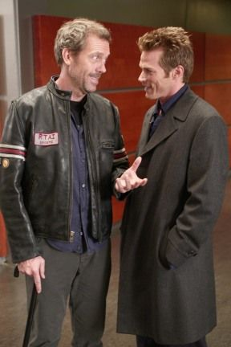

 
 
> Dr. House:  Nada importa. Sólo somos cucarachas. Animales muriendo a la
> orilla del río. Nada  que hagamos tiene significado duradero.
>
> Evan Greer: ¿Y tú crees que yo soy miserable?
>
> Dr. House: Si eres infeliz en el avión, sólo salta.
>
> Evan Greer: Quiero hacerlo, pero\... no puedo.
>
> Dr. House: Es el problema con las metáforas. Necesitan
> interpretación\... Saltar del avión es estúpido.
>
> Evan Greer: ¿Y qué tal si no estoy en un avión? ¿Qué tal si si estoy
> en un lugar donde no quiero estar?
>
> Dr. House: Ese es el otro problema con las metáforas. Sí, ¿y si  en
> realidad estás en un camión de helados, y afuera hay caramélos, flores
> y vírgenes? ¡Estás en un avión! Todos lo estamos. La vida es peligrosa
> y complicada, y es  una larga caida.
>
> -- Temporada 4, Episodio 14

Amén.
