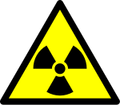

En estos días han circulado muchas noticias respecto al accidente nuclear
en Japón donde se habla de ciertas medidas de radiación. Por ejemplo, en
un momento se midió un peak por sobre los 8.227 micro-sieverts en la
central y el límite son 500 micro-sieverts.

Pero, ¿qué significa eso? Las noticias  nos hablan de que se  se
emitieron dosis miles o millones de veces más altas que lo permitido,
sin explicar cuáles son esos límites y que significan para la salud.Y a
pesar de que la explicación está al alcance de todos, parece que  hay
pereza de los medios en investigar y explicar, o quizás no hay interés
de poner las cosas en
[perspectiva](/blog/2011/01/perspectiva.html)
(conspiranoicamente pensando, quizás es un buen negocio para alguien
mantener la alarma pública).

Un [Sievert](http://en.wikipedia.org/wiki/Sievert) (Sv)  mide el grado
de dosis de radiación absorbida por los tejidos. Se obtienen midendo la
energía absorbida por kilogramo de peso (expresada en
[Grays](http://en.wikipedia.org/wiki/Gray_(unit))) y multiplicándola por
un factor que depende de la fuente de radiación.

Para tener una referencia: una radiografía al pecho te expone a 0.04
mSv, una mamografía son 0.3 mSv, una tomografía computarizada del pecho
va entre 6 a 18 mSv. La radiación natural del cuerpo humano es de 0.4
mSv/año.\
Si interpreto bien, una dosis de 8.227 µSv/hora, o 8,23 mSv,  eso es
equivalente a 197,45 mSv en 24 horas, ahora, porque lo expreso en 24
horas, es para comparar con la tabla que viene más abajo.   ~~la dosis
de 8.227 µSv/hora significaría que si se está expuesto al reactor de
Fukushima durante una hora se recibe el equivalente a una tomografía
computarizada de pecho.~~

Una persona recién empieza a verse afectada por sobre los 0,25 Sv (250
mSv, ó 25,0000 µSv), es decir, la dosis más alta medida ahora en
Fukushima es ~~un tercio~~ 4/5 aprox. de la dosis que empieza a generar
nauseas.

Por cierto, los japoneneses son previsores y establecieron el límite
legal de radiación de sus plantas en los 500 µSv/hora, es decir, 1/50
ava parte de la radiación que empieza a generar nauseas.

Según wikipedia el daño se expresa en esta tabla (en una exposición de
un día)

-   0--0.25 Sv: Nada

-   0.25--1 Sv: Algunas personas sienten nauseas, perdidad de apetito,
    daño a la médula osea, nodos linfáticos y al bazo.

-   1--3 Sv: Nausea más severa, pérdida de apetito, infección, daño más
    severo a medula osea, nodos linfáticos. Es probable recuperarse,
    aunque no se asegura.

-   3--6 Sv: Nausea severa, pérdida de apetito, hemorragias,
    infecciones, diarrea, escamas en la piel, esterilidad, muerte si no
    se trata.

-   6--10 Sv: Todos los síntomas anteriores, más deterioro del sistema
    nervioso central, expectativas de muerte.

-   Sobre 10 Sv: Incapacitación y muerte.

La radiación de 8.227 µSv/hora en Fuskushima aún está por debajo del
umbral menor de esta tabla.

**Actualización:** tal como apunta Javier Rovegno, los efectos de la
radiación son "acumulativos" (si dañas un organo por exposicion
prolongada o intensa no te recuperas). La situación es grave, es por eso
que se evacua a la gente mientras se realiza la contención de las fugas.
Después hay que asegurarse que no queden desechos y fuentes de radiación
en el ambiente, lo que es bastante difícil.

Se sabe que se han escapado radioisótopos a la atmósfera, algunos
permanecerán por décadas, lo que sería interesante saber cuanto y de
 que tipo. Lo importante ahora es contener las fuentes de radiación, que
es lo que están haciendo los ingenieros japoneses. Esperemos que lo
logren y no empeore la situación.

**Segunda Actualización**: lamentablemente en estos momentos hay una
discrepancia entre la autoridad japonesa y la internacional sobre el
grado de la catástrofe, entre 4 y 6 en la [escala INES](http://es.wikipedia.org/wiki/Escala_Internacional_de_Accidentes_Nucleares).
Esto introduce otro grado de incertidumbre en la información y de la
consiguiente alarma.

**Tercera Actualización:** corregí algunos errores de cálculo.
