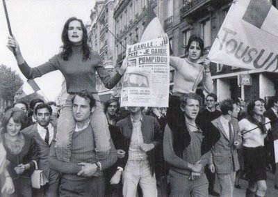
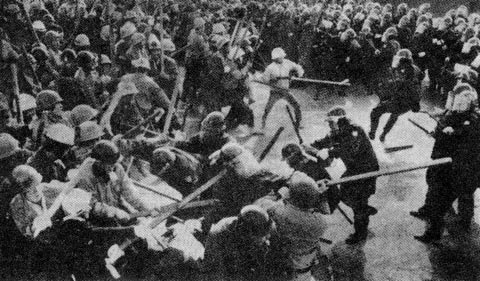

Vimos que el éxito de una obra tan importante como la Mona Lisa
probablemente se deba a una [razón accidental](/blog/2011/07/12/razonamiento-circular).
A lo mejor  si el robo de 1911 no se hubiera perpetrado, en la
actualidad el objeto de arte más famoso del mundo sería otro, no podemos
saberlo. Por lo tanto no podemos explicar el éxito de la Mona Lisa en
función de sus atributos propios. Podemos razonar, circularmente, que la
Mona Lisa es la obra de arte más importante del mundo porque tiene los
atributos propios de la Mona Lisa.

Pero, ¿qué pasa con el éxito de obras como Harry Potter, por ejemplo?
¿Por qué Harry Potter es tan exitoso y tanta gente compra sus libros y
ve las películas? ¿Es por su calidad intrínseca? ¿Es producto de la
publicidad?  Hay críticas que explican que Harry Potter "explota una
serie de estereotipos que ilustran la envidia, intolerancia, una maldad
profunda que aumenta la tensión, con algunas sentencias morales sobre el
valor del coraje, la amistad, el poder del amor, en un ambiente de
fantasía y magia. Es la suma de todos estos atributos aseguran su éxito
masivo." Otra vez tenemos el razonamiento circular, Harry Potter es
exitoso por tener los atributos de Harry Potter. Eso no explica nada.
Las razones están fuera de los atributos o características de esta serie
de libros. La explicación de como se pudo lograr que millones de
lectores  compararan estos libros es la piedra filosofal de todo editor
moderno (si me permiten la broma).

Como vimos en al [artículo anterior](/blog/lnds/2011/07/12/razonamiento-circular),
una solución común es la adopción de un modelo basado en una  entidad o
agente representativo. Se trata de entender el comportamiento del
consumidor promedio,  a partir de la observación o conjeturas sobre el
comportamiento de esta entidad abstracta. Perfilamos al lector promedio
de Harry Potter y a partir de eso modelamos un nuevo producto adaptado a
ese lector ideal. Esto no funciona, por supuesto, porque es una
explicación de sentido común que falla al ignorar las interacciones
entre individuos.

Esto queda claro al analizar el trabajo del sociólogo 
[Mark Granovetter](http://en.wikipedia.org/wiki/Mark_Granovetter) en su
"modelo de los umbrales para los motines (riots)". El modelo es
bastante simple, consideren una multitud hipotética, donde cada persona
decide participar de actos de violencia dependiendo si hay otras
personas cometiendo actos de violencia. En este modelo cada persona
tiene su "umbral de violencia", están los instigadores, que empezarán
con los desordenes aunque nadie más esté dispuesto a la violencia, en
este caso su umbral es cero. Están los que tienen un umbral de uno, es
decir, acuden a la violencia sólo si otra persona está cometiendo actos
violentos, lo que tienen umbral 2, es decir, cometen actos de violencia
si hay 2 personas haciéndolos, y así. Los umbrales van desde el ultra
violento de umbral cero,  al pacifista a ultranza tipo Ghandi que nunca
ocupará  la violencia,  aunque todo el resto de la muchedumbre esté
peleando (es decir, su umbral es infinito). Cada grupo tendrá su
 distribución única y particular de estos umbrales de violencia.

Un ejemplo de estas distribuciones de umbrales de violencia es el
siguiente, tenemos un grupo en que el primer individuo tiene un umbral
de cer0, así que empieza la violencia, el segundo individuo tiene un
umbral de 1 por lo tanto se une al primero, el tercer individuo tiene un
umbral de 2, se une al grupo, el cuarto individuo tiene un umbral de 4,
el quinto individuo tiene un umbral de 5, los demás individuos tienen
umbrales mayores a 5, la violencia no prospera, el acto termina
pacíficamente con pocos incidentes.

Supongamos ahora que tenemos  dos muchedumbres, A y B, con la misma
cantidad personas, del mismo tipo, por ejemplo, son todos estudiantes,
en los mismos rangos etarios, que además están reclamando por la misma
causa (la política gubernamental en educación), sólo que en ciudades
distintas y con distribuciones de umbrales de violencia ligeramente
diferentes. Por ejemplo, puede que el grupo  A se diferencie del grupo
 B en sólo una persona, la que tiene  un umbral levemente inferior a su
contraparte. Lo que puede suceder es que la muchedumbre A genera
desordenes y violencia, y en el caso  B no se produce ningún acto de
vandalismo, todo por esta mínima diferencia. En la ciudad A la protesta
termina con detenidos, daños a la propiedad pública, heridos, etc. En la
ciudad B la protesta termina pacíficamente y se disuelve después de un
rato. Por supuesto nosotros sabemos que las probabilidades de que se
produzcan actos de violencia son distintas porque conocemos estas
distribuciones, porque  inventado estas distribuciones de probabilidad
sobre la violencia de estos grupos. Pero dos observadores externos
tratarían de buscar explicaciones a los resultados distintos de las
protestas en A y B. Los observadores trataría de conjeturar las causas
que llevaron a la violencia en A y no en B. Quizás en A la policía fue
más agresiva, quizás el grupo A estaba más enojado, o despesperado que
el grupo B, quizás en el grupo B había un dirigente más explosivo que
generaba más pasión en su audiencia, etc. Todas explicaciones de sentido
común, la razón real, de que el umbral de violencia era apenas superior
en B con respecto a A es algo que queda oculto a estos observadores.
Aparte del umbral de violencia, no hay nada en este experimento mental
que diferencie a la muchedumbre A del grupo B. Y este punto es super
importante, porque la única manera en que un modelo de agente
representativo, "el estudiante protestante promedio", pueda  explicar
las diferencias es que hubieran diferencias en las propiedades promedios
de las dos poblaciones, y eso no se da, porque hemos construido dos
grupos que son iguales en todas las propiedades observables.

En el modelo de Granovetter no importa el modelo de comportamiento
individual que se tenga, porque se las poblaciones son indistinguibles
unas de otras. La única diferencia está dada por el grado de
interacciones entre individuos, lo que requiere que revises la secuencia
completa de decisiones que cada individuo realiza en función del
comportamiento de los demás.  Este modelo deja claro la importancia de
las micro interacciones entre individuos.

Por cierto este es un modelo muy simple de influencia entre individuos,
pero sirve para resaltar esta propiedad importante, las micro
interacciones son las importantes. En los próximos artículos
exploraremos cómo se pueden explorar las maneras en que nos
influenciamos unos a otros en las redes sociales.
