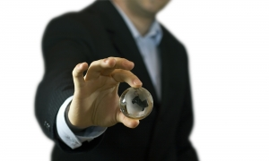

 
Si somos malos para [explicar el pasado](/blog/2011/07/razonamiento-circular.html),
¿cómo somos prediciendo el futuro?

Nos encantan las predicciones. Todos los años leemos predicciones sobre
tecnología escritas por expertos de importantes firmas como Gartner y
otros. Importantes think tanks y publicaciones hacen predicciones sobre
eventos económicos y políticos, e incluso los diarios citan a adivinos,
astrólogos y numerólogos que vaticinan los eventos del año. Estos
últimos parecieran tener muy malos resultados, pero ¿son mejores las
predicciones de un astrólogo que las de una prestigiada firma
especialista en estudios de mercado? La verdad es que nadie sabe, porque
nadie se preocupa de hacer alguna auditoría a los resultados.

Pero hay un experimento realizado por el sicólogo Philip Tetlock que
puso a prueba la capacidad de predicción de 284 expertos políticos. A
mediados de la década de 1980 Tlelock contactó a estos expertos y les
solicitó cerca de cien predicciones sobre una variedad de posibles
eventos futuros, desde los posible resultados de una elección a la
probabilidad de que dos naciones se enfrentaran en un conflicto armado.
Por cada predicción se les pidió a los expertos que especificaran cual
de dos opciones esperaban que sucediera, y que asignaran una
probabilidad a su predicción. Después de recoger estas predicción
Tlelock esperó veinte años, y publicó sus resultados[^1].

Aunque los expertos tuvieron un comportamiento mejor que la adivinación
al azar, no lo hicieron tan bien comparados con un sencillo modelo
estadístico. Pero lo más sorprendente es que los expertos lo hicieron
ligeramente mejor cuando operaban fuera de su área de experiencia. Los
resultados de este experimento, y muchas otras historias sobre la
capacidad de los expertos para predecir el futuro son la base del libro
de Dan Gardner [Future Babble](http://www.amazon.com/gp/product/0525952055/ref=as_li_tf_tl?ie=UTF8&tag=lanaturaledel-20&linkCode=as2&camp=217145&creative=399369&creativeASIN=0525952055).

En este libro Gardner entrega una serie de historias que muestran la
consistente incapacidad de los expertos para predecir el futuro, al
grado que parece que cualquiera de nosotros lo podría hacer mejor.

Nadie predijo nunca el éxito de La Guerra de las Galaxias o Harry
Potter, el colapso económico de fines de 2008, o el éxito de Google o
Facebook. A fines de la década de 1990 Sergey Brin y  Larry Page
trataron infructuosamente de vender su empresa por 1.6 millones de
dolares, y nadie pensaba que esa empresa llegara valer eso, menos mal,
porque actualmente Google está evaluada unas 100.000 veces más.

Dado esto pareciera que los seres humanos simplemente somos malos en
hacer predicciones. Pero no es tan así. Por ejemplo, todos los días
podemos hacer un cierto grado de predicción sobre el clima de nuestra
localidad, y curiosamente nuestras predicciones serán bastante buenas.
Sabemos que ciertas cosas sucederán, y nos parecen inevitables, o hay
otras que simplemente suceden con una periodicidad que son totalmente
predecibles. El sol seguirá saliendo por el oriente, es difícil que haya
una guerra entre Canada y Estados Unidos en los próximos diez años, etc.
Claro que estas predicciones no impresionan a nadie. En palabras de
Duncan Watts: *"el problema real de las predicciones no es que seamos
universalmente buenos o malos en estas,  sino que somos malos en
distinguir las predicciones que podemos hacer con certeza de aquellas
que no podemos."*

En los sistemas simples podemos hacer predicciones precisas, por
ejemplo, podemos predecir cuando volverá a aparecer el cometa Halley,
porque conocemos su órbita y hay un modelo simple que nos permite
predecir su evolución a través del sistema solar. Pero en los sistemas
complejos, como los sistemas sociales, esto no es posible. Lo que
podemos hacer es dar cierta probabilidad de que un hecho ocurra. Sin
embargo, los sistemas complejos no son exactamente aleatorios, el hecho
de que podamos calcular probabilidades de que ciertos eventos ocurran no
tiene que ver con una naturaleza aleatoria. Los sistemas complejos son
caóticos, es decir, son el fruto de miles o millones de micro
interacciones. El problema es que cada interacción contribuyen a
perturbar el sistema de formas que son impredecibles. Estamos ante algo
conocido popularmente como el **[efecto mariposa](http://es.wikipedia.org/wiki/Efecto_mariposa)**.

"El simple aleteo de una mariposa puede cambiar el mundo",  hemos
escuchado frases de ese estilo, una mariposa aletea en el Amazonas y se
desata un monzón en el océano índico. Las condiciones iniciales en un
sistema complejo pueden variar ligeramente y los resultados variar
enormemente. El concepto de efecto mariposa viene del trabajo de Edward
Lorenz quien trabajaba en el modelamiento de predictores del clima.
Actualmente los modelos de predicción del tiempo son bastante buenos,
pero aún así son muy sensibles a pequeñas variaciones. No es posible
predecir más allá de cierta cantidad de días, porque las perturbaciones
se van haciendo cada vez mayores a medida que pasa el tiempo. Por eso
que los modelos climáticos entregan sus resultados expresados como
probabilidades, "la probabilidad de que llueva mañana es de un 60% y
que llueva pasado mañana un 40%".

Entonces, cuando en 2008, un día antes de que saliera electo Barack
Obama se hablaba de que el tenía una probabilidad sobre el 90%  de ser
electo, a ¿qué se referían? ¿a que si se hubiera postulado 10 veces
presidente habría ganado 9? Claramente no, porque esta elección es un
evento único. Desde un punto de vista matemático asignar probabilidades
a un evento único es algo problemático.

Cuando miramos al pasado no sentimos confusión sobre los eventos que
sucedieron, y sabemos cuales eventos eran relevantes. Pero, ¿cuáles
eventos son los relevantes en el futuro? El futuro es una gran nube de
probabilidad que colapsa cuando las cosas pasan. Sólo cuando los eventos
ocurren podemos saber cuales eran los más importantes y relevantes.
Luego se deduce que la importancia de los eventos requiere que la
predicción no sólo sea sobre los hechos que ocurrirán, sino del
resultado de los mismos. Si vamos a predecir eventos sociales, no sólo
debemos predecir qué sucederá, sino cuál será el proceso social que hace
que todo lo sucedido tenga sentido.

Hemos visto que el sentido común no nos da explicaciones de los eventos
pasados, sólo descripciones de los mismos, añadan esto a  a nuestra
incapacidad para predecir el futuro. El problema es que las políticas
económicas, los planes de desarrollo, las políticas públicas afectan a
grandes grupos de personas. Una campaña de marketing, o un plan de salud
público dependen de nuestra capacidad para asociar adecuadamente la
causa del efecto, así que requieren de una explicación científica
apropiada, más que de una narración histórica de los hechos. Por todo
esto uno se pregunta si no habrá una manera  mejor de hacer
predicciones, una suerte de "sentido no común" que nos ayude. Pues ese
será nuestro objetivo ahora, la búsqueda del sentido no común, de sus
virtudes e implicancias para la predicción, la planificación y la
ciencia social.

[^1]: [Expert Political Judgment: How Good Is It? How Can We
Know?](http://www.amazon.com/gp/product/B003HOXLAW/ref=as_li_qf_sp_asin_tl?ie=UTF8&tag=lanaturaledel-20&linkCode=as2&camp=217145&creative=399373&creativeASIN=B003HOXLAW),
Philip Tetlock.
