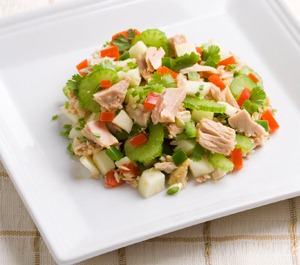
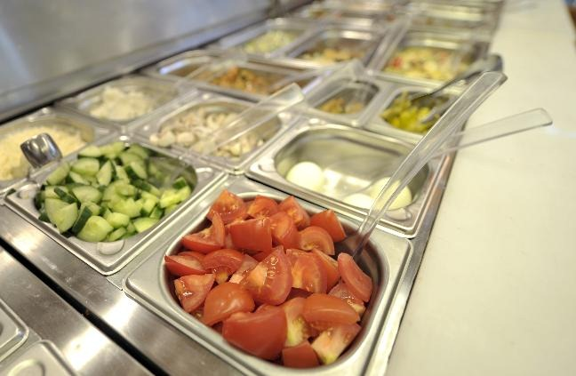

Hace unos  años, probablemente inspirado por
[Ratatouille](/blog/2007/07/ratatouille-lecciones-de-ingenieria-de-s.html),
me dió por cocinar. Mi mujer dice que no cocino mal, pero resulto un
tanto caro como "chef", aparte de desordenado (algo para mejorar). Pero
he aprendido a preparar algunos platos, y he experimentado con otros, es
una actividad que resulta bastante grata y relajante, quizás porque hay
una relación con programar un algoritmo eficiente.

Una de los platos mas sencillos y entretenidos para aprender a cocinar
son las ensaladas, mejor si van acompañadas de alguna salsa. Ayer sábado
en la tarde improvisamos con mi hija mayor y mi esposa una deliciosa
ensalada de manzanas verdes con atún. La receta va al final de este
post, lo interesante fue el proceso aplicado para armar esta ensalada en
particular.

Teníamos una restricción de cinco minutos para ejecutar la tarea, así
que dividimos el trabajo, alguien picaba las manzanas, mientras otra
persona preparaba la lechuga, y un tercero mezclaba manzanas y lechugas
con el atún. Al final mi hija preparó la salsa, la echamos sobre la
ensalada, la distribuimos sobre cada plato y servimos. Fue todo bastante
rápido.

Técnicamente usamos un mecanismo de paralelización y segmentación
(pipelining) en algunas etapas.

¿Y si decidiera dedicarme a la venta de las ensaladas en forma masiva?
La opción para poder producir ensaladas frescas en gran cantidad pasa
por paralelizar el trabajo de producción. Imagino líneas paralelas de
preparación de ingredientes, convergiendo en recipientes donde se
mezclan las verduras se empacan, en paralelo se hace lo mismo con las
salsas y los aderezos. La imagen es sencilla, supongo que les queda
clara la idea. Bueno, esa imagen refleja uno de los grandes secretos de
Google. El famoso algoritmo
[MapReduce](http://labs.google.com/papers/mapreduce.html).

En términos de ensaladas, tenemos una etapa inicial de preparación de
los ingredientes, cada ingrediente es depositado en un recipiente con
una etiqueta: "manzanas verdes para ensalada con atún", "manzanas para
ensaladas de frutas", "tomates para pebre", "tomates para ensalada",
etc. La clave es **etiquetar y separar**.

Luego cada línea toma los recipientes para sus respectivas ensaladas. El
cocinero que mezcla los ingredientes los toma de las líneas respectivas
asignadas a su proceso de mezcla. El orden, la organización mediante el
etiquetado y clasificación es muy importante, pues facilita la labor del
cocinero.

A la primera fase de separar los ingredientes, picarlos, pelarlos, y
finalmente depositarlos en el contenedor con la etiqueta apropiada se le
llama la **fase de mapeo**. A la segunda etapa, cuando mezclamos los
ingredientes y armamos las ensaladas para depositarlas en sus platos o
envases la llamamos la **fase de reducción**.

Cuando procesamos grandes volúmenes de datos podemos usar esta técnica,
la que se describe en términos técnicos así:

> map(in key, in values) --\> list(out key, intermediate values)
>
> - Procesa pares de llave/valor (key/value)
> - Produce un conjunto de pares intermedios
>
> reduce(out key, list(intermediate value)) --\> list(out value)
>
> - Combina los valores intermedios de una llave particular
> - Produce un conjunto de valores de salidas consolidado (usualmente sólo
uno)

Si recuerdan el problema del censo que 
[describimos hace unos días atrás](/blog/2011/10/datos-datos-datos.html), 
lo que teníamos que calcular era la mediana de la edad por cada región.
Supongamos que los datos vienen en forma desordenada, la estrategia
MapReduce para resolver este problema es la siguiente:

> map(datos_censo) --> list({región,sexo}, cuenta por edad según
> {región,sexo})
>
> - separa datos del censo determinando región, sexo y edad
> - usando la llave (región, sexo) cuenta por cada edad la frecuencia del
> dato
>
> reduce({región,sexo},cuenta por edad según {región,sexo}) --> mediana({región,sexo})
>
> - recorre la cuenta de edades para esta llave {región,sexo}
> - determina la mediana, es decir, sabiendo la cantidad total de
> habitantes de esta {región,sexo}, determina la edad que divide a las
> personas en dos mitades (por debajo o por encima de esa edad)

Ambas etapas se podrían paralelizar, aunque la etapa *map* sería más
compleja de paralelizar que la etapa reduce (¿por qué?). Para una
cantidad de datos tan pequeña como la de la población de Chile quizás no
tiene mucho sentido, pero piensen si estamos determinando el censo
mundial, donde tenemos unos 6.500 millones de habitantes.

Incluso, como hemos visto, estos 6.500 millones de habitantes no son un
desafío formidable para un algoritmo como MapReduce, que es usado para
procesar volúmenes de datos mucho más grandes.

Pero esta técnica es muy ventajosa para tomar otro enfoque a problemas
que tradicionalmente son resueltos con bases de datos relacionales, pero
que se vuelven muy lentos de procesar debido al uso de *joins*, y los
famosos *full table scan*, que pueden llegar a ser imposible de
eliminar. No es que los sistemas relacionales no sean suficientemente
poderosos para resolver estos problemas, lo que pasa es que estos
métodos de paralelización permiten lograr tiempos mucho menores (a
costa, a veces, de una mayor complejidad de implementación en términos
de programación).

Cuidado, el grado de paralelización siempre estará sujeto a la 
[ley de Amdhal](/blog/2009/09/el-problema-de-paralelizar.html).
Afortunadamente muchos de los problemas abordables con MapReduce son
*[vergonzosamente paralelizables](http://www.lnds.net/blog/2009/09/el-problema-de-paralelizar-2.html)*
(como hacer ensaladas, calcular la frecuencia de palabras en muchos
textos, o 
[calcular el PageRank de las páginas web indexadas por Google](http://michaelnielsen.org/blog/using-mapreduce-to-compute-pagerank/)).

Así que hay una relación entre ensaladas y algoritmos, por lo que
recomiendo altamente practicar el arte culinario, es fuente de grandes
inspiraciones, y quien sabe que futuros desarrollos pueden surgir de la
simple experimentación y la mezcla de ingredientes, y si no se te ocurre
un gran algoritmo como MapReduce, puedes al menos disfrutar una fresca
ensalada.

## **Receta**: Ensalada de Atún Con Manzanas

### **Ingredientes** (para 4 personas):

-   2 manzanas verdes

-   1 lata de atún pequeña (mejor los lomitos de atún en agua)

-   1/2 lechuga picada

-   Mayonesa

-   Ketchup

### **Instrucciones** (los ingenieros a esto lo llamamos procedimiento):

-   Cortar las manzanas en rodajas, picar la lechuga. Mezclar con el
    atún en un bol, o recipiente adecuado.

-   Mezclar mayonesa y ketchup, esto se conoce como [salsa
    golf](http://es.wikipedia.org/wiki/Salsa_golf) en Chile y Argentina.

-   Si está apurado aplique paralelismo mediante el algoritmo MapReduce :smile:

Se puede mejorar con zanahoria, tomates picados, champiñones, nueces, o
espárragos. Mientras más ácidas las manzanas, mejor.

