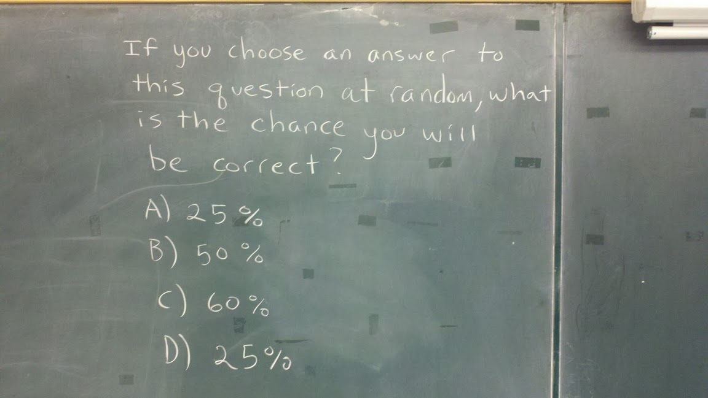
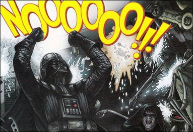
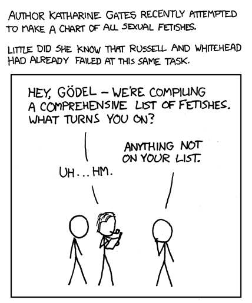

Dicen que al final de sus días Kurt Gödel trataba de demostrar la
existencia de Dios mediante un [razonamiento
ontológico](http://en.wikipedia.org/wiki/G%C3%B6del's_ontological_proof).
En 1960 escribió en sus apuntes sus 
[puntos de vista filosóficos](http://cs.nyu.edu/kandathi/goedel_viewpoint.html), para él
el mundo debía ser racional. Supongo que no habría aceptado los
resultados actuales de las ciencias cognitivas. También se dice que era
un hombre tímido que vivía un tanto angustiado... Me pregunto ¿Cuál
habría sido la respuesta de Gödel [al problema que planteamos el
domingo](http://www.lnds.net/blog/2011/11/desafio.html)?

Acá está de nuevo:

¿En qué estaría pensando el profesor que escribió esto en la pizarra?

Este es un verdadero [ataque de denegación de
servicio](http://es.wikipedia.org/wiki/Ataque_de_denegaci%C3%B3n_de_servicio)
(DOS) al cerebro, ¿no creen? :wink:

Vamos con la respuesta, o al menos la respuesta que supongo espera el
profesor que escribió esto.

La respuesta no es 25%, ni 50%, la respuesta es **B,** claro, ¡estamos
hablando de la respuesta que esperaría un profesor de matemáticas! :smile:

El razonamiento es el siguiente:

Primero hay que considerar que esta es una "meta pregunta", una pregunta
sobre una pregunta. Si en la pizarra estuviera escrito: "para una
pregunta cualquiera con 4 alternativas, ¿cuál es la probabilidad de
elegir al azar la  alternativa correcta?", la respuesta obvia sería 1 en
4, o sea, 25%.

Pero la pregunta es auto referente, es una meta pregunta, recuerden, que
dice: "si usted escoge una respuesta a **esta pregunta** al azar".
Resulta que esta pregunta tiene 2 respuestas que dicen 25% A y D.
Entonces la probabilidad en esta pregunta es 2 sobre 4 (porque cada
respuesta es independiente una de otra), o sea 50%. Entonces la
respuesta sería B: 50%. Lo interesante es que dado que la respuesta
correcta, de la meta pregunta, es sólo una: la opción B, se mantiene el
hecho de que la probabilidad de elegir al azar la respuesta a cualquier
pregunta con 4 alternativas es del 25%!!.

Pero varios no quedan conformes con esta respuesta, ¿verdad? Lo que pasa
es que esta es una pregunta recursiva, un tema que le fascinaba a Kurt
Gödel.

¿Recuerdan la [paradoja de Pinocho](/blog/2010/11/la-paradoja-de-pinocho-y-el-origen-de-la-computacion.html)?
Acá está para los que no se acuerden:

Gödel usó este tipo de expresiones  recursivas para 
[demostrar su famoso teorema de incompletitud](/blog/2010/11/la-paradoja-de-pinocho-y-el-origen-de-la-computacion.html).
Entonces ustedes amigos computines, que han sido programados en la
tradición de la lógica de primer orden, andan buscando paradojas en
todas partes, porque el pensamiento recursivo los lleva por ese camino.

Pero la pregunta de la pizarra no entra en un loop infinito, como la
paradoja de Pinocho, o la famosa sentencia que usó Gödel para demostrar
su teorema. Acá hay dos niveles, lo que permite resolver el problema.

OK, estoy seguro que esto va a generar varias discusiones en los
comentarios, como le ocurrió a Cedric Beust, quien [planteó
originalmente este problema en su
blog](http://beust.com/weblog/2011/10/27/probability-quiz/). La
discusión que siguió en
[G+](https://plus.google.com/108840253750748459271/posts/3g9UvRt4iZi)
sobre esta pregunta es intensa, y bien filosófica, pero estoy con Beust,
creo que la respuesta B tiene el mejor argumento, y por último, [en
algún momento hay que
cortar](http://www.akarru.org/blog/2010/06/nudos-espadas-y-huevos/), por
algo somos ingenieros, y no filósofos, ¿no creen?.

Ahora, ¿que pasa si cambiamos la alternativa C, si en vez de 60% fuera
42?

