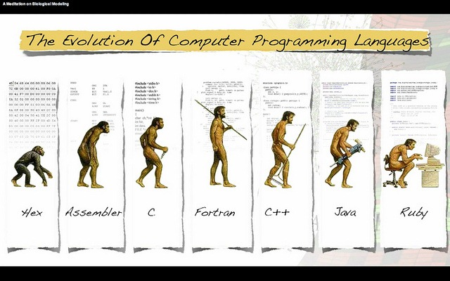

> "De todas las formas de adquirir libros se considera la más gloriosa
> el escribirlos uno mismo" -- Walter Benjamin
>
> "'Ta muy malo el corralero, y allá en el potrero como viejo está. Hay
> que ayudarlo a que muera para que no sufra más." -- Sergio Sauvalle

Esa pareces ser la consigna desde hace unos dos o tres años, java, como
lenguaje de programación, debe dar el paso a lenguajes más modernos.

Cuando uno ocupa durante mucho tiempo una herramienta empieza a
descubrir sus limitaciones, y trata de hacer cambios para mejorarla,
adaptaciones, o derechamente vas a adquirir otra.

Es natural, somos seres tecnológicos, y uno de los elementos que nos
diferencia es nuestro uso de las herramientas. Somos expertos en la
mejora continua de nuestras herramientas, nuestra historia es, en cierto
sentido, la historia de nuestras herramientas.

De todas las herramientas disponibles para un programador el lenguaje es
la más importante. Y vaya que ha evolucionado, aunque no siempre para
mejor :wink:

En 1973 el lenguaje C ya estaba establecido, en 1983 C++ aparece en
escena. Para 1995 la introducción de Java supuso un hito importante en
la historia de la programación. Ya en ese tiempo C++, tenía unos 12 años
y era tiempo de cambiarlo, parece que tenemos este ciclo de 10 a 12 años
para empezar a cambiar lenguajes. ¿Por qué Java sigue con nosotros? (C\#
es una copia, como dijo Gosling[^1], así que no vale[^2]. ¿Y Scala?,
bueno, hablemos de eso más adelante).

La verdad es que Gosling tampoco lo entendió muy bien. Puede ser que C\#
sea una copia, y es porque los negocios lo forzaron a ir en esa
dirección. El diseñador principal de C\# es Anders Helsjberg, famoso por
turbo Pascal, y por Delphi (Object Pascal). Puede que Hejlsberg nunca
haya creado un lenguaje desde cero, pero ha tenido siempre la habilidad
de llevar un lenguaje existente en direcciones muy interesantes e
innovadoras.

Una cosa que hay que entender de la evolución es que no significa
necesariamente progreso. Evolución es adaptación al cambio. En la
evolución se prueban diversas alternativas ante condiciones nuevas, si
funcionan se mantienen, si fracasan se desechan.

La figura de arriba es errada, porque la evolución no es lineal. La
evolución se mueve a través de un árbol, de una estructura mucho más
intrincada, con entrecruzamientos, atavismos, mutaciones, etc.

Cuando algo funciona bien en un nicho puede permanecer sin cambiar por
mucho tiempo. Piensen en el cocodrilo, ¡básicamente es la misma especie
desde hace 84 millones de años!

Entonces hay cosas de Java que han funcionado muy bien, es lo que
llamamos la plataforma Java. Una plataforma que ha permitido crear un
rico ecosistema. En este nicho Java, el lenguaje, se desplaza como un
pesado saurópodo.

Quizás la mayor fuente de las críticas a Java tienen su origen en el
concepto de "**simplejidad**", que identificó muy bien Andres Hejlsberg,
en [esta entrevista](http://www.artima.com/intv/simplexity.html) que le
hizo hace años Bill Venners:

> **Bill Venners**: Una manera en que C\# difiere de Java es en como
> propaga eventos a los objetos interesados. Java usa clases, a menod
> clases internas, que implementan interfaces listeners. C\# usa
> delegates, que son un poco más como punteros a funciones. ¿Por qué
> delegates?
>
> **Anders Hejlsberg**: Déjame hablar primero un poco sobre como veo la
> simplicidad en general. Nadie aragumenta que la simplicidad no sea
> buena, pero la gente define simplicidad de muchas maneras. Hay un tipo
> de simplicidad que me gusta llamar *\*\*simplejidad. \*\**Cuando tomas
> algo increiblemente complejo y tratas de envolverlo en algo más
> simple, a menudo terminas ocultando con un velo la complejidad. No
> diseñas realmente un sistema más simple. En cierto modo lo haces aún
> más complejo, porque ahora el usuario tiene que entender por qué fue
> omitido aquello que ellos necesitarán a veces. Eso es simplejidad. Así
> que para mi, la simplicidad debe ser verdadera, en el sentido de que
> cuando más abajo te internas más simple se vuelve. No debe volverse
> más complicado en la medida que profundizas. Los delegates agregan un
> grado de expresividad que no obtienes con clases o interfaces, por lo
> cual pienso que son importantes. Los lenguajes de programación que han
> estado antes que nosotros han reconocido su importancia. Tienen muchos
> nombres: punteros a funciones, punteros a funciones miembras. En LISP
> tienes closures (clausuras). Eso es de lo que se trata la programación
> funcional cuando se hace bien. Son tremendamente útiles.

La simplejidad es otra forma de rascarse la oreja mal. Veamos un ejemplo,
supongamos que queremos enseñar a programar, lo natural sería partir con
el clásico programa hola mundo.

Consideren la primera clase de Python:

> Para crear un programa muy simple que imprima en pantalla la frase
> "hola mundo", ustedes deben escribir la siguiente sentencia:
> print("hola mundo")
>
> print es una sentencia que toma este texto entre comillas y lo
> despliega en la consola (pantalla), etc.

Ahora piensen el esfuerzo del entrenador de Java:

> Para crear un programa muy simple que imprima en pantalla la frase
> "hola mundo", ustedes deben escribir el siguiente código:
>
> class HolaMundo {
>
> public static void main(String args\[\]) {
>
> System.out.println("hola mundo");
>
> }
>
> Por favor ignoren la sentencia class, ya lo vamos a explicar cuando
> veamos los conceptos de orientacíón a objetos.
>
> Por ahora ignoren que significa public static.
>
> void significa que esta es una función que no retorna ningún valor
> (wait, todavía no les enseño que es una función verdad?)
>
> System.out.println es una llamada a la clase System (ya vamos a
> aprender que es una clase, no se apuren), que tiene una variable
> pública llamada out que ha sido inicializada con la salida estandar
> (la consola, o pantalla).
>
> etc, etc.

Puedo imaginar la confusión de los alumnos, por eso que Java no debe ser
enseñado en los primeros años!

Y que hay de cosas más interesantes, ¿como delegates, o clausuras?
¿funciones de primer orden? Java 7 recién empieza a explorar estos
temas, pero con sintaxis horribles.

OK, pero hay que reconocer que esas cosas vienen de un paradigma
distinto, el paradigma funcional es distinto al paradigma orientado al
objeto sobre el que se basa Java, así que hay que ser justos.

Lo que pasa es que necesitamos incorporar el paradigma funcional,
porque, entre otras razones, porque debemos desarrollar más la
computación paralela. Los procesadores multicore son cada vez más
comunes, y los conceptos de la programación funcional son muy útiles en
este nuevo mundo.

Los nuevos lenguajes serán un híbrido entre los paradigmas funcionales y
orientados al objeto, porque ambos paradigmas tienen características que
deben sobrevivir en las nuevas condiciones y en los nuevos nichos
ecológicos que se abren.

La tendencia actual en el ecosistema de Java (la plataforma) es crear
nuevos lenguajes (Scala, Groovy, Clojure), o adaptar otros (Jython,
JRuby) para la JVM.

Es curioso, cuando .Net nació se decidió diseñarla para que aceptara una
gran variedad de lenguajes. El mismo Microsoft decidió iniciar la CLI
con tres lenguajes: Visual Basic, C\# y un dialecto de C++. La idea era
crear una gran cantidad de lenguajes que se adaptaran a esta plataforma.
A pesar de esto C\# es el lenguaje más usado, y probablemente termine
siendo el que se coma la mayor parte del pastel .Net.

Pero sobre la JVM en el último tiempo ha empezado una verdadera carrera
por crear el sucesor de Java.

[Scala](http://www.scala-lang.org/) es el asalto a los cielos más
rimbombante hasta ahora, seguido por un modesto y más efectivo
[Groovy](http://groovy.codehaus.org/). Otro candidato notablemente es
[JRuby](http://jruby.org/), impulsado por la popularidad de
[Ruby](http://www.ruby-lang.org/). Pero no hay un ganador claro.

Aún así el empeño persiste, tenemos [Clojure](http://clojure.org/), y
[Kotlin](http://confluence.jetbrains.net/display/Kotlin/Welcome), y
[Gosu](http://gosu-lang.org/)!

Pero hay dos adiciones interesantes del último tiempo:
[Xtend](http://www.eclipse.org/Xtext/xtend/), que tiene el respaldo de
[Eclipse](http://www.eclipse.org/) y [Ceylon](http://ceylon-lang.org/)
auspiciado por [RedHat](http://www.redhat.com/).

¡Matemos a Java, para que Java viva! Yo creo que es interesante que se
desarrollen estos lenguajes, veamos que pasa con esta [explosión
cámbrica](http://es.wikipedia.org/wiki/Explosi%C3%B3n_c%C3%A1mbrica),
exploremos estos lenguajes.

Al menos yo voy a ir un paso más allá, y seguir los consejos de Walter
Benjamin, aplicados a los lenguajes de programación, voy a escribir uno,
y espero que ustedes me ayuden, así que atentos.

[^1]: La frase de Gosling, el creador de Java, es: \"The trite answer
is, \'imitation is the sincerest form of flattery\--thank you very much,
but the other answer is, \'You guys (at Microsoft) still don\'t get
it,\' because it\'s sort of Java with reliability, productivity and
security deleted.\" (La respuesta trillada es 'la imitación es la forma
más sincera de adulación', muchas gracias, pero la otra respuesta es
\'ustedes chicos (en Microsoft) todavía no lo entienden', porque es una
especie de Java sin confiabilidad, productividad y la seguridad
eliminada" (fuente: <http://news.cnet.com/2008-1082-817522.html>)

[^2]: Aunque a partir de C\# 2.0 las cosas empezaron a cambiar, y C\#
2.0 salió en 2005!, quizás deberían haberle cambiado el nombre.
