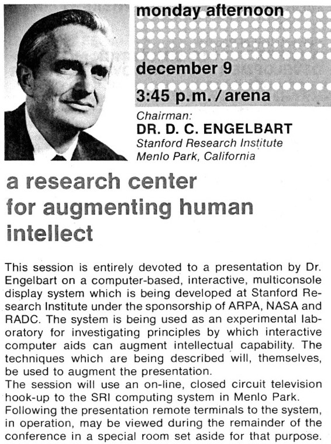
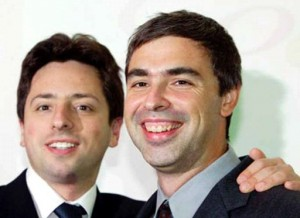

> "La perspectiva aporta 80 puntos al coeficiente intelectual"\
> -- Alan Kay

Originalmente [Alan Kay](/blog/2010/05/alan-kay.html)
había decidido dedicarse a la biología, fue casi por accidente que
terminó dedicándose a la computación. En [una de sus
charlas](http://www.windley.com/archives/2006/02/alan_kay_is_com.shtml)
hace unos años atrás Kay confesaba que si quisiera volver al campo de la
microbiología le tomaría mucho tiempo ponerse al día, dado los increible
avances que ha tenido esa disciplina en esto años. Sin embargo, opina
él, no pasa lo mismo con  las ciencias de la computación, las que le
parecen que se encuentran estancadas.

> "Mucho de lo que está mal en nuestro campo es que muchas de las ideas
> que surgieron antes de 1975 aún son el paradigma actual."

Y Alan Kay lo viene diciendo hace rato, este video de 1997 en la OOPSLA
muestra lo que se podía hacer con computadores en 1972 (la demo aparece
a los 3 minutos 40 segundos):

El mouse, una de las *grandes innovaciones* de la década del 80, fue
originalmente presentado por Douglas Engelbart en [La Madre de Todas las
Demos](http://www.dougengelbart.org/firsts/dougs-1968-demo.html), en
1968. En esa mítica demostración, aparte del mouse, se mostró por
primara vez el uso de las redes de datos, la tele conferencia (con
video), el correo electrónico, el hipertexto, la edición colaborativa en
tiempo real de texto (¿alguien mencionó Google Buzz Wave?).

Toda la inspiración para el trabajo de Engelbart venía del artículo de
Vannevar Bush "As We May Think", de 1945. Muchos de ustedes
seguramente no lo han leido, [aquí
está](http://www.theatlantic.com/magazine/archive/1945/07/as-we-may-think/3881/).

En ese largo artículo aparece el concepto de
[Memex](http://en.wikipedia.org/wiki/Memex),  un dispositivo que
anticipa la idea de  nuestros computadores usando hipertexto para
navegar en la información, conceptos que fueron los fundamentos de la
World Wide Web de Tim Berners Lee.

En 1992 [Michael Buckland
critica](http://people.ischool.berkeley.edu/~buckland/goldbush.html) la
visión de Vannevar Bush, por considerarla incompleta y no entender "la
ciencia de la información", al tener  una mala opinión de los indices y
esquemas de clasificación: "Bush piensa que la creación de asociaciones
arbitrarias entre registros individuales era la base de la memoria, así
que quería \'mem(oria)-ex\' o \'Memex\' en vez de Index (indice). El
resultado era un diseño personalizado, pero contraproducente."

Si miran los primeros esfuerzos de clasificar la información de la web,
todos persistían en la idea de que había que indexar la información,
parecía como que nadie consideraba el valor intrínseco de los
hiperenlaces, que preconizaba Vannevar Bush. Buckland había logrado
imponer "la visión correcta de la ciencia de la información".

La revolución en la búsqueda, la verdadera innovación de esa época, vino
del trabajo de Larry Page y Sergei Brin, con su concepto de PageRank,
que valora intrinsecamente  las ideas de Vannebar Bush, y desafía el
convencionalismo de la "ciencia de la información" de Buckland.Page y
Brin adoptaron  una perspectiva distinta a  sus competidores y con eso
triunfaron.

Los grandes avances en informática han venido de esa manera. Pero el
resto, sólo siguen mejorando y optimizando problemas ya resueltos. Pocos
informáticos se preocupan de estudiar su pasado y vuelven a repetir una
y otra vez los errores, o simplemente vuelven a crear la rueda.

Seguimos estancándonos, una vez que damos un pequeño paso, nos quedamos
en un loop de micro optimizaciones, sin dar saltos cuantitavos
importantes, eso es lo que reclama Alan Kay, y en gran parte tiene
razón.

Hoy en día tenemos muchos  "Bucklands", sobretodo en la academia, que
nos dicen que este, o aquel es el paradigma correcto,  y cancelan todo
intento de abordar los problemas desde otra perspectiva.

Todo avance tiene que romper con lo establecido. Es necesario mirar
hacia atrás, entender y asumir lo que se nos ha legado.  Salir de los
estrechos senderos que nuestros maestros nos han trazado. En definitiva,
asumir siempre  nuevas perspectivas, para recién estar en condiciones de
innovar.

