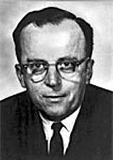

> **Washington D.C. 23 de Abril de 1963**
>
> **Memorandum**
>
> **Para: Los Miembros y Afiliados de La Red Intergaláctica de
> Computadores De: J. C. R. Licklider\
> Asunto: Tópicos para Discusión en la Próxima Reunión**

Así empezaba uno de los documentos más interesantes, y problablemente
muy influyente, en la historia de la tecnología, el famoso [Memorandum a los miembros de la red intergaláctica de computadores](http://www.kurzweilai.net/memorandum-for-members-and-affiliates-of-the-intergalactic-computer-network),
de Joseph Carl Robnett Licklider.

Cuando leí este memorándum(1) me encontré con un caso de uso que
describe la necesidad de sistemas operativos distribuidos, de definir
"lenguajes" que permitan la interoperabilidad entre sistemas diversos,
RPC, ejecución remota de procesos, la descripción de una arquitectura
orientada a servicios, integración entre múltiples lenguajes de
programación (un programa en Fortran puede invocar rutinas escritas en
Algol que se encuentran disponibles en otra máquina en algún punto de la
red), la descripción de las máquinas virtuales (en el sentido de la JVM,
o el CLR de .Net), bibliotecas de carga dinámica en tiempo de ejecución
(DLLs, .so), ¡el concepto de MashUp!, el concepto de  la computación en
la nube (es transparente para el usuario en que nodo de la red se ejcuta
una tarea) y un sinfín de otros elementos, algunos que recién estamos
desarrollando. Por favor léanlo, [acá está](http://www.kurzweilai.net/memorandum-for-members-and-affiliates-of-the-intergalactic-computer-network).

Lo más importante es que este memorandum, y la inspiración e influencia
de Licklider sobre Ivan Sutherland, y Robert Taylor fueron los
motivadores para la creación de ARPANET y posteriormente Internet. Hay
una linea que va desde Vannevar Bush hasta Tim Berners Lee, y pasa por
Licklider.

Pero Licklider tenía un visión que está en parte plasmada en ese memo,
pero que es más detallada en un artículo de 1960, publicado en la IRE
Transactions on Human Factors in Electronics, que se llama "[Man
Computer
Symbiosis](http://www.columbia.edu/~jrh29/licklider/man-computer_symbiosis.html)"
(Simbiosi*s Hombre Computadora)*

> *Simbiosis*

*La higuera es polinizada únicamente por el insecto
Grossorun Blastophaga. La larva del insecto vive en el ovario de
la higuera, y allí obtiene su alimento. El árbol y el insecto son, por
lo tanto, en gran medida interdependientes: el árbol no se puede
reproducir sin el insecto, el insecto no puede comer sin el árbol.
Juntos constituyen no sólo una viable, sino que una productiva
asociación. Esta cooperativa "de vivir juntos en asociación íntima, e
incluso cercana unión, entre dos organismos diferentes", se llama
simbiosis.*

> *La "simbiosis hombre-computadora" es una sub clase de los sistemas
> hombre máquina. Hay muchos sistemas hombre-máquina. En la actualidad,
> sin embargo, no hay simbiosis hombre-computadora. El propósito de este
> artículo es presentar el concepto, y  speramos,  promover el
> desarrollo de la simbiosos hombre-computadora analizando algunos
> problema de la interacción entre los hombres y las máquinas de
> cómputo, llamando la atención sobre principios aplicables a la
> ingeniería hombre-máquina, y apuntando algunas preguntas para las que
> se necesitan respuestas e investigación.(\*)*

A esta visión Licklider la llamaba Machine-Aided-Cognition (MAC), y se
materializó en un proyecto en el MIT, el Proyecto MAC, que incluía el
desarrollo de un sistema operativo que implementara el concepto de
multitarea (multitasking), sistemas de archivos (filesystems), políticas
de respaldo regulares, tiempo compartido, ambientes multi usuarios. De
hecho, C y Unix fue una reacción de llevar a  cabo de forma más simple
este programa de Licklider (¿recuerdan [peor es
mejor](/blog/2010/05/peor-es-mejor.html)?).

Licklider fue un inspirador, un hombre que tuvo la oportunidad de
liderar, y contactar a un conjunto de mentes brillantes, su red
intergalactica, era una red de personas que bajo la influencia de este
pensador hicieron grandes aportes a la tecnología de información, desde
el PC, hasta internet, en todas esas tecnologías está la influencia de
las ideas de Licklider. A eso llamo yo motivar.

Notas:

(\*) Prometo que un día voy escribir algo sobre esste paper  de
Licklider, porque es muy interesante.

\(1\) Conocí la historia de Licklider a través de este [notable
post](http://www.moserware.com/2008/05/who-is-this-licklider-guy.html)
de Jeff Moser.
