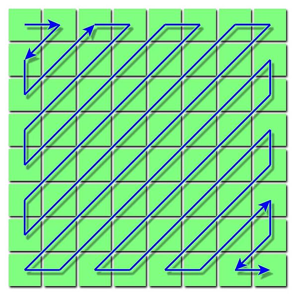

 
Dado el éxito que ha tenido [un simple test](/blog/2010/12/un-simple-test.html), 
voy a re editar un desafío que lancé hace 2 años, se aceptan respuestas (esa vez
llegó sólo una respuesta, y estaba mala :()

Producir un arreglo zig-zag.

Un arreglo zig-zag es un arreglo cuadrado de los primeros N2 enteros,
donde los números van ordenados de menor a mayor distribuidos en forma
de zig zag a lo largo de las anti diagonales de la matriz (ver la
figura).

Por ejemplo, si N es 5, el programa debe producir este arreglo:

0   1   5   6  14\
2   4   7 13  15\
3   8 12 16  21\
9 11 17 20  22\
10 18 19 23  24

No hagan trampa, no busquen la respuesta en google, o stackoverflow,
piensenla  y escríbanla en su lenguaje de programación favorito,
mientras más exótico el lenguaje mejor, capaz que tenga premio ;)

-   Aunque esto puede parecer un juego de ingenio, un tanto inútil, la
    verdad es que este tipo de arreglos es usado en el algoritmo de
    compresión de imágenes JPEG.

