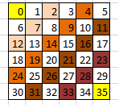
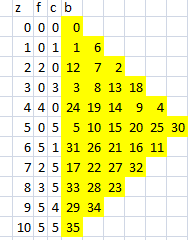

Han habido varias contribuciones al desafío del Zig Zag, si todavía no
lo has leido, y te animas a contestar el test, entonces antes de
seguir [lee el desafío](/blog/2011/01/un-test-mas-dificil.html) e
intenta resolverlo.

La solución más concisa que conozco aparece en el sitio [Rosseta
Cod](http://rosettacode.org/wiki/Zig-zag_matrix)e, está escrita en el
[lenguaje J](http://www.jsoftware.com/) y es la siguiente:


>      ($ [: /:@; <@|.`</.@i.)@,~ 5

Increible, ¿verdad? En este caso es la solución para una matriz de 5 x 5. Hay una explicación de ese código
[acá](http://rosettacode.org/wiki/Talk:Zig_Zag#reading_the_J_examples),
pero antes de que emprendan la tarea de tratar de entenderla veamos que
respondieron algunos lectores y después le voy  a mostrar mi solución.

Si tuviera que elegir 3 finalistas me gustan las soluciones de  de [Luis
Cárdenas](/blog/2011/01/un-test-mas-dificil.html#comment-959)
(en perl), la de [Javier
Rovegno](http://code.activestate.com/recipes/577536-un-arreglo-zig-zag-es-un-arreglo-cuadrado-de-los-p/)
(en python) y la de [Francisco
Rojas](https://gist.github.com/772690/b5ca761dd6d7919790ea7103f70c430d217da3b1)
(en Java). En particular, creo que la más sucinta es la de Francisco,
Luis hizo una optimización interesante y queda en segundo lugar.

La solución de Javier es representativa de la estrategia más común, que
es usar una suerte de cursor que indica hacia donde hacer la siguiente
movida, las otras soluciones siguen ese esquema, pero la de Javier me
parece las más legible de las de este tipo.

La solución de Francisco Rojas me sorprendió por su brevedad, 28 lineas
en Java. La clave está en que Francisco intuyó una propiedad de las
diagonales y las antidiagonales, que vamos a aclarar en breve.

Ahora les voy a explicar como yo solucioné el problema, esta solución no
necesariamente es la más óptima (hay varias soluciones mejores en
[Rosseta Code](http://rosettacode.org/wiki/Zig-zag_matrix)), pero tiene
dos características interesantes, no hay ningún if en el algoritmo, y
usa un arreglo de una dimensión para simular la matriz.

El código completo, escrito en C++, va más abajo, acá van las dos
funciones que implementan el algoritmo:

```c++
    void zigzag(int* array, int n)
    {
        int c = 0;
        int d = 1-n;
        int k = n;
        int n2 = 2*n;
        int z;

        for (z = 0; z < n; z++, d = -d, k = n/k)
        c = run_diag(array, z*k, z+1, d, c);

        for (; z < n2; z++, d = -d, k = n/k)
        c = run_diag(array, z*k+d*(z+1-n), n2-(z+1), d, c);
    }

    int run_diag(int* array, int base, int top, int delta, int cont)
    {
        for (int i = 0, l = base; i < top; i++, l += delta)
            array[l] = cont++;
        return cont;
    }
```

Para entender esto fíjense en la siguiente figura:



Lo que hace esta figura es escribir en cada cuadrado la suma de sus
coordenadas. En la figura las antidiagonales son blancas, y las
diagonales son de colores. Las diagonales  "suben" y las
antidiagonales "bajan", si se fijan las diagonales son pares, y las
antidiagonales son impares.

Acá está el cuadrado zig zag de 6x6:



Con esto se puede optimizar varios de los algoritmos que propusieron los
lectores.

El paso siguiente es que yo considero que voy a usar un arreglo de una
sola dimensión, entonces si recorriera la matriz como arreglo cada
coordenada esta dada por un número correlativo:



Por lo tanto, si recorriera la matriz a lo largo de las diagonales y
antidiagonales, para una matriz de N x N tendré 2N-1 diagonales que
recorrer, y por cada diagonal se recorreran las casillas en el orden que
sale en la figura:




En esta figura z es la diagonal (para una matriz de 6x6 son 11 diagonales,
numeradas de 0 a 10), f y c son las filas y columnas iniciales de la
diagonales, b indica la base, o primer indice de la diagonal.

Veamos la diagonal 4, como es diagonal entonces "sube", por lo tanto
parte de un indice alto (24) y termina en un indice bajo (4). La
antidiagonal 5 "baja", por lo tanto parte de un indice bajo (5) y
termina en un índice alto (30). Por lo tanto en el caso de las
diagonales el paso (delta) es negativo y vale -5 (1-N). En el caso de
las antidiagonales el paso es positivo y vale 5 (N-1). Esto explica la
variable d que cambia de signo en los dos loops.

Lo otro es que cada diagonal tiene una cantidad de elementos que va en
aumento hasta llegar a la diagonal de la mitad (N-1) y después empieza a
disminuir, eso explica la variable top que recibe la función
run\_diag(). También explica por que tenemos dos loops, y nos permite
eliminar los if.

Les queda propuesto deducir como llegué a los otros valores.

Un par de trucos que se usaron, para calcular el valor b (base), que
corresponde al indice inicial de cada diagonal (antidiagonal) se usa una
variable k que tiene dos valores posibles: 1 y n, por eso que se parte
con k = n y luego hace k = k/n en cada ciclo del for. La variable c es
el contador que va creciendo de 0 a (N\*N-1), se pasa como parámetro y
se retorna como resultado, esto para usar un estilo más funcional, se
podría haber dejado como una variable global, o pasar por referencia.

Espero haber explicado bien la solución, sino para eso están los
comentarios.

Una cosa interesante es que a partir de esto es fácil generalizar para
el caso de una matriz de NxM (¿alguien se anima a hacer los cambios?).

A continuación el código completo:

    #include <stdlib.h>
    #include <stdio.h>

    int run_diag(int* array, int base, int top, int d, int cont);

    void zigzag(int* array, int n)
    {
        int c = 0;
        int d = 1-n;
        int k = n;
        int n2 = 2*n;
        int z;

        for (z = 0; z < n; z++, d = -d, k = n/k)
            c = run_diag(array, z*k, z+1, d, c);

        for (; z < n2; z++, d = -d, k = n/k)
            c = run_diag(array, z*k+d*(z+1-n), n2-(z+1), d, c);
    }

    int run_diag(int* array, int base, int top, int delta, int cont)
    {
        for (int i = 0, l = base; i < top; i++, l += delta)
            array[l] = cont++;
        return cont;
    }

    void print_array(int* p, int n)
    {
        for (int i = 0; i < n; i++) {
            for (int j = 0; j < n; j++)
                printf("%2d ", *p++);
            printf("\n");
        }
    }

    int main(int argc, char* argv[])
    {
        if (argc != 2) {
            fprintf(stderr, "uso: zigzag N\n");
            return -1;
        }

        int n = atoi(argv[1]);
        int* array = (int*) malloc(n*n*sizeof(int));
        zigzag(array, n);
        print_array(array, n);
        return 0;
    }

Gracias a todos los que han participado. Pronto publicaré otros
desafíos.
