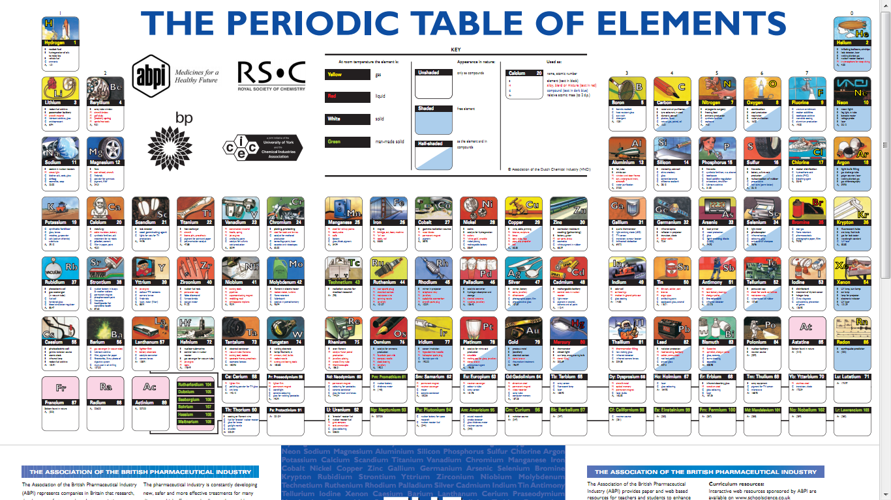
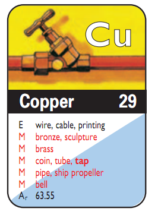
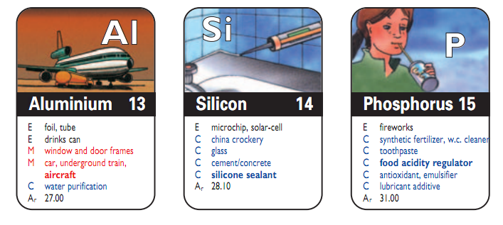

Esto es algo que no conocía, y que se publica desde el año 2005, se
trata de la tabla periódica de los elementos orientada a sus
aplicaciones.

La idea es colocar en cada espacio de la taba  una ilustración que
muestra objetos de la vida cotidiana donde se aplica el elemento químico
respectivo:

Por ejemplo, acá tenemos al Cobre (Cu):

Y acá al Aluminio (Al), Silicio (Si) y Fósforo (P):

La tabla está disponible gratuitamente, la pueden descargar
desde [acá](http://www.abpi.org.uk/publications/pdfs/Periodic-table-2005.pdf),
y fue publicada por la industria química y farmaceutica inglesa, entre
los auspiciadores está British Petroleum (ouch).

En todo caso encuentro que es una genial forma de difundir el
conocimiento, sería genial contar con una visualización así en nuestro
idioma, ¿no creen?.
