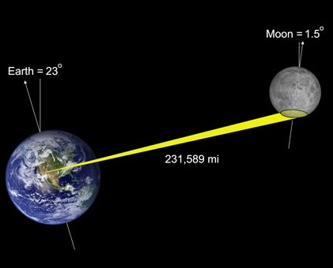
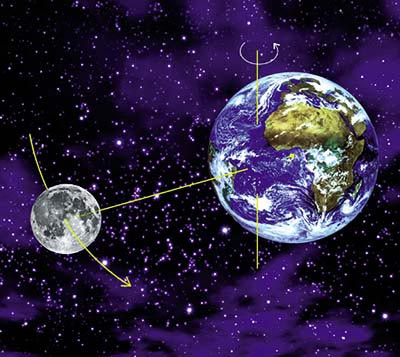
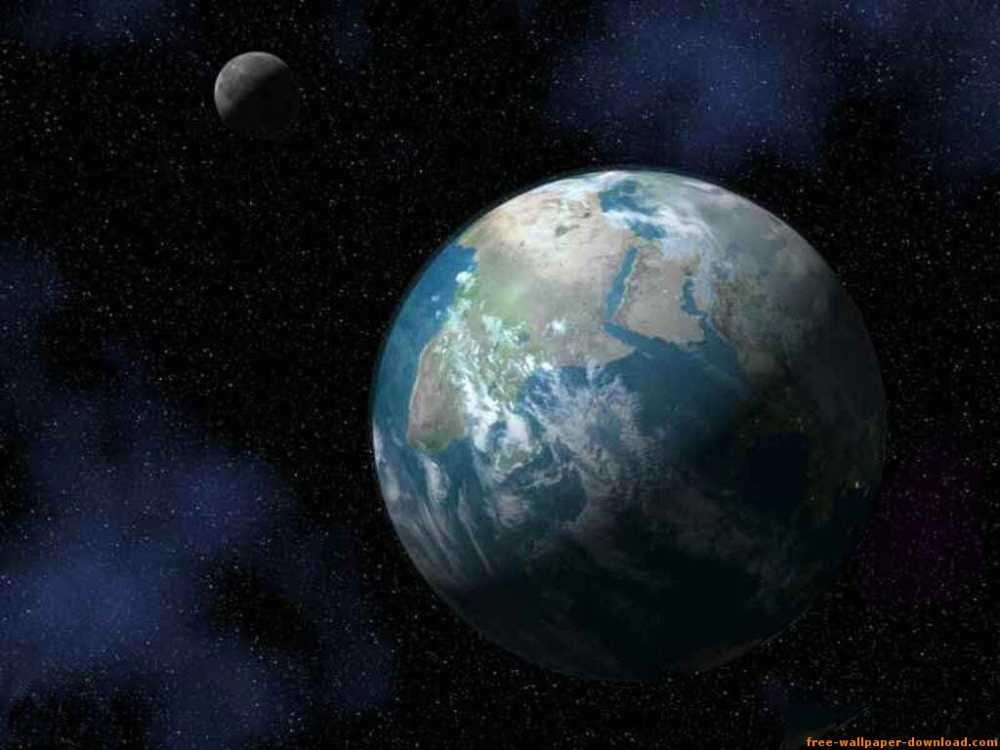

Este video es interesante, porque representa un error de estimación, que
parece ser bastante común, y que quizás tenga su origen en la educación
que recibimos.



En el video se le entregan 2 pelotas a las personas y se les pide que
representen la distancia relativa entre la tierra y la luna.

(vía [En Resumidas Cuentas](http://eduardoe.tumblr.com/post/3457865131/la-luna-no-esta-tan-cerca),
[amazing.es](http://amazings.es/2011/02/23/la-luna-no-esta-tan-cerca/) y
sobre todo [Recuerdos de Pandora](http://recuerdosdepandora.com/ciencia/astronomia/distancia-entre-la-tierra-la-luna/))

El diametro de la tierra (que [se puede calcular con un sencillo experimento](http://web.educastur.princast.es/proyectos/fisquiweb/AIA/eratostenes.htm))
es de aproximadamente 12.700 kilómetros.

Hay un segundo luz entre la tierra y la luna aproximadamente (la luz
demora un segundo en llegar desde la superficie de la tierra), como la
[velocidad de la luz](http://es.wikipedia.org/wiki/Velocidad_de_la_luz)
es de 300.000 kilómetros/segundo, nos da que la distancia entre tierra y
luna es de unos 24 diámetros de la tierra.

Las pelotas de basquetbol tienen un diámetro de 24 centímetros, la
distancia entre las representaciones de la tierra y la luna sería de
5,76 metros. Esos son entre 7 u 8 pasos, dependiendo de la estatura de
la persona (el presentador da 10 pasos).

Algunas ilustraciones de la distancia Tierra-Luna que inducen a este
error:

