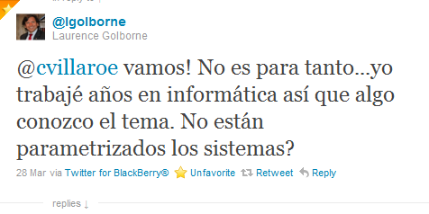
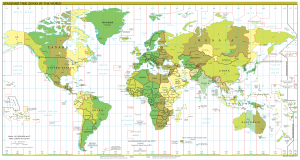

En Chile en estos momentos coordinar una reunión, usando tecnología por
supuesto,  es un
[caos](http://www.theregister.co.uk/2011/03/29/chilean_clocks/).

Coordinamos con un amigo una reunión almuerzo para las 13:00, él
despacha la citación para las 13:00, con su móvil Android, coordinado
con  Google Calendar. Mediante una intrincada red de transacciones llega
a mi empresa, que usa Microsoft Exchange, y de ahí mediante un
[servidor BES](http://en.wikipedia.org/wiki/BlackBerry_Enterprise_Server) a mi
Blackberry. ¿El resultado de toda esta coreografía de interoperabilidad?
En la agenda de mi teléfono la reunión queda fijada a las 14:00 horas,
en el outlook del pc de mi empresa a las 13:00 horas, y lo más curioso
es que por alguna razón, mi amigo recibe un email automático confirmando
que la reunión ha quedado aceptada y agendada para las 17:00 horas!!

No sé que zona horaria tiene configurado mi colega en su android, pero
yo tuve que configurar mi Blackberry a la zona de Montevideo para que
las cosas anden relativamente bien. No tengo idea cómo están los
servidores exchange, ni el BES. Lo que sí sé es que 
[Google deja el problema al usuario](http://googleamericalatinablog.blogspot.com/2011/03/google-calendar-y-el-horario-de-chile_29.html)
(así con el cloud computing). Que todo el mundo anda coordinando por
teléfono o colocando la hora en "mensajes fuera de banda". Que
[Microsoft declara](http://blogs.technet.com/b/latam/archive/2011/03/29/updated-chile-dst-changes-2011.aspx)
que  no hay tiempo para desplegar un parche que sea transparente para
los usuarios.

Y el ministro dice que esto no es un gran problema, que no sería más que
cambiar algún parámetro, porque ustedes son informáticos inteligentes y
tienen todo parametrizado, ¿no?. Simpático el ministro.

Pero no es tan así, el problema no son solamente calendarios y reuniones
descoordinadas.

-   Aún hay muchos computadores no actualizados, porque no hubo tiempo
    para aplicar los parches a miles de servidores. Bueno ahora hay un
    poco de tiempo, que bueno, a ver si terminan estos sysadmins.

-   Muchos usuarios no saben aún que hacer con sus teléfonos, y
    computadores personales, seguirán con ese problema hasta mayo, y
    volverán a tener problemas en agosto.

-   Sistemas de Reloj Control que están registrando horas extras, u
    horas de atraso, supongo que la gente que trabaja en recursos
    humanos van a estar felices cuadrando a fin de mes (y los
    desarrolladores de estos sistemas aún más, al menos cobrarán las
    horas extras para "arreglar el sistema" :)

-   Sistemas de control de tráfico aéreo, transporte y
    telecomunicaciones.

-   Procesos que han tenido que ser reconfigurados porque depende de
    ciertas horas para operar, acá si que es probable que haya que
    modificar parámetros, pero hay que hacer esa tarea, multiplicada por
    miles de servidores, tenemos muchas horas hombre, valiosas, gastadas
    en tareas innecesarias.

-   Timestamping de transacciones (y que pasa con las transacciones que
    interoperan con sistemas fuera de nuestro país?)

-   Aplicaciones en la nube alojadas en otros países que asumen que
    nuestro timezone se comporta de acuerdo a lo establecido.

-   Si algún astuto sysadmin había programado un script para que sus
    servidores regularizaran las horas este fin de semana, bueno, ya
    saben en qué está.

-   Lo peor es que tendremos que repetir todo este molesto ejercicio en
    agosto.

**Actualización**: Para que se entienda, el principal problema es de
infraestructura y operacional, no de un mal diseño del software, como ha
dicho [un comentarista más
abajo:](#comment-1322)
"el software NO PUEDE ADIVINAR que el gobierno de turno decide poner el
horario de verano en invierno."

Hay personas que estiman que esto es problema trivial, puesto que a lo
más hacen un click en el reloj de su pc personal(\*), o algo por el
estilo, que todo esto es una simple pataleta de computines.

La verdad es que tenemos poco tiempo para operar las infraestructuras
como para andar perdiendo tiempo "cambiando parámetros horarios". Yo
quiero que mis sysadmins estén preocupados de operar los sistemas y no
perdiendo tiempo bajando parches y reconfigurando sistemas y servidores
que ya estaban programados para cambiar automáticamente.

Y todo por una medida con intenciones poco claras, que no aporta ningún
sólo kilowatt adicional de energía.

**El tiempo es una convención.**

Este diagrama, tomado de [esta interesante
página](http://www.shedrupling.org/activist/heure/heure.php?lang=en&e=b&j=1&f=&),
muestra el tiempo solar. Recordemos que la idea era dividir el día en 24
horas, de modo tal que al mediodía el sol estuviera en el cenit (el
punto más alto del cielo):

Lo que muestra el diagrama es que en verano y en invierno la cantidad de
horas de luz varían, pero siempre tenemos el sol al mediodía en el punto
más alto, así deberían ser las cosas, pero eso implica que tenemos que
levantarnos más temprano para ir a trabajar. Así que lo que se hace es
ajustar el horario solar con el horario legal, acá está el ejemplo de
Francia, y que es similar a como lo hace  Chile:



Ajustamos nuestros relojes para que el sol salga cerca de las 7:00 y
volvamos a casa cerca de las 21 horas. Esto produce que el sol alcance
el cenit  cerca de las 14:00 horas (la hora de más luz y calor). Pero no
importa lo que hagamos la cantidad de horas disminuirá en invierno, por
eso que atrasamos el reloj.

Lo que hacemos es que en verano nos desplazamos 2 horas del horario
solar, y en invierno sólo una hora.

¿Y si dejaramos todo el año con el mismo horario, este de verano, UTC -
3?

Les pido que miren el segundo diagrama en la parte inferior, donde se
muestra el horario de invierno y desplacen las horas a la izquierda,
fíjense en lo que pasa al llegar a pleno invierno.

No tengo el tiempo para modificar el dibujo, pero no cuesta nada darse
cuenta que si mantuvieramos el horario de verano (UTC-3) durante todo el
año, en pleno invierno saldríamos en la mañana con mucha oscuridad y
cerca de las 19:00 horas ya estaría oscuro, no mucho mejor de lo que
pasa con UTC -4.

Si dejamos UTC-4, pasa lo contrario, en el verano el sol se pondría más
temprano, cerca de las 20:00.

La decisión no es fácil. Pero, ¿y si cambiaramos el horario de trabajo,
en vez de la hora? ¿Qué pasaría si ajustaramos nuestro horario de
trabajo a lo más natural, que es trabajar de acuerdo a la disponibilidad
del sol?

Que podemos notar hasta ahora:

1.  Nuestra hora no es la hora que calza con el horario solar, que es la
    base de la definición del [tiempo universal
    coordinado](http://es.wikipedia.org/wiki/Tiempo_universal_coordinado)
    (o sea en Greenwich al mediodía el sol está en el cenit, en Chile
    no, eso pasa a las  13 horas en invierno, y a las 14 en verano).
    Deberíamos ser UTC-5 (ver el mapa que puse arriba).

2.  La decisión de ganar más horas de luz en verano es racional, pero
    prolongar el horario de verano no aporta mucho, y menos mantener
    este horario durante el invierno, es más sensato mantener el sistema
    de cambio de horario, pero no jugar con este.

3.  La idea de mantener un sólo horario todo el año también es racional,
    aunque es mejor que esté más ajustada al horario solar, porque sería
    el más eficiente, es decir, lo ideal sería UTC-5, pero sino es
    preferible UTC-4

**Ahorro de energía**

El argumento es que con esto se ahorra energía y disminuye la
delicuencia. Ya hemos visto que extender el horario de invierno no hace
que se creen más horas de luz, y la delincuencia ocurre a cualquier
hora, no es que los delincuentes sean lechuzas (y no hay tanta
delincuencia en Chile).

Pero veamos que pasa con lo del ahorro de energía. Lo que se podría
ahorrar es en luz, pero hay muchos elementos eléctricos que consumen
mucho más que se usarán igual en horario nocturno: secadores de pelo,
micro ondas, televisores, computadores, etc. El ahorro de luz es muy
menor a lo que se consume en otras cosas. De hecho, no hay demostración
de que se logren ahorros significativos con esta medida.

Esto debería estudiarse mejor, eso es lo que [varios
decimos](http://www.alejandrobarros.com/content/view/1432514/Cambio-de-hora-requiere-evaluacion-mas-profunda.html),
pero no puede ser decidido en base a corazonadas y supuestas
tendencias. Si es por especular digamos que los costos informáticos
pueden ser tanto como lo que se gana en ampolletas apagadas, ¿quién
puede argumentar en contra, si nadie presenta evidencias?.

En un ejercicio que hizo  un amigo llegó a un costo de unos 3 millones
de dolares en términos del costo que significa "parchar" la
infraestructura TI en Chile por esta medida, yo creo que se quedó corto.
En USA el estado de Indiana, con 6 millones de habitantes, estimó que el
gasto adicional por implementar el horario de verano fue de 8.6 millones
de dólares ([tomado del Wall Street
Journal](http://online.wsj.com/public/article/SB120406767043794825.html)).

La verdad es que no se ven estudios que determinen si hay ahorro con el
horario de verano, y no creo que vayan a hacer uno para el próximo año
(ojalá alguien me desmienta y muestre cifras y estudios serios).

En resumen, parece que no ganamos nada con estas medidas en términos de
eficiencia energética, todos los argumentos a favor tienen una base bien
endeble, y los perjudicados son los informáticos.

Jugar con el cambio de hora  produce otros costos derivados de nuestra
dependencia tecnológica y el grado de interoperabilidad que está
alcanzando. Hoy los sistemas son más complejos y más interconectados, lo
que hace que estas operaciones de cambio de hora,que eran simples hace
años atrás, ya no lo sean (hay más computadores, más servidores, más
gente afectada).

Si al analizar con un poquito de profundidad esta medida notamos que
parece que no se logra un gran impacto, si parece bastante irracional,
¿por qué se hace?

Sí ministro, la hora es un parámetro, pero un parámetro tan importante,
y de tanto impacto para la interoperabilidad de nuestros complejos
sistemas actuales que jugar con él es costoso, probablemente más de lo
que se sospecha. Yo tengo una sensación sobre los costos en
infraestructura TI de jugar con este parámetro, podría hacer un cálculo
estimativo, pero me gustaría ver primero los ahorros que se lograrán con
esta medida. Lo que hace un ingeniero es responder si los ahorros serán
mayores a los costos y ahí toma la decisión, es lo racional, es lo
adecuado, no seguir corazonadas. Eso haría un buen administrador, a
menos que hayan otras variables de las que no sabemos nada.

Notas:

1.  Mapa de zona horaria tomado de wikipedia.
2.  Las otras imágenes fueron creadas por [Richard
    Tigraux](http://www.shedrupling.org/perso/RT/profoi.php?lang=en&j=1&e=b#qui_je_suis),
    en su sitio [THE TRUTH ON DAYLIGHT SAVING
    TIME](http://www.shedrupling.org/perso/RT/profoi.php?lang=en&j=1&e=b#qui_je_suis).

(\*)  No falta el "power user" que piensa que basta con hacer *"apt-get install tz-data"*.
