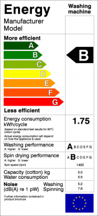

En 1865 el economista inglés William Stanley Jevons observó que las mejoras
tecnológicas que incrementaban la eficiencia en el uso del carbón llevó
al aumento en el consumo de este mineral. Jevons argumentó que,
contrario a la intuición común, las mejoras tecnológicas no provocarían
una reducción del consumo de combustible.

La **paradoja de Jevon**s, o el **efecto Jevons**,  dice que, en la
medida que se perfecciona la tecnología que aumenta la eficiencia del
uso de un recurso, lo más probable es que aumente el consumo de dicho
recurso, en vez de disminuir.

En términos simples, motores más eficientes, mayor consumo de
combustible. ¿Eficiencia energética? A mayor eficiencia energética mayor
consumo, y necesidad de nuevas fuentes de generación de energía (como
represas, centrales termoeléctricas, etc.)

Matemáticamente:

> Si Ef \> Ei entonces Cf \< Ci, pero Ci \* Ei \* Ni \<\< Cf \* Ef \* Nf
>
> -   E: es la eficiencia del consumo
>
> -   N: es el número de consumidores
>
> -   C: El consumo instantáneo
>
> -   i: indica el estado inicial, f el estado final.

Los economistas lo llaman paradoja porque va en contra de la intuición
económica de que mayor eficiencia implica menor consumo.

Un simil se da en el manejo de la información, a mayor eficiencia en el
manejo de la información mayor demanda para procesar información, y
mayor generación de nueva información, que requiere ser procesada. "Los
computadores en vez aliviarnos el trabajo terminan haciéndonos trabajar
más" :wink:

En los ochenta, en los primeros lugares donde trabajé, había 1 ó 2
computadores. Hoy todo el mundo tiene uno. El consumo de energía por
concepto de informatización y apoyo a las labores administrativas
aumento en uno o dos órdenes de magnitud.

En la década de 1980, los economistas Daniel Khazoom y Leonar Brookes
postularon que: _"las mejoras de eficiencia energética, que por
amplias consideraciones, son económicamente justificadas al nivel micro,
llevan a altos niveles de consumo de energía a nivel macro."_

El postulado de Khazoom-Brookes fue analizado por 
[Harry Saunders](http://www.allbusiness.com/utilities/339669-1.html) en 1992,
quien encontró las condiciones bajo las cuales esta hipótesis es cierta,
siguiendo el análisis de 
[teoría de crecimiento económico neo clásico](http://es.wikipedia.org/wiki/Modelo_de_crecimiento_de_Solow).

O sea, la idea de que la eficiencia  es la solución para nuestros
problemas de consumo de energía es de dudosa validez. La única forma de
disminuir el aumento del consumo de energía sería achicando la economía,
es decir, dejando de crecer. Otra manera es interviniendo directamente
en el mercado para regular el consumo, con impuestos, por ejemplo.

Hay economistas que sugieren que lo que se debe hacer es aplicar
impuestos al consumo energético los que pueden ser re invertidos en la
rehabilitación de *"capital natural".*

Lo que el efecto Jevons nos dice es que la sola idea de eficiencia
energética no es suficiente, y que las políticas de energía sustentable
necesitan de otros tipos de intervenciones gubernamentales.

La pregunta es si las autoridades están conscientes de este efecto, y si
los que promueven la eficiencia energética como la única solución para
el problema también.

Por cierto, esto se manifiesta en el efecto rebote, que preocupa a
varios economistas, y por cierto a grupos  como el 
[BreakThrough Institute](http://thebreakthrough.org/index.shtml), que publicó en
febrero [un reporte](http://thebreakthrough.org/blog/2011/02/new_report_how_efficiency_can.shtml)
donde estudia este fenómeno.
