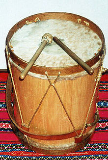
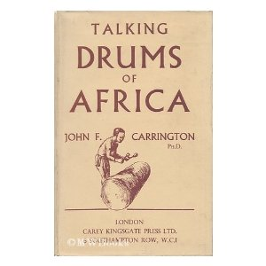

> "El problema fundamental de la comunicación es el de reproducir en un
> punto, ya sea exacta o aproximadamente, un mensaje seleccionado en
> otro punto. Frecuentemente los mensajes tienen significado." \
> -- Claude Shannon

Cuando adolescente me regalaron un **bombo legüero**, que aún conservo. Se
llama legüero porque se dice que, con las condiciones adecuadas, su
sonido se puede escuchar a una legua de distancia (entre 4 a 5
kilómetros).

El tambor es una antigua forma de comunicación. Tenemos campanas, y
otros tipos de instrumentos de percusión, como los triángulos o el gong,
que nos permitieron indicar acontecimientos mediante señales: ¡fuego!,
¡es hora de comer!, ¡vienen los realistas!, etc. Los ejércitos
aprendieron a hacer señales asociadas a redobles, y así. Pero la más
notable de todas estas formas de comunicación son los tambores parlantes
africanos.

## **Tambores que hablan**

No era simple hablar con tambores:

> El tamborilero no diría, "Vuelve a casa", sino que más bien,
> "Haz que tus pies vuelvan por el camino por el que fueron, haz que tus
> piernas vuelvan el camino por el que fueron,\
> planta tus pies y tus piernas de nuevo,\
> en la aldea a la que pertenecemos."\
> -- James Gleick

James Gleick en su libro [The Information: A History, a Theory, a
Flood](https://www.amazon.com/gp/product/0375423729/ref=as_li_qf_sp_asin_tl?ie=UTF8&tag=lanaturaledel-20&linkCode=as2&camp=217145&creative=399349&creativeASIN=0375423729),
nos revela la historia de cómo el resto del mundo llegó a comprender el
misterio de los tambores parlantes africanos. Aunque muchos exploradores
y viajeros habían escuchado los tambores sub saharianos, nadie sabía que
llevaban información, que de hecho hablaban.

A mediados del siglo XIX ,en una expedición al rio Niger, organizada por
la "Sociedad para la extinción de la esclavitud", el capitán William
Allen hizo un descubrimiento importante, al ponerle atención a su piloto
camerunés, a quien  llamó Glasgow. Estaban en la cabina de la nave
cuando el capitán notó que su piloto se encontraba abstraido escuchando
los tambores. "¿No escuchas a mi hijo hablar?", le preguntó Glasgow.
Como no habían escuchado voces, le preguntaron cómo sabía que su hijo le
hablaba. "El tambor me habla, me dice que salga a la cubierta." El
asombro fue mayor, y el capitán anotó por primera vez
las increíbles capacidades de comunicación de estos tambores, que podían
transmitir mensajes por grandes distancias. Una tecnología que aún no se
desarrollaba en Europa, la capacidad de enviar mensajes más rápido que
con mensajeros a caballo.

Los exploradores y misioneros comenzaron a registrar y transcribir estos
mensajes.

> El anuncio de un nacimiento en Bolenge, una villa en el Congo Belga,
> iba así: *Batoko fala fala, tokema bolo bolo, boseka woliana imaki
> tonkilingonda, ale nda bobila wa fole fole, asokoka l\'isika koke
> koke.*
> Las esteras están enrolladas, nos sentimos fuertes, una mujer vino
> desde el bosque, ella está en la villa abierta, eso es suficiente para
> su tiempo.
>
> Un misionero, Roger T. Clarke, transcribió esta llamada a un funeral
> de un pescador:
>
> *La nkesa laa mpombolo, tofolange benteke biesala, tolanga bonteke
> bolokolo bole nda elinga l\'enjale baenga, basaki l\'okala bopele
> pele. Bojende bosalaki lifeta Bolenge wa kala kala, tekendake
> tokilingonda, tekendake beningo la nkaka elinga l\'enjale. Tolanga
> bonteke bolokolo bole nda elinga l\'enjale, la nkesa la mpombolo.*
>
> En la mañana al amanecer, no queremos reunirnos para el trabajo,
> queremos una reunión de juego en el río. Los hombres que viven en
> Bolenge, no vayan al bosque, no vayan a pescar. Queremos una reunión
> de juego en el rio, en la mañana al amanecer."

¿Por qué son tan grandilocuentes, y aparentemente ineficientes, estos
mensajes por tambor?

La explicación la tenemos gracias al trabajo de John. F. Carrington, un
misionero inglés, nacido en 1914.  A los 24 años se dirigió al África y
se estableció de por vida en ese continente. Descubrió que los tambores
no usaban un sistema de señales, no había código, para decirlo en
términos modernos, en estas transmisiones. Los tambores transmitían
poesía, oraciones, incluso chistes. Los tambores literalmente se usaban
para hablar.

Carrington aprendió a tocar los tambores, en particular dominaba el
Kele, un lenguaje de la famila
[Bantu](https://en.wikipedia.org/wiki/Bantu_languages), del este de
Zaire. Los nativos decían que en realidad él no era europeo, a pesar de
su color, Carrington era uno de ellos. Que al morir los dioses  habían
enviado su alma por error a Inglaterra, al cuerpo de un bebé. Pero como
era africano no pudo evitar volver. Generosamente los aldeanos decían,
que si a veces sus mensajes por tambor sonaban extraños, era por la
pobre educación que los blancos le habían dado.

Carrington se convirtió en una autoridad lingüistica en la estructura de
las familias de lenguajes africanos. Sus descubrimientos los publicó en
un libro titulado: "The Talkin Drums of Africa" (Los Tambores
Parlantes de África) en 1949.

Para entender el misterio de los tambores parlantes hay que conocer la
estructura de los lenguajes africanos. Estos son lenguajes tonales,
donde el sentido está determinado por la subida o bajada del tono al
pronunciar vocales o consonantes. Nuestra lengua no tiene este tipo de
cambio de tonalidades, salvo cuando hacemos una pregunta, o exclamación.
Pronunciamos "¿estás feliz?" de forma distinta a cuando decimos
"estás feliz", en el caso de la pregunta hay una ligero alzamiento del
tono al final de la frase. Eso es lo que los lenguajes africanos aplican
a todas sus vocales y consonantes.

Por ejemplo, la palabra *lisaka, \_pronunciada con las tres sílabas
bajas significa \_charco*, cuando se pronuncia subiendo el tono en la
última sílaba, sin necesariamente cargar la voz o acentuar, significa
*promesa*, y pronunciada de otra forma puede significar *veneno*.

Carrington observó cuan cómica la confusión puede ser:

> alambaka boili \[-*\--* \_ \_\] = el miró la orilla del río alambaka
> boili \[\-\-\-- \_ - \_ \] = el hirvió a su suegra

El tambor transmite el tono, pero no la altura, por eso en el lenguaje
de los tambores se transmiten las consonantes representadas por los
diversos tonos de los distintos tambores. El problema es que esto
produce ambigüedades, por ejemplo, dos tonos altos de tambor en Kele,
pueden ser *sango*, que significa padre, o *songe* que significa luna.
Para evitar esta ambigüedad se introducen palabras adicionales que crean
una frase que permite identificar la palabra. Por ejemplo, para decir la
luna se usa la frase "*songe li tange la manga*" ("la luna se ve
abajo en la tierra"). Los golpes adicionales proveen contexto. 
[Escucha una muestra del sonido de los tambores parlantes](https://www2.si.umich.edu/chico/instrument/sounds/tdrum.aiff)

Lo que hacen estos sonidos extras es introducir bits adicionales de
información para corregir y desambiguar el mensaje. **La redundancia,
aunque ineficiente, evita la confusión del mensaje**.

Sobretodo cuando estamos en un ambiente ruidoso, por ejemplo, en las
radio comunicaciones, entre pilotos de avión y torres de control, se usa
un lenguaje que introduce redundancia para disminuir los errores. En vez
de decir E C T, se dice Eco, Charly Tango.



Después de publicar su libro Carrington se encontró con una fórmula
matemática que ayuda a entender esta necesidad de la redundancia. En
1928 un
[artículo](https://www.dotrose.com/etext/90_Miscellaneous/transmission_of_information_1928b.pdf)
de un ingeniero de Bell Labs, Ralph Hartley, establecía la fórmula:

    H = n log s = log sn

donde H es la cantidad de información, n es el número de símbolos de un
mensaje, y s es el número de símbolos disponibles en el lenguaje.

Lo que dice esta fórmula es que mientras menos símbolos se tengan
disponible, mayor cantidad de estos deben ser transmitidos para una
cantidad dada de información. Para el caso de los tambores parlantes,
los mensajes tienen que ser al menos ocho veces más largo que sus
contrapartes habladas.

Aunque el trabajo de Hartley se concentraba en el caso de lenguajes
codificados, como el código Morse, pensó que este trabajo se podía
generalizar a todo tipo de comunicación, escrita o hablada, también como
a la transmisión física del sonido a través de ondas electromagnéticas,
por cierto, Hartley no sabía nada de los tambores africanos. Sería
un joven colega suyo en Bell Labs quien asumiría ese desafío al elaborar
una teoría de la información, nos referimos a Claude Shannon, cuyo
trabajo analizaremos en otra ocasión.

Carrington empezó a comprender que los adelantos tecnológicos harían
desaparecer a los tambores parlantes del escenario africano. El vio como
la juventud Lokele practicaba cada vez menos con los tambores. En 1954
un visitante norteamericano lo encontró a cargo de una escuela misionera
en el puesto Congolés de Yalemba. Carrington aún caminaba internándose
en la selva, cuando era el momento de almorzar su mujer lo convocaba con
un rápido redoble en tambores que decía:

> "Hombre blanco, espíritu en el bosque, ven, ven a la casa de los
> altos matorrales sobre el espiritu del hombre blanco en el bosque. La
> mujer con las batatas espera. Ven, ven."

Los textos citados están tomados del primer capítulo del libro [The
Information: A History, a Theory, a
Flood](https://www.amazon.com/gp/product/0375423729/ref=as_li_qf_sp_asin_tl?ie=UTF8&tag=lanaturaledel-20&linkCode=as2&camp=217145&creative=399349&creativeASIN=0375423729)
de James Gleick. La imagen del libro de Carrington está tomada de
Amazon, lamentablemente el libro no está disponible.

Este [artículo en
Wikipedia](https://en.wikipedia.org/wiki/Tonal_language) (en inglés)
describe a los lenguajes tonales.
