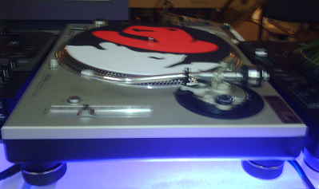

Esta semana tengo la oportunidad de asistir al RedHat Summit and JBoss
World Event en Boston. Pretendo cubrir algunos temas interesantes de
este evento en el blog, así que atentos a mis lectores más techies.

**Actualización**

-   Red Hat lanza su PaaS, Plataforma como Servicio, justo hoy, se
    llama*\* [OpenShift](http://openshift.redhat.com/app/)*\*
