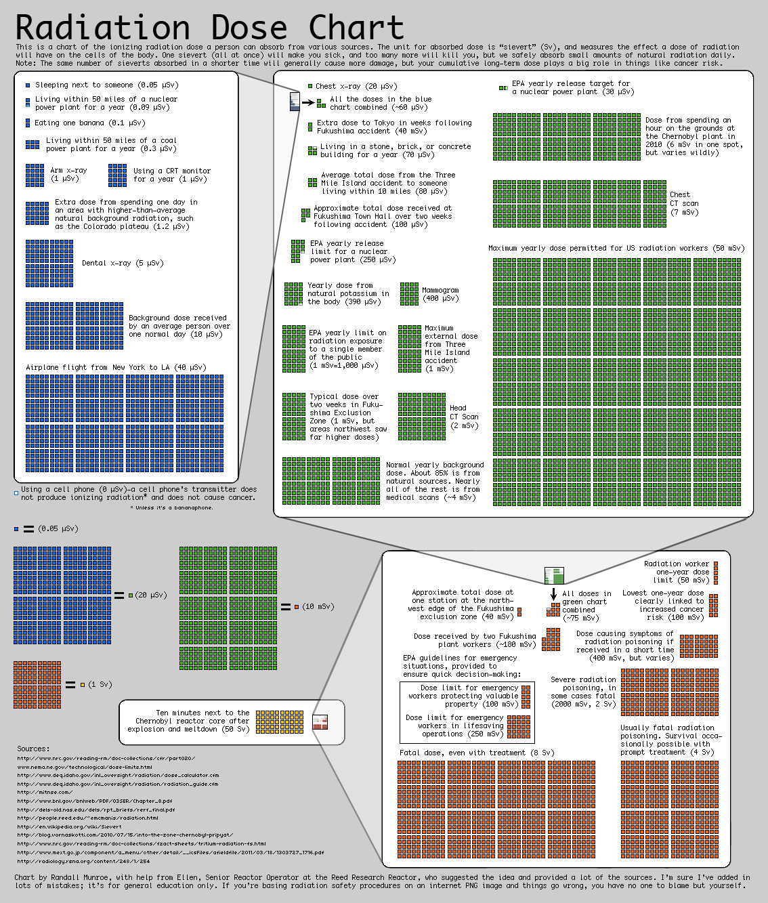

Incluso cuando duermes al lado de alguien estás expuesto a 0.05
microsieverts de radiación.

Esta gráfica preparada Randall Munroe, el autor de
[XKCD](http://www.xkcd.com/), explica la escala de radiación y nos da
una perspectiva de estas medidas.

[Imagen original](http://xkcd.com/radiation/).
