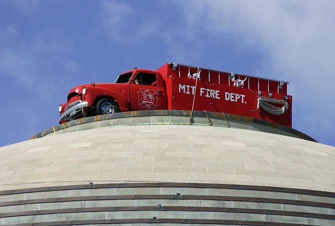
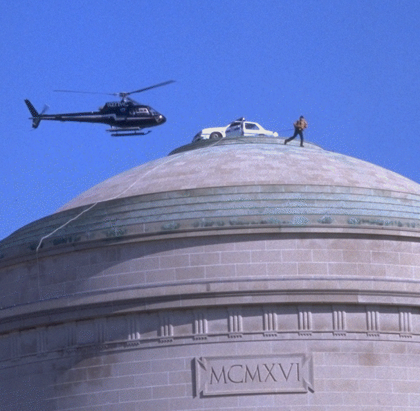

En [mi reciente viaje a Boston](/blog/2011/05/red-hat-jboss-summit-2011.html)
aproveché de escaparme para conocer Cambridge, y pasear por dos de las
instituciones universitarias más prestigiadas del mundo, las
universidades de Harvard y el MIT (Instituto Tecnológico de
Massachusetts). Y aunque todos me decían que conociera Harvard, la más
famosa, lo que realmente me impresionó fue el campus del
[MIT](http://web.mit.edu/).

La foto que tomé con mi cámara no refleja la dimensión del Great Domus.
Es enorme, y para darles una idea voy a recurrir a las fotos uno de los
"hacks" más ingeniosos que se han hecho en esa universidad, fíjense en
estas fotografías:

Creo que con eso quedan claras las dimensiones de este edificio :wink:.

Pero vamos a los hacks. En el MIT la palabra hack se refiere a una broma
de gran sofisticación, astuta, pero benigna y ética:

> The word **hack** at [MIT](http://web.mit.edu/) usually refers to a
> clever, benign, and
> "[ethical](http://hacks.mit.edu/Hacks/misc/ethics.html)" prank or
> practical joke, which is both challenging for the perpetrators and
> amusing to the MIT community (and sometimes even the rest of the
> world!).

Estas bromas se rigen por un código de conducta informal, un hack debe:

-   Ser seguro

-   no dañar nada

-   no dañar a nadie, ya sea físicamente, mentalmente o emocionalmente

-   ser divertido, al menos para la mayor parte de las personas que lo
    experimenten

Es una tradición que la comunidad del MIT celebra y que ha quedado
registrada en su sitio oficial: <http://hacks.mit.edu/Hacks/>

Algunos ejemplos, en abril de 2009 los estudiantes del MIT colocaron
este tren del metro impulsado por energía solar en el domo:

2006: [un camión de bomberos corona la cúspide del domo](http://hacks.mit.edu/Hacks/by_year/2006/firetruck/additional_information.html)

1994, [la inscripción del Lobby 7 es alterada](http://hacks.mit.edu/Hacks/by_year/1994/entertainment_and_hacking/),
la inscripción dice: "Established for Advancement and Development of
Science its Application to Industry the Arts Agriculture and Commerce.
Charter MDCCCLXI", las palabras Agriculture and Commerce son
reemplazadas por Entertainment and Hackig.

1994: [un carro de policía es depositado en el gran
domo](http://hacks.mit.edu/Hacks/by_year/1994/cp_car/):

1990: [La oficina del presidente del MIT desaparece](http://hacks.mit.edu/Hacks/by_year/1990/vest_bboard/).

Hay un [interesante artículo](http://hacks.mit.edu/Hacks/books/articles/engineering_in_action.html)
que explica el aspecto ingenieril del hacking en el MIT. El diseño,
preparación y ejecución de un hack de este estilo, con las restricciones
éticas establecidas anteriormente, requiere el manejo de un perfecto
proyecto de ingeniería, razón por la cual estas bromas son celebradas,
admiradas e y vistas con buenos ojos por la comunidad universitaria en
general, incluidas las autoridades.

Humor y buena ingeniería, la mezcla perfecta para un buen hack. Espero
que disfruten explorando el mundo del hacking del MIT.
