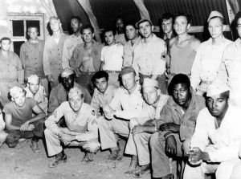

En 1941 el ejército norteamericano reportó que había una gran cantidad
de deserciones en los puntos de embarque en Nueva York. Se le pidió a la
división de investigación que hiciera un estudio sobre lo que pasaba. El
encargado fue el sociologo [Samuel A. Stouffer](https://www2.asanet.org/governance/stouffer.html). Después de
un rápido estudio descubrió que cuando los soldados eran enviados a sus
hogares, para despedirse, lo hacían vestidos de civil. La recomendación
fue que se les enviara a casa vestidos con sus uniformes. La tasa de
deserción bajo inmediatamente después que se aplicó la medida[^1].



Por cierto, el resultado obtenido no era obra de magia, en palabras de
Stouffer:

> "Cuando los soldados iban a sus hogares o con sus familiares y amigos
> vistiendo uniforme se veían como soldados preparados. Sus familias se
> sentían orgullosas y sus amigas les llamaban héroes,  todos querían
> verlos volver al campamento."

Así empezó su trabajo en el departamento de guerra, durante el cual su
equipo de investigación sostuvo más de 500.000 entrevistas a
combatientes norteamericanos de la Segunda Guerra Mundial, un trabajo
que plasmó en los cuatro volúmenes de 
[American Soldier, Studies in Social Psychology in World War II](https://openlibrary.org/books/OL6044939M/Studies_in_social_psychology_in_World_War_II_...).

¿Cómo Stouffer comprendió la solución al problema de la deserción
descrito al principio? Gracias a la aplicación sistemática de las ideas
científicas de su tiempo, como la sicología dinámica, que ve al ser
humano no como un ser racional, sino más bien como una criatura motivada
por deseos inconscientes, o las teorías de aprendizaje  y respuestas
condicionadas. Sin embargo, él veía su trabajo como una aplicación de
ingeniería social. No olvidaba que si bien mucho de los datos que
recolectaban serían valiosos para la sociología en el futuro, estaban
contratados para realizar un trabajo rápido y práctico en tiempos de
guerra.

Hasta Stouffer las únicas referencias a la sociología militar estaban en
los comentarios de Julio Cesar, Maquiavelo, Napoleón y Sun Tzu. Nadie
antes había empezado alguna investigación sistemática sobre las
actitudes de los soldados. Sus predecesores consideraban que tenían
habilidades innatas para juzgar a los hombres, y que estos temas eran
sólo cuestión de sentido común e intuición.

Pero si algo se aprendió del trabajo de Stouffer es que nada es obvio en
cuanto a las motivaciones y actitudes humanas. A pesar de que tenemos la
tendencia a creer que los resultados de la sociología están llenos de
obviedades.

Para clarificar este punto, el sociólogo Paul Lazarsfeld, en su revisión
de *The American Soldier*, propuso seis *"descubrimientos
representativos*" del reporte de Stouffer[^2]. El número dos, por
ejemplo, dice que "los hombres de extracción rural parecían estar con
una actitud más positiva  durante su periodo en el ejército que los
hombres que provenían de las ciudades.".

> "-- Ajá --dice el lector imaginario de Lazarsfeld, --esto tiene
> sentido. Los hombres rurales en 1940 estaban acostumbrados a
> condiciones de vida más duras, y una mayor cantidad de labor física
> que los hombres de ciudad, así que naturalmente era más fácil para
> ellos ajustarse. ¿Por qué necesitamos este enorme y caro estudio para
> decirnos lo que podíamos concluir por nosotros mismos?"[^3]

Sólo que más adelante Lazarsfeld revela que estos "descubrimientos" en
realidad mostraban exactamente lo contrario. Eran los hombres de
extracción urbana los que estaban más felices con su vida en el ejército
que los soldados de origen rural. Por supuesto, si al lector se le
hubiera revelado la respuesta real en primer lugar habría conciliado lo
que ya pensaba que sabía:

> "La gente en las ciudades están más acostumbrados a trabajar en
> condiciones de hacinamiento, y en corporaciones, con cadenas de
> comando, estándares estrictos de vestimenta y etiqueta social, etc.
> ¡Es obvio!"

Pero ese es exactamente el punto de Lazarsfeld. Cuando cada respuesta y
su opuesta aparecen igualmente obvias, entonces, en palabras de
Lazarsfeld, "obviamente algo está mal completamente con el argumento de
la *\'obviedad\'*"[^4].

Y aunque Lazarsfeld habla sobre la sociología, la verdad es que el punto
es válido igualmente para la política, el marketing, la filantropía, los
negocios, el desarrollo de software y todo lo que tenga que ver
entender, predecir, cambiar o responder al comportamiento de la gente.

Todo esto nos lleva a la paradoja del sentido común. En palabras de
Duncan Watts[^3]:

> Entonces, ¿por qué la ciencia de los viajes espaciales (rocket
> science) nos parece difícil y los problemas que tienen que ver con la
> gente, los que sin duda son más difíciles, parece que deberían ser
> cuestión sólo de sentido común?

La paradoja del sentido común es que aunque este nos ayuda a encontrarle
sentido al mundo, puede activamente minar nuestra habilidad para
entenderlo.

Entonces, si el sentido común no nos ayuda a entender el comportamiento
de la gente, ¿por qué insistimos en usarlo para explicar, o guiar la
forma en que  entendemos a las personas?

Al ser expuestos a esta paradoja tendemos a estar de acuerdo con esta, e
incluso pensamos que siempre hemos notado que la gente cree una serie de
cosas tontas, que tienen certezas de cosas que en realidad no entienden.
Pero no consideramos que este hecho tenga que afectar nuestras propias
creencias y convicciones. Confiamos mucho en nuestro sentido común, pero
desconfiamos del sentido común de los demás.  La frase "el sentido
común, el menos común de los sentidos", se ha vuelto casi en un cliché.
Y la verdad, es que lo que nos propone Watts, a través de su paradoja,
es que debemos desconfiar de este concepto.

El mismo Stouffer invita a sus colegas a dejar el sentido común y tratar
de cultivar el sentido no común, algo de lo que hablaremos más adelante.

Por ahora los dejo con la inquietud, de que probablemente todo lo que
consideran obvio no lo es. Cuando analicen un hecho y encuentren una
respuesta obvia, consideren la explicación contraria, si ambas
respuestas son obvias están en problemas.

[^1]: "Samuel A. Stouffer and The American Soldier", Joseph W. Ryan
disponible en
PDF [https://www.ufv.ca/jhb/Volume*7/Volume*7\_Ryan.pdf](https://www.ufv.ca/jhb/Volume_7/Volume_7_Ryan.pdf)
interesante para entender el aporte de Stouffer a la sociología.

[^2]: Citado por Duncan Watts en [^3].

[^3]: Tomado del libro [Everything Is Obvious: \*Once You Know the Answer](https://www.amazon.com/gp/product/0385531680/ref=as_li_qf_sp_asin_tl?ie=UTF8&tag=lanaturaledel-20&linkCode=as2&camp=217145&creative=399373&creativeASIN=0385531680)
de Duncan Watts.
Este libro es uno de los más interesantes que he leido en el último
tiempo, lo recomiendo a todos los interesados en estos temas, y es la
base de esta serie de artículos que estoy escribiendo.

[^4]: La frase es citada por Duncan Watts, pero se encuentra completa en:  <https://en.wikiquote.org/wiki/Sociology>

