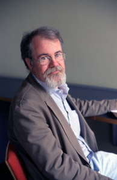

> "Un **planificador** piensa que él ya sabe la respuesta. Piensa en la
> pobreza como problema técnico ingenieril y que sus respuestas lo
> resolverán. Un **buscador** admite que no sabe la respuesta de
> antemano, él cree que la pobreza una maraña complicada de factores
> políticos, sociales, históricos, institucionales y tecnológicos\... y
> tiene la esperanza de que encontrará la respuesta a los problemas
> individuales por prueba y error\... Un planificador cree que los
> externos \[outsiders\] saben lo suficiente para imponer una solución.
> Un buscador cree que  los internos \[insiders\] tienen suficientes
> conocimiento para encontrar soluciones, y que muchas soluciones deben
> originarse desde adentro."\
> -- [William  Easterly](http://williameasterly.org/)
