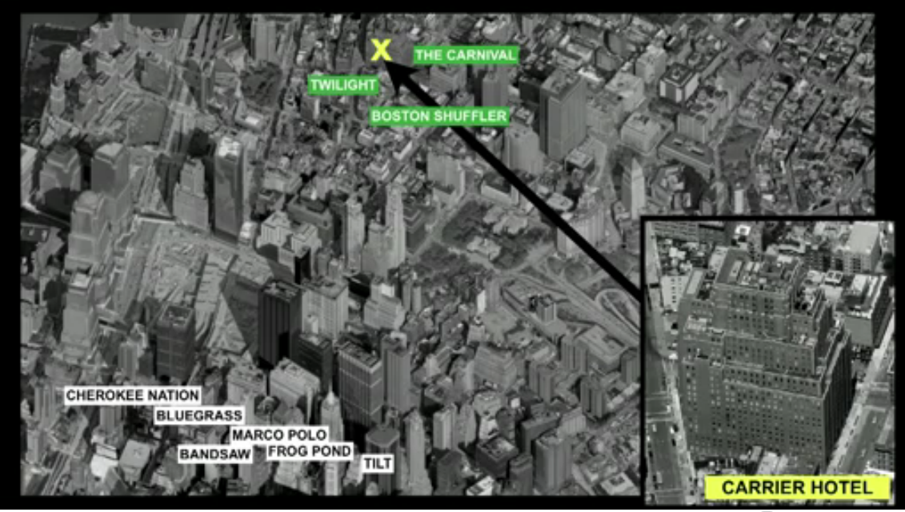

 
El 26 de mayo de 2010 a las 14:45 horas de Nueva York se produjo un
crash de la bolsa que hizo caer el índice Dow Jones en 900 puntos (una
caida del 9%) el que se recuperó completamente unos pocos minutos
después. A este fenómeno se le denominó el 
[Flash Crash de 2010](http://en.wikipedia.org/wiki/2010_Flash_Crash)

Hay sobre 2.000 físicos de particulas que trabajan actualmente en Wall
Street. Lo que hacen es modelar el comportamiento de las bolsas en
algoritmos que transan acciones en cuestión de micro segundos. Para que
tengan una idea nos demoramos 500.000 microsegundos en hacer un click
con el mouse. Así que en términos de algoritmos  si te demoras un par de
segundos eres un perdedor.

Consideren esta imagen, tomada de una presentación reciente de 
[Kevin Slavin en TED](http://www.ted.com/talks/kevin_slavin_how_algorithms_shape_our_world.html):

Un Carrier Hotel es un datacenter  donde se arrienda espacio para
colocar los servidores. En la foto tenemos este carrier hotel localizado
en la calle Hudson, donde se transan las acciones de la bolsa de New
York. Los nombres que aparecen en blanco o en verde son sitios con
servidores que están corriendo algoritmos de compra/venta de acciones.
Lo que ocurre es que los algoritmos como Cherokee Nation, Bluegrass,
Marco Polo, etc. tienen 8 micro segundos de desventaja con respecto a
los sitios que corren los algoritmos The Carnival, Twilight y Boston
Shuffler. Entonces los edificios alrededor del carrier hotel están
siendo vaciados para colocar servidores que se encuentren más cerca del
lugar donde se transan las acciones.

La empresa Spread Networks construyó una trinchera de 1300 kilómetros
entre Chicago y Nueva York para poder lograr transmitir una señal de 14
milisegundos a través de un enlace dedicado de fibra óptica. Así que
literalmente estamos modificando el mundo para darle ventajas a unos
algoritmos que negocian por nosotros en las bolsas de comercio. Pero,
¿alguien ha pensado las consecuencias que puede tener todo esto?

Nadie tiene claro que pasó en el El Flash Crash de 2010, porque nadie
estaba en control de lo que pasó, literalmente fueron las máquinas las
que provocaron la caida de la bolsa por 9 minutos ese día. De alguna
forma los algoritmos entraron en una extraña resonancia, y generaron una
espiral de transacciones que llevaron a la baja instantánea de la bolsa,
y esos mismos algoritmos reaccionaron generando la recuperación.

Siento escalofríos cuando pienso  que nuestros fondos de pensiones, o
los trabajos de miles de personas dependen del comportamiento coordinado
de muchos algoritmos, escritos bajo los supuestos de un conjunto de
físicos teóricos que experimentan con sus ideas de cómo tratar con la
complejidad en sus computadores, como si esto fuera un juego de ingenio,
donde se trata  de demostrar quien escribe el algoritmo más inteligente,
sobre cosas que apenas comprendemos.

Espero que con esto puedan comprender  por que tengo esta  preocupación
de explorar todas estas  estrategias para predecir, tanto el futuro como
 el presente.

Les dejo esta presentación en TED donde Kevin Slavin habla sobre estas
cosas:

