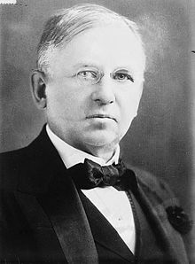

Al revisar [la paradoja de la estrategía](/blog/2011/08/la-paradoja-de-la-estrategia.html)
encontramos que los grandes planes pueden generar un gran desastre, o un
gran éxito. Los planes mediocres generan resultados mediocres. Se dice
que "un mal plan es siempre mejor que no tener plan", así que ante la
incertidumbre una estrategia del tipo 
[medir y reaccionar](/blog/2011/08/medir-y-reaccionar.html)
parece una alternativa razonable, y probablemente sea más exitosa.

Ahora bien, en muchas situaciones las mediciones no nos dicen lo que
queremos saber. Por ejemplo, si estamos planeando una campaña
publicitaria. Por ejemplo, un CFO de una importante empresa
internacional se lamentaba de que se habían gastado 400 millones de
dólares en una campaña de posicionamiento de marca, no de ningún
producto en particular, sólo de la marca. La pregunta era saber cuán
efectivo fue ese gasto. No podía saber si la efectividad había sido 400
millones o cero. El CFO no estaba diciendo que el gasto en publicidad no
hubiera sido efectivo, sino que no tenía idea de cuan efectivo había
sido. Era totalmente posible que si no hubieran gastado un centavo su
desempeño como compañía habría sido el mismo, pero probablemente si no
gastaban esos millones quizás se habrían enfrentado a un desastre.

Ahora, 400 millones de dolares nos parece una monstruosidad, pero
consideren que al año las corporaciones norteamericanas gastan 500 mil
millones de dólares en marketing. Entonces es evidente preguntarse
cuanto de este dinero produce efectos sobre los consumidores. ¿Alguien
tiene idea?

A fines del siglo XIX el magnate norteamericano [John
Wanamaker](https://en.wikipedia.org/wiki/John_Wanamaker), considerado por
algunos como [el pionero del marketing
moderno](https://mises.org/daily/5054/The-Pioneer-of-Marketing), se
quejaba de que:

> *"la mitad del dinero que gasto en publicidad se pierde, lo malo es
> que no sé cual mitad"*

Wanamaker era considerado un genio del avisaje, y un pionero de  las
tiendas por departamentos, introduciendo conceptos como la devolución
del dinero como garantía. Se le consideraba un empresario honesto,
ofrecía a sus empleados cuidados médicos gratuitos, educación, espacios
de recreación y planes de pensión y distribución de ganancias. Aunque se
oponía fieramente a la sindicalización.

Mucho de lo que se hace en retail hoy en día para llamar la atención de
los consumidores ya lo había probado Wanamaker en la década de 1860.

Entonces, a pesar de todos los avances que hemos logrado en ciencia y
tecnología, la pregunta de Wanamaker sigue vigente. El CFO mencionado
anteriormente sigue con la misma duda que el magnate de fines del siglo
XIX.

No es que no contemos con mejores mediciones, al contrario, desde los
tiempos de Wanamaker tenemos muchas empresas que se encargan de medir,
las tiendas tienen sus bases de datos de clientes, y sistemas CRM,
inteligencia de negocios. Existen agencias de rating como Nielsen, o
ComScore, que miden el flujo de clicks sobre los avisajes digitales.
Tenemos mucha información, pero el problema es que los avisadores
quieren saber si los avisos causan un aumento en las ventas, pero casi
siempre lo que se obtiene es una correlación entre avisos e incremento
en ventas.

"Correlación no implica causalidad", eso debería ser claro, pero nos
confundimos. Como cuando la gente hace dieta. Cuando la gente hace dieta
y baja peso inmediatamente lo atribuye a la dieta. Pero ocurre que
aparte de hacer dieta la gente que entra en un programa de baja de peso
además empieza a hacer ejercicios, o cambia sus hábitos, como las horas
en que come, o su rutina de descanso, incluso se preocupa más sobre lo
que come. Entonces cualquiera de esos cambios, o la combinación de
estos, es probablemente la responsable de la pérdida de pesos, más que
la elección de una dieta.

En el avisaje pasa lo mismo. Los avisadores anticipan su gasto de
publicidad en función de ventas futuras, o empiezan a gastar más en
temporadas peak, como cuando se acercan las fiestas. Entonces en esos
escenarios las ventas y el avisaje tendrán una correlación, aunque el
avisaje no genere nada especial (en Navidad la gente igual irá a
comprar, independiente de la campaña publicitaria), o pueden haber otros
factores externos que causan esta mayor venta, y que no necesariamente
están relacionados con el avisaje.

Así que diferenciar  correlación de causa es difícil, en general. Una
posible solución es realizar un experimento. Si queremos medir la
efectividad de un "tratamiento" (dieta, o campaña de avisos), debemos
aplicarlo en algunos casos y no en otros (el grupo de control). Al igual
de como se hace con la evaluación de los nuevo medicamentos. A algunos
pacientes se le aplica el  medicamento, y a otros se les entrega un
placebo. Sólo si la gente con el tratamiento tienen una mayor frecuencia
de mejora entonces se aprueba la nueva droga.

En el mundo del avisaje en linea se ha detectado que los anuncios
patrocinados que aparecen en los resultados de una búsqueda, tienen más
éxito que los que se colocan en los sitios web. La razón es que los
anuncios patrocinados depende fuertemente de lo que estabas buscando.
 Las personas que buscan sobre problemas en su auto harán click sobre
anuncios de talleres mecánicos en su área.

Es la base de la riqueza de Google, y porque esa publicidad puede ser
más efectiva que la que aparece colgada en Facebook, en Gmail, o la que
ven en el costado de este mismo blog. Cuando busco estoy más
predispuesto a la publicidad que cuando simplemente navego por internet.

Esto es entendido mal, porque los avisadores pagan un premio por
alcanzar a los consumidores que son los más probables consumidores de
sus productos. Es lo que se llama el avisaje dirigido. Donde se trata de
segmentar al consumidor. Lo que no se dan cuenta es que esos
consumidores comprarán sus productos de todas maneras. El valor de esa
publicidad sólo está en el _consumidor marginal_, aquel que no habría
comprado el producto de no haber visto la publicidad. La única manera de
determinar el efecto de la publicidad en los consumidores marginales es
conduciendo experimentos, en que la decisión de quién ve el aviso  y
quién no, es determinada por el azar.

Eso es difícil de hacer en publicidad tradicional, como los avisos en la
carretera, o en una revista. Pero es posible en el mundo electrónico.
Hay un experimento comentado por Duncan J. Watts[^1], realizado por sus
colegas en Yahoo, David Reily, Taylor Schreiner, y Randall Lewis:
[Advertising Works](https://research.yahoo.com/project/2616).

Se trata de un experimento de campo con 1.6 millones de clientes de una
cadena de retail que también eran usuarios activos de Yahoo!. Para
realizar el experimento, Reiley y su equipo asignaron a 1.3 millones de
usuarios al grupo de "tratamiento", los que al llegar a un sitio
operado por Yahoo! se les mostraría anuncios del *retailer*. Los otros
 300.000 quedaron asignados al grupo de control, es decir, nunca verían
la publicidad, aunque visitaran exactamente las mismas páginas del grupo
anterior. Dado que la asignación fue al azar las diferencias tenían que
darse por el desempeño del aviso en si mismo, como los usuarios además
estaban en las bases de datos de la empresa, el efecto del aviso podría
medirse en términos de compras reales.

Usando este método los investigadores estimaron que el ingreso adicional
generado por los avisos era rigurosamente cuatro veces el costo de la
campaña en el corto plazo, y probablemente más alto en el largo plazo.
Por lo tanto, concluyeron que la campaña había sido de hecho efectiva,
buenas noticias para el retailer y para Yahoo!. Pero también
descubrieron que casi todo el efecto fue sobre los clientes de más edad.
Los avisos casi no tuvieron efecto alguno sobre los menores de 40 años.
Esto que parece malo es una ventaja, porque el experimento nos dice que
aquí hay algo que no funciona con los jóvenes y podemos conducir nuevos
experimentos para cautivar su atención. Pero aún así, si no se consiguen
resultados con el consumidor joven podemos ver si es la marca la que no
atrae a este público, o la publicidad en linea es ignorada por este
grupo. Cualquiera sea el resultado, al menos el avisador sabe que no
vale la pena gastar dinero en este segmento y concentrar sus recursos en
el segmento que si es sensible a los avisos.

Por lo tanto los experimentos deben ser vistos como una manera de ir
aprendiendo, son parte de un proceso permanente. No se debe esperar de
estos la respuesta definitiva. Probablemente generen nuevas
interrogantes, pero permiten realizar ciertas discriminaciones que
ayudan a eficientar el uso de recursos.

Estos experimentos están siendo usados cada vez más, no sólo en el
marketing en linea, también en el diseño de interfaces de usuario, o en
el diseño de la navegación de sitios webs. En las ciencias sociales,
para medir la eficacia de ciertas políticas públicas, y en las empresas
para  medir esquemas de compensación por desempeño.  El potencial de los
experimentos es enorme, y claramente deberían ser usados más.

[^1]: Duncan J. Watss. [Everything Is Obvious: \*Once You Know the
Answer](https://www.amazon.com/gp/product/B004DEPHGQ/ref=as_li_qf_sp_asin_tl?ie=UTF8&tag=lanaturaledel-20&linkCode=as2&camp=217145&creative=399373&creativeASIN=B004DEPHGQ)
