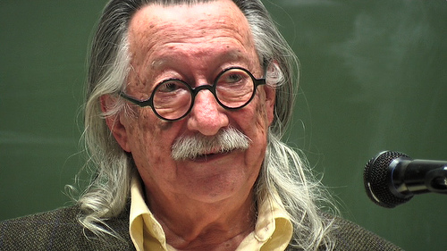

> The computer programmer is a creator of universes for which he alone
> is responsible. Universes of virtually unlimited complexity\
> can be created in the form of computer programs.

> (El programador de computadoras es un creador de universos para los
> cuales es el único responsable. Universos de complejidad virtualmente
> ilimitada pueden ser creados en la forma de programas de computadora.)

> -- Joseph Weizenbaum, Computer Power and Human Reason

