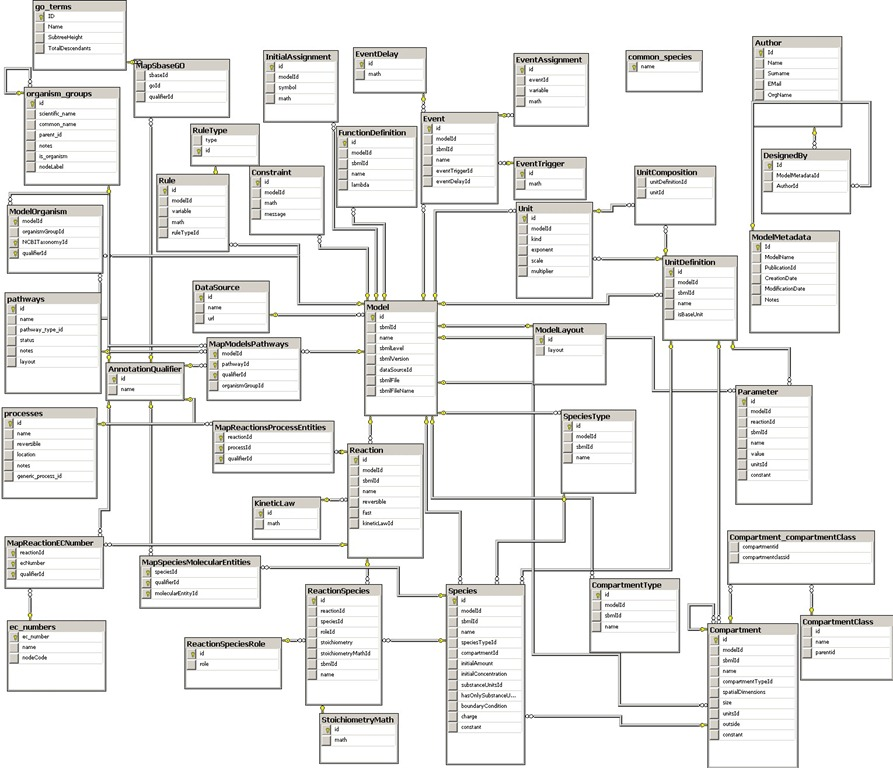

Hay veces que nos encanta rascarnos la oreja izquierda con la mano
derecha, por puro complicar las cosas


Eso se da mucho en las etapas de diseño y modelamiento de datos. Un
problema simple después de pasar por la etapa de análisis y diseño puede
quedar así:



¡Ah!, que hermosos son estos modelos genéricos, con trazabilidad,
controles de accesos, y perfiles, una orgía de tablas y relaciones
(¿será que eso de las "relaciones foráneas" despierta alguna
inconfesable fantasía en los analistas de sistemas?)

A veces esto se convierte en puro onanismo, originado por un axioma que
fue imbuido en nuestros cerebros por un grupo de investigadores de IBM
en 1969[^1], la idea de que todo debe ser modelado en una base de datos
relacional hasta la "vigésima quinta forma normal"[^2].

No hay que desconocer que el modelo relacional tiene sus ventajas,
después de todo es el corazón de la mayoría de los sistemas
transaccionales en la actualidad. A saber las bases de datos
relacionales, cuando se usan adecuadamente, tienen muchas ventajas.

1.  La teoría que las sustenta está basada en la lógica de primer orden
    y la teoría de conjuntos, por lo que es fácil de entender y explicar
    desde un punto de vista teórico.

2.  Como las bases de datos relacionales permiten operar con conjuntos
    se pueden definir operaciones muy eficientes que permiten "cruzar"
    los datos, esto es conocido como "algebra relacional". Un lenguaje
    equivalente es el "cálculo relacional" \[3\], ambos lenguajes
    teóricos permitieron crear el lenguaje de consulta estructurado SQL,
    un lenguaje sencillo y muy poderoso que permite extraer información
    desde el modelo relacional.

3.  Cuando las bases de datos relacionales están bien modeladas usan
    eficientemente el espacio.

4.  Un buen modelo permite realizar consultas que no estaban previstas,
    hacer nuevos cruces de información, claro que a un costo. Si los
    índices no existen las consultas pueden tomar tiempos cuadráticos, o
    peores.

Todo estos beneficios vienen de que las bases de datos relacionales
promueven una estructura, sólida, tolerante a fallas, que permite
validar errores semánticos o de estructura dento del mismo motor. Dadas
estas ventajas posteriormente los sistemas administradores de bases de
datos incorporaron otros conceptos, como la transaccionalidad, el famoso
[ACID](http://en.wikipedia.org/wiki/ACID) (Atomicity, Consistency,
Isolation, Durability), que permiten que estas bases sean tan usadas en
aplicaciones empresariales (contabilidad, bancos, retail, etc.).

El otro día escuché a un importante ejecutivo decir que todo el mundo
usa Oracle, o SQL Server porque sirven para resolver problemas grandes a
nivel empresarial. Le comenté que [Facebook almacena 135 mil millones de
mensajes al mes en una base de datos no
relacional](http://highscalability.com/blog/2010/11/16/facebooks-new-real-time-messaging-system-hbase-to-store-135.html),
pero ni aún así entendió. Es el típico caso de [razonamiento
motivado](http://www.lnds.net/blog/2011/07/decisiones-irracionales.html).

Si bien casi todo problema se puede modelar con una base de datos
relacional, no siempre conviene resolver un problema con una base de
relacional. Ya [les mostré un
ejemplo](http://www.lnds.net/blog/2011/10/datos-datos-datos.html) en que
un programa en C puede ser más eficiente que procesar una simple
sentencia SQL, claro requiere más trabajo de desarrollo, pero ahí viene
el arte y la ciencia, conocer y usar la herramienta adecuada para cada
tipo de problema.

Consideren este modelo:


```
 class Book {   
     String title   
     String author   
     Integer year    
     Integer pages    
     Set keywords    
     Set ratings   
}
```

Versus este otro

```
class Book {   
    Integer id    
    String title    
    String author    
    Integer year    
    Integer pages
} 

class Keyword {   
    Integer id    
    String keyword    
    Integer bookId    
}


class Ratings {   
    Integer id    
    String rating    
    Integer bookId    
}
```

Si tienes un sistema de ventas de libros por internet es mucho más
conveniente desde un punto de vista semántico usar el primer modelo, con
una sola clase Book, que contiene toda la información relevante en un
sólo lugar. Como normalmente el usuario va a interactuar con un libro a
la vez este modelo es más simple y directo.

Si vas a hacer estadísticas u operaciones agrupadas sobre los libros, el
segundo modelo te conviene más. Pero considera que esas operaciones
también las puedes ejecutar mediante algún mecanismos tipo 
[Map Reduce](/blog/2011/10/ensaladas-y-algoritmos.html) en
otro horario, o en una base offline.

Las bases de datos no relacionales permiten abordar el mismo problema,
pero a veces desde una perspectiva más simple, y muchas veces más ágil.
Pronto veremos algunos ejemplos. Lo importante es tener una mente
abierta y considerar que hay formas más simples de rascarse una oreja.


[^1]: Edgar F. Codd, investigador británico trabajando en IBM en 1969
propuso la teoría de las bases de datos relacionales en una serie de
papers a comienzos de la década de 1979, recibió el premio Turing en 1981.

[^2]: Hasta la fecha se conocen [6 formas normales](http://en.wikipedia.org/wiki/Database_normalization#Normal_forms),
pero la imaginación de un académico no tiene límites.

[^3]: El teorema de Codd, que en realidad es un resultado de la lógica
de primer orden, garantiza que una expresión en álgebra relacional puede
ser expresada en cálculo relacional.
