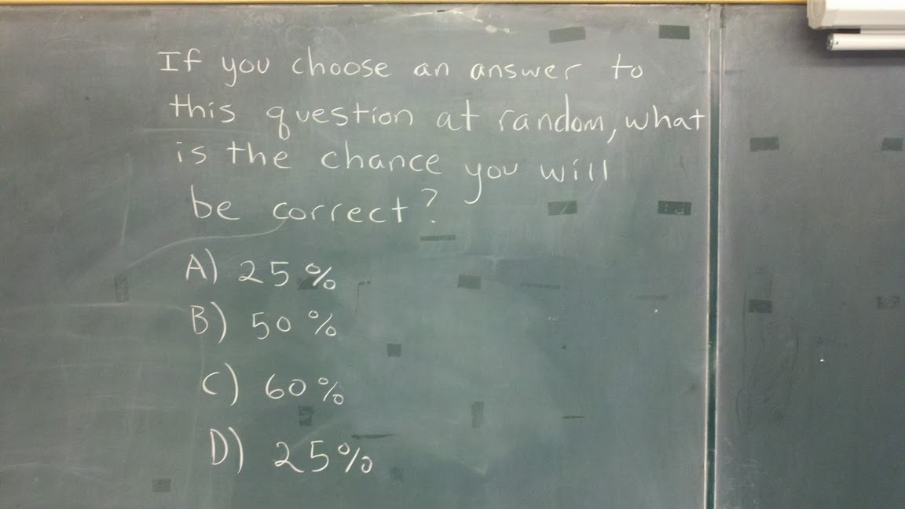

Para los que no hablan inglés, la pizarra dice:

"Si usted escoge una respuesta al azar para esta pregunta, ¿cual es la
probablidad de que sea correcta?\
A) 25%\
B) 50%\
C) 60%\
D) 25%\"

A ver como les va, sin hacer trampas, ni buscar en google.
