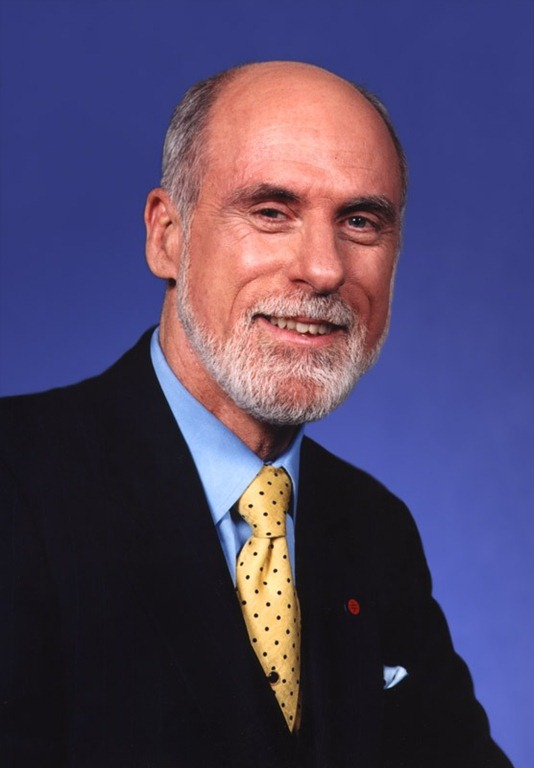

En 1963 Joseph Licklider escribió su famoso memorandum, ¿lo recuerdan?
¿no? bueno, la historia la conté en [este post](/blog/2011/01/el-memorandum.html). Su idea era
crear la "red intergaláctica de computadoras", el era el hombre del
sueño. Leonard Kleinrock, el chico que quería un condensador para
construir la radio que salía en la contratapa del comic Superman 
([la historia está aquí](/blog/2008/04/todo-por-un-condensador-variable.html)),
nos dió la teoría matemática para poder construir una red basada en
packet switching, el fue el hombre de la teoría. Después Lawrence
Roberts dirigió al equipo que construyó ARPANET, la red predecesora de
internet.

Se llama Internet, porque es una red de redes: inter-net, "entre redes".
Alrededor de 1973 habían varias redes que se estaban interconectando
entre ellas y con ARPANET. En ese tiempo se hizo evidente que se
necesitaba un mecanismo que permitiera unificar las redes. Para resolver
este problema [Robert E. Khan](http://en.wikipedia.org/wiki/Robert_E._Kahn) 
reclutó a [Vinton Cerf](http://en.wikipedia.org/wiki/Vint_Cerf), un joven estudiante de
doctorado, para trabajar en la especificación de un nuevo protocolo. El
fruto de ese primer trabajo fue el [RFC 675](http://tools.ietf.org/html/rfc675), que describe TCP/IP, el
protocolo básico de la red. Este documento también contiene el primer
uso de la palabra internet, para quienes les interese ese tipo de cosas.

Vint Cerf estuvo hoy acá en Santiago, y tuve la oportunidad, el honor,
de estrechar su mano y saludarle, pero sobretodo escuchar sus palabras
en una charla que dictó hoy en la [Escuela de In**J**eniería](http://escuela.ing.uchile.cl/).

Habló de la importancia de la innovación, compartió con nosotros sobre
las características de un ambiente innovador como Sillicon Valley, y qué
se requiere y quizás falta en Chile para lograr esto, comop no castigar
el fracaso del emprendedor y tener gente educada y bien capacitada.
Habló sobre el futuro, sobre como vamos a tener mucha más información a
nuestro alcance. De la internet de las cosas, por que debemos promover,
e incluso exigir el soporte de IPv6 de nuestros ISPs. Sobre privacidad y
seguridad en la red, sobre participación ciudadana en la red, sobre
infraestructura de la red, e incluso sobre energía (con algunas
propuestas interesantes, como su analogía de packet switching y la
necesidad de desarrollar el concepto de "buffering", pero con la
energía).

Felicito a los organizadores de la charla, a Patricio Poblete y el
equipo de NIC Chile, fue una gran oportunidad, un evento memorable.
