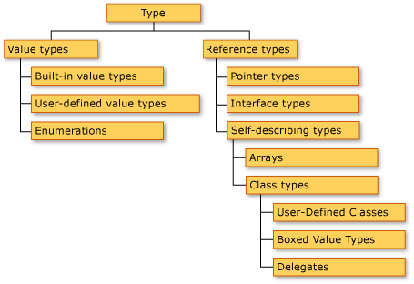

Es momento de analizar más detalles del 
[lenguaje de programación Ogu](/blog/2011/12/compiladores.html), vamos a partir
por su sistema de tipos, este artículo es una introducción al tema.

Ogu es un lenguaje con declaración de tipos estáticos, aunque implementa
inferencia de tipos. Veamos algunos ejemplos:

    i : Int = 0

    j := i // j es de tipo Int

    s : String = "un string"

    t := s

Ogu tiene "sacarina sintáctica" para soportar tuplas

    naipe : (Int,String) = (10, "espadas")  // naipe es una tupla

    as := (1,"espadas")

    Naipe = (Int,String) // Introduce el tipo Naipe como alias de la tupla (Int,String)

Tambien hay sacarina para listas y hashes:

    vocales : \[String\] = \["a", "e", "i", "o", "u"\]

    ListaDeStrings = \[String\]

    mapa : \[String : Int\] = \["Chile":56, "Usa":1\]

Las clases pueden ser genéricas:

    Stack{T}  : () = {

        var \_data : \[T\] = \[\]

        push : (x:T) = \_data = x :: \_data

        pop : ()-\>(r:T) = {

            r = head \_data\
            \_data = tail \_data\
        }

    }

Las tuplas, listas y mapas se implementan en basa tipos genéricos. En
realidad al declarar una variable de tipo \[T\] es lo mismo que
declararla como Sequence{T}, y al declararla como \[K:V\] es lo mismo
que Map{K,V}.  Tanto Sequence y Map son clases definidas en el runtime
básico de Ogu.

Para crear un stack de enteros hacemos lo siguiente

    stackOfInt := Stack{Int}()

    // otra manera

    StackOfInt = Stack{Int} // type alias

    stackOfInt := StackOfInt()

Ogu soporta herencia de clases

    // un troglodita es un cavernicola que vive en una cueva

    Troglodita : (nombre,grito,cueva : String) > Cavernicola(nombre,grito) = {
        _cueva := cueva
    }

**Interfaces**

Consideremos un paquete que trabaja con figuras geométricas

    Circulo : (radio:Int) = {

        area : () -> Int  = pi * radio ^ 2

        perimetro: () -> Int = 2 * pi * radio

    }

    Cuadrado : (lado:Int) = {

        area : () -> Int = lado * lado

    }

Supongamos que queremos crear una funcion que imprima el area de una
figura geometrica:

    imprimeArea : (c:Cuadrado) = println("el area es "+c.area())

    imprimeArea : (c:Circulo) = println("el area es "+c.area())

el problema es que Ogu no nos permite sobrecargar funciones :sad:

Hay tres maneras de solucionar esto, la primera es usando selectores de
tipo:

    imprimeArea : (c:Cuadrado\|Circulo) = println("el area es "+c.area())

lo que hemos hecho es que el tipo de la función imprimeArea puede ser un
Cuadrado o un Circulo (Cuadrado \| Circulo ).

Ahora si definimos esta función:

    imprimePerimetro : (c : Cuadrado\|Circulo) = println("el perimetro es "+c.perimetro())

tendremos un error de compilación,  Cuadrado no define la función
perímetro.

La otra forma de solucionar este problema es declarando una interfaz:

    Figura := {

        area : ()->Int

        perimetro : () -> Int

    }

Una interfaz es como una clase, pero no tiene constructor y el cuerpo de
las funciones es opcional.

De este modo puedo redefinir las clases Circulo y Cuadrado de esta
manera:

    Circulo : (radio:Int) ~ Figura = {

        area = pi * radio ^ 2

        perimetro = 2 * pi * radio

    }

    Cuadrado : (lado:Int) ~ Figura ={

        area = lado * lado

        perimetro = lado * 4

    }

e implementar nuestras funciones así

    imprimeArea : (f:Figura) = println("el area es "+f.area())

    imprimePerimetro : (f:Figura) = println("el perimetro es"+f.perimetro())

La tercera forma de implementar polimorfismo es mediante herencia y esa
queda propuesta al lector.

Consideremos la interfaz Dibujo

    Dibujo :=  {

        dibujar : () = println ("dibuja un "+nombre)

        nombre : String

    }

Podemos ahora extender Circulo y Cuadrado para que sean también dibujos:

    Circulo : (radio:Int) \~ Figura & Dibujo = {

        area = pi \* radio \^ 2

        perimetro = 2 \* pi \* radio

        nombre = "circulo"

    }

    Cuadrado : (lado:Int) \~ Figura & Dibujo ={

        area = lado\*lado

        perimetro = lado\*4

        nombre = "circulo"

    }

Este artículo es solo una introducción, y es un complemento a [la
primera parte de la presentación de Ogu](/blog/2011/12/compiladores.html). Espero sus
comentarios.
