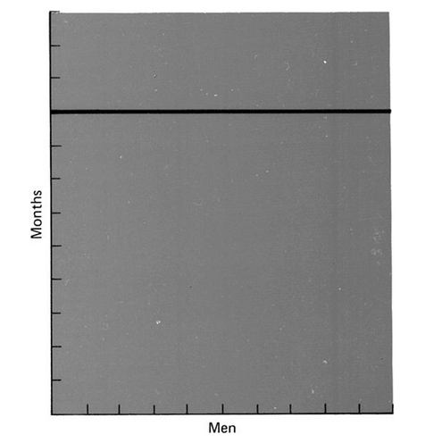
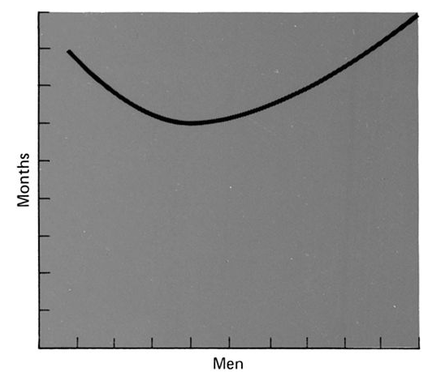
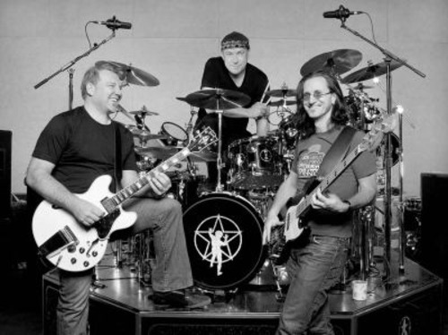

## **Intro**

> Time is a gypsy caravan Steals away in the night

En 1997 Rush era una banda exitosa, su baterista, Neil Peart era
considerado el mejor del mundo, tanto por sus pares como por la crítica.
Pero en ese año, su única hija, de 19 años, muere en un accidente
automovilístico, diez meses después su mujer, quien nunca superó la
pérdida, fallece afectada de cáncer. Un dolido Neil comunica a sus
compañeros que ha decidido tomarse una pausa, para reflexionar, no sabe
por cuanto tiempo, toma su motocicleta y parte a recorrer la carretera.
El futuro de la banda es incierto.

## **Estrofa**

> We will pay the price, But we will not count the cost

[Nicholas Taleb](http://es.wikipedia.org/wiki/Nassim_Taleb) nos diría que lo
sucedido a Neil Peart es uno de esos eventos desastrosos que impacta
profundamente nuestro entorno, algo totalmente impredecible, para lo
cual no estamos preparados. Un "Cisne Negro", tanto para el músico como
para la banda, que a partir de este evento sufre un hiato de casi ocho
años.

La imagen del cisne negro, introducida en el libro 
[The Black Swan, The Impact of the Highly Improbabble](http://amzn.to/zmPCl1), de Nicholas
Taleb, viene del hecho que por muchos años para los naturalistas
europeos todos los cisnes era blancos, hasta que uno fue encontrado en
Australia. Este concepto ilustra la fragilidad de nuestro conocimiento.
Una simple observación invalida una afirmación general sostenida durante
milenios tras la observación de millones de cisnes blancos.

En su libro, Taleb introduce el concepto del **cisne negro** como un
evento que tiene tres atributos: primero es una cosa aislada de todas
las expectativas regulares, porque nada en el pasado puede
convincentemente dar indicios de su posibilidad. Segundo genera un
impacto extremo, y en tercer lugar, a pesar de su carácter ajeno,
nuestra naturaleza nos hace confeccionar explicaciones de su ocurrencia
después del hecho, por lo que lo asimilamos como si fuera algo
explicable y predecible.

## **Riff**

> Why are we here? Because we\'re here\
> Roll the bones

Taleb se auto define como un empirista escéptico, siguiendo la tradición
de Montaigne, y sobretodo de David Hume, este autor nos recuerda la
vieja máxima de que el pasado no sirve para explicar el futuro. Algo de
lo que hemos hablado en "[causas
imaginadas](http://www.lnds.net/blog/2011/07/causas-imaginadas.html)".
El libro contiene muchos de los temas que hemos tratado
[acá](http://www.lnds.net/blog/tag/sentido-comun), lo que no es de
extrañar, pues se suma a una lista de textos que están hablando de los
mismo: el manejo de la complejidad, la irracionalidad humana, y nuestras
limitaciones cognitivas para lidiar con la realidad.

Lo que vamos a ver ahora es si esto aplica en la gestión de proyectos
informáticos, porque al parecer tenemos cisnes negros. Lo que viene es
una exploración de esta idea, también una respuesta a 
[un post](http://www.alejandrobarros.com/no-es-bueno-estar-cerca-de-un-proyectos-cisne-negro)
de mi estimado colega [Alejandro Barros](http://www.alejandrobarros.com/), con quien hemos sostenido más
de alguna discusión sobre la realidad del concepto "crisis del
software", o la deuda en la eficiencia de la gestión de proyectos TI [^1] [^2].

## **Estribillo**

> Why does it happen? Because it happens\
> Roll the bones

Fuimos engañados, [por gente que no entendía lo que leía](/blog/lnds/2011/11/12/comprension-de-lectura), y
montones de libros enseñaban a los ingenieros de software como hacer mal
las cosas, "*la maldición de la cascada"*, recién ahora algunos
cuestionan a la peor metodología para desarrollar un proyecto de
software que haya existido, pero aún hay gente que espera milagros,
chocando con la realidad. "[Locura es hacer siempre lo mismo y esperar
resultados diferentes](/blog/lnds/2011/03/09/locura)".

Soy un convencido que debemos abandonar "la imagen del software como
algo que se construye". Me resisto a creer que este oficio deba ser
asimilado a la construcción civil, o la ingeniería de obras, esa que
construye puentes, porque esa visión es la fuente de tanta frustración y
confusión.

## **Puente**

> Face up! There\'s still time to turn the game around Face up! -- Turn
> it up\
> Or turn wild card down

Alejandro [nos informa](http://www.alejandrobarros.com/no-es-bueno-estar-cerca-de-un-proyectos-cisne-negro)
de un artículo llamado [Why your IT Project may be riskier than you think](http://www.alejandrobarros.com/media/users/1/50369/files/4363/Black_Swan.pdf).

El tema del artículo es el de siempre, los proyectos TI están
condenados, somos pésimos estimando, y nuestros proyectos siempre
terminan mal, bueno, no siempre, pero el promedio de costo de los
proyectos está por sobre el 27%. Pero las malas noticias son que el 17%
de los proyectos TI se transforman en cisnes negros. Lo que los autores
del artículo definen como cisnes negros son proyectos que
sorpresivamente suben sus costos por sobre el 200%.

## **Break**

> Shadows on the road behind Shadows on the road ahead\
> Nothing can stop you now

Después de su pérdida Neil Peart recorrió 80.000 kilómetros en
motocicleta por norteamérica, plasmó sus vivencias en un libro y una
canción. El dolor se fue disolviendo en el tiempo, y de repente,
mientras visitaba a un amigo en Los Ángeles, éste le presenta a la que
terminaría siendo su segunda esposa. Después de esto hace una llamada a
sus compañeros para anunciarles que está de vuelta, que quiere volver al
estudio a grabar y componer, después de 14 meses Rush vuelve con "Vapor
Trails"[^3].

## **Sólo**

> Well, I was only a kid \-- didn\'t know enough to be afraid Played the
> game, but not the way the big boys played\
> Nothing to lose \-- maybe I had something to trade

No me considero una persona optimista, pero parece que lo soy. No me
importan tanto los fracasos como la forma en que se superan. El éxito
siempre es aburrido, la ingeniería es aburrida si no se presentan
desafíos. Para mi la idea de que la metodología correcta llevará al
éxito de los proyectos siempre es reconfortante, pero es pura fantasía,
voluntarismo, que nace de no reconocer la naturaleza del desarrollo de
software. Lo malo es que no puedes decirle eso a los que ponen el
dinero, que esperan que el proyecto salga en el tiempo y el presupuesto.
Y ahí está el problema.

Los autores del estudio mencionado arriba afirman haber recogido una muestra
global de 1.471 proyectos TI, comparando sus presupuestos y beneficios
esperados con los costos y resultados reales. El rango de los proyectos
era de del tipo de implantación de sistemas de ERP, CRM y administración
de información. El costo promedio de los proyectos fue de 167 millones
de dólares, y el más grande de 33 mil millones de dólares. Eran
proyectos grandes, varios planeados para ser ejecutados en periodos de
varios años. El 92% de los proyecto fue en agencias públicas y el 83%
estaba basado en USA. Pero como encontraron poca diferencia entre el 92%
de los proyectos públicos con el 8% de los proyectos privados en su
muestra, los autores estimaron que el comportamiento es el mismo en el
sector privado. ¡Ah!, olvidé mencionar, los autores Bent Flyvbjerg es
académico en Oxford, y Alexander Budzierno consultor en McKinsey & Co. y
candidato a PhD .

¿Qué puede alegar un (no tan) humilde desarrollador ante tamañas
credenciales, y base muestral?

Pues yo creo que mucho. En primer lugar me parece que los autores
cometen muchos de los errores que el autor de Black Swan se encarga de
destacar en su libro. Sabemos que a fines del 2008, después de la crisis
financiera, Taleb era referencia obligada, y muchos han citado su obra
sin siquiera hojear la contratapa. Ha habido tantas malas
interpretaciones de las ideas de Taleb que el autor decidió escribir un
largo apéndice en la segunda edición de su libro:

> "El hecho es que muchos investigadores no se dan cuenta inmediatamente
> de que un Cisne Negro corresponde principalmente a un mapa incompleto
> del mundo, o que algunos investigadores deben resaltar esta cualidad
> subjetiva \[...\] lo que nos lleva al problema histórico sobre la
> definición misma de probabilidad.\[...\] La noción de que dos personas
> pueden tener diferentes visiones del mundo, y luego expresarlas como
> diferentes probabilidades permanece extraña a los investigadores. Así
> que le ha tomado un tiempo a los científicos aceptar la noción
> no-Asperguer que diferentes personas pueden, siendo racionales,
> asignar diferentes probabilidades a diferentes estados futuros del
> mundo. Esto se llama "probablidad subjetiva"
>  
> *-- Nicholas Taleb, "Probability has to be subjective", Ensayo postscriptum: Sobre la
> robustez y fragilidad... Segunda Edición de El Cisne Negro.*

En ese párrafo está la clave para entender cuál es el problema con estos
análisis, como veremos.

## **Estribillo**

> Do we have to be forgiving at last? What else can we do?\
> Do we have to say goodbye to the past?\
> Yes I guess we do

No sólo hemos sido engañados, también nos hemos engañados nosotros
mismos, hemos sufrido una amnesia imperdonable. Porque sabemos esto
desde hace más de 30 años, las falacias de la estimación fueron
enunciadas por Brooks en su clásico ensayo [The Mythical Man Month](http://amzn.to/zhUwYa). 
Cometemos errores porque olvidamos el
pasado, vivimos como si el desarrollo de software se hubiera inventado
ayer, como si todos estos problemas fueran nuevos. Taleb sonríe desde su
escepticismo empirista...

## **Estrofa**

> I don\'t believe in destiny Or the guiding hand of fate\
> But I believe there\'s a ghost of a chance

A pesar de las objeciones que yo pudiera tener sobre la elección de la
muestra, o la metodología del estudio de Flyvbjerg y Budzier, los
números están ahí, cuando un proyecto TI se sale de la escala, el costo
es muy alto. ¿Por qué pasa eso?

Al principio de su ensayo Brooks cita el menú del Restaurant Antoine de
New Orleans:

> "La buena cocina toma tiempo. Si le hacemos esperar, es para servirle
> mejor, y complacerle"

¡Cómo nos hace falta tener la actitud del Chef Antoine! Si negociaramos
plazos y costos con la educada inflexibilidad del Chef, Alejandro Barros
perdería tanto material para escribir...:wink:

Hace más de 30 años Brooks identificó los problemas con las
estimaciones:

-   Optimismo injustificado: los programadores son optimistas. Muchas de
    las estimaciones parten de la premisa de que todo irá bien. El
    código es un medio tan maleable que crea un sentido de control
    absoluto por parte del programador que es engañoso, porque confía
    que todo depende de su propia capacidad intelectual, de sus propias
    ideas. Pero nuestras ideas evolucionan, en la medida que entendemos
    mejor el problema, así que nuestro optimismo es inherentemente
    injustificado. Y este sentido además cae en la actitud
    aspelgueriana, de que no depende de nadie más, soy yo y el código
    ante mi. Todas las demás componentes respetarán la interfaz y no
    habrán problemas de compatibilidad, o en la infraestructura.

-   La falacia del hombre-mes: se usa la misma unidad en la estimación y
    en la programación o calendarización del trabajo: el hombre-mes. El
    costo es el producto de la cantidad hombres por el número de meses,
    pero el progreso no debe medirse así. "Usar el concepto de
    hombre-mes como unidad para medir el tamaño de un trabajo es un mito
    peligroso y engañoso".

Dice Brooks: "hombres y meses son productos intercambiables solo cuando
el trabajo puede ser particionado entre muchos hombres sin comunicación
entre ellos. Esto es verdad cuando cosechamos trigo, o recogemos
algodón; no es siquiera aproximadamente verdad cuando hablamos de
programación de sistemas".

En el ensayo Brooks introduce varios gráficos que aclaran este problema.
El primero nos muestra el tiempo versus el número de trabajadores en
tareas que pueden particionarse en forma perfecta (como la cosecha de
trigo):



Si la tarea no se puede dividir (por ejemplo, al depurar) este es el
gráfico del tiempo versus trabajadores:

Cuando tenemos interrelaciones complejas (como cuando desarrollamos un
sistema) el trabajo y la división de la labor seguirá este
comportamiento:

Sabemos esto, Brooks publicó estos ensayos en 1975. No es de extrañar
que las estimaciones iniciales estuvieran subvaloradas. El último
gráfico sirve para explicar muchas de las observaciones encontradas por
Flyvbjerg y Budzier.

Otros de los problemas que también identificó Brooks es el famoso
"efecto del segundo sistema"[^4]. Sospecho que muchos de los proyectos que
Flyvbjerg y Budzier encontraron sufren de este problema. El "efecto del
segundo sistema" es una trampa peligrosa en la cual caen los arquitectos
al diseñar la segunda versión o la reimplementación de un proceso o
sistema, tenderán a agregar todo aquello que no incorporaron en la
primera etapa, debido a las restricciones de tiempo, y esto llevará a
una sobrecarga, la curva de complejidad se desplazará de modo de el
costo del proyecto aumente (adivinen en que porcentaje, 200% o más,
exacto!).

## **Puente**

> You just don\'t get it What it is \... well, you\'re not really sure\
> You move like you\'re walking on thin ice\
> Talking like you\'re still insecure

Los proyectos presentados en el paper de Flybjer no son cisnes negros.
No satisfacen la definición de Taleb, pues representan problemas
conocidos, el factor sorpresa no está, salvo como excusa. Puede que las
empresas que se embarcaron en estos proyectos desconocieran las ideas de
Brooks, no me extraña, muchos ingenieros de software aún las desconocen.

Brooks no se enseña en las universidades, es un viejito, "¡estamos
hablando de un libro de 1975, ¿qué podría enseñarnos, que no sepamos?!".
Las universidades han decidido que sólo pueden enseñar en su aulas PhD y
académicos de jornada completa, no gente con experiencia real en el
desarrollo de software (el catedrático del que hablaba Andrés Bello).
Entonces, ¿que podemos esperar como resultado de los arrogantes nuevos
ingenieros que salen a repetir errores de 1960 en el desarrollo de
sistemas para el sector público o corporativo?

[History teach us nothing](/blog/lnds/2011/07/20/condiciones-necesarias),
cantaba Sting...

## **Colisión**

> The odds get even You name the game\
> The odds get even

Neil Peart reconstruyó su vida, Rush volvió, costó, pero volvió. Pero no
sólo eso, sino que llegó a ser una banda más grande que antes.

El baterista de Rush dice que un concierto de ellos es como correr una
maratón de tres horas mientras resuelves ecuaciones[^4]. Bueno,
programar es más o menos así :wink:

A pesar de la imagen que mucha gente pueda tener, el rock requiere mucha
disciplina. (Hay una relación entre desarrollar software y el rock,
tiene que haberla, ¡prometo que he de encontrarla!)

Lo más notable de la historia de Rush es su evolución. Es una banda que
experimentó con sintetizadores, que volvió a lo básico, que adoptó
elementos modernos del grunge, y el rock alternativo, incluso del hip
hop y el jazz, sin perder su base progresiva. Los tres son virtuosos,
inteligentes, cultos. Tuvieron fracasos económicos, y excedieron a veces
el presupuesto asignado. Hombres brillantes orgullosos de su trabajo,
los mejores en lo que hacen, personas sin miedo.

Los ingenieros de software, los desarrolladores de software deben tener
esa actitud del músico de rock progresivo, no tener miedo. Yo creo que
el desarrollo de software es mejor hoy que en 1975, o que en 1984,
cuando Brooks escribió "No Silver Bullets" (otro texto olvidado). Brooks
nos cuenta los errores que se cometen, no para darnos miedo, al
contrario, para animarnos a enfrentarlos y superarlos.

Las metodologías pesadas, las asesorías, la literatura hasta la
estimación de tiempos y esfuerzos está llena de miedo. La idea de que
los proyectos de software van a fracasar siempre, o que tendrán un sobre
costo.

Los cisnes negros son los nuevos hombres lobos[^5].

## **Coda**

> The stakes are the same You bet your life\...

El software es desarrollado por gente para la gente. La gente se
equivoca, estima mal, es optimista, es ignorante, es inteligente, es
brillante, es deficiente. La gente es el factor clave.

La visión aspergueriana (para usar una expresión de Taleb), no
considerará el factor humano, y terminará condenada a subestimar el
trabajo, a entregar fuera de los plazos, y del presupuesto.

La clave del éxito de cualquier proyecto, y sobretodo de los proyectos
TI es la administración de la gente. Olvidamos eso. La gestión del
riesgo parte por la gestión del equipo humano.

No hay cisnes negros, hay mala gestión, sobretodo mala gestión de la
gente: expectativas, comunicación, coordinación, confianza
(desconfianza), actitud, etc.

El software se desarrolla, no se construye. Se desarrolla en un ambiente
social, con gente inter conectada. Con eso en mente, hemos de mirar
nuestros procesos, y cuestionarlos. Toda metodología es vana, si no va a
la esencia de las cosas, pagamos el precio, pero no contamos el costo,
así es como administramos nuestros proyectos.

Los cisnes negros son excusas.

**Reverencia**

Alejandro Barros tiene un [blog
notable](http://www.alejandrobarros.com/), y que es una referencia
obligada todos los que estamos preocupados de las TI, y que leo siempre
que puedo, ustedes deberían seguirlo.

Esta pequeña polémica, que no creo que sea tal, sólo es un juego, y un
tema de visiones más o menos optimistas sobre nuestra profesión, es
estimulante. Le agradezco las horas de diversión que me dio el preparar
esta respuesta a su post.

Todos los epígrafes son letras de las canciones del álbum 
[Roll The Bones](http://amzn.to/x7DhLg) de [Rush](http://www.rush.com/), excepto
el epígrafe bajo Break, que es del tema Ghost Rider del álbum Vapor
Trails. Roll The Bones fue la banda sonora mientras escribía e
investigaba para este post. Los títulos son, obviamente, los elementos
de un tema rock.

**Notas**

[^1]: [Comportamiento de proyectos TI: Están en deuda!](http://www.alejandrobarros.com/content/view/691759/Comportamiento-de-proyectos-TI-Estan-en-deuda.html#content-top),
en el blog de Alejandro Barros, publicado en enero de 2010, visitado el
14 de enero de 2012.

[^2]: [¿De qué deuda me hablan?,](/blog/lnds/2010/01/07/de-que-deuda-me-hablan)
mi respuesta al artículo en de Alejandro, publicado en este blog el 7 de
enero de 2010.

[^3]: Admiro a Peart, uno de los más grandes bateristas del rock. 
[En una entrevista](http://articles.latimes.com/2011/jul/25/health/la-he-fitness-neil-peart-20110725/2)
comenta que tocar batería es una manera de estimular a los chicos que
odian los deportes, pero aman la música, para que hagan ejercicio. Yo
hacía precisamente eso, sorprendiendo a mi profesor de educación física,
que nunca entendió como yo, el peor en su ramo, podía tocar batería tan
coordinadamente (true story :wink:).

[^4]: Tengo un ejemplo en mi trabajo, que sufrió del síndrome del
segundo sistema, el esfuerzo final es el doble de estimación inicial,
precisamente porque se trataron de introducir todas aquellas cosas que
no estaban en la primera versión.

[^5]: La referencia es a los werewolves de los que habla Brooks en No
Silver Bullets.
