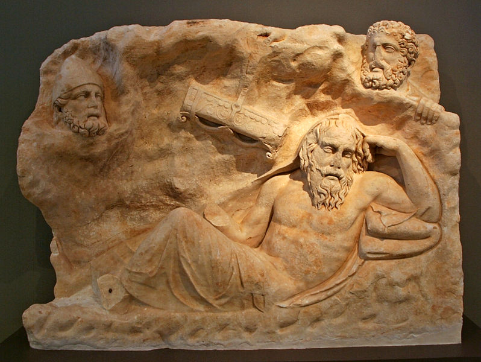

De todos los guerreros griegos que partieron a la guerra de Troya,
Filoctetes era notable no solo por su bravura, sino por la maravillosa
herencia de la cual era poseedor: el arco y las flechas del mismísimo
Hércules.

Pero este valiente guerrero sufrió un terrible percance en su camino a
Troya. En un alto en el camino es mordido en el pie por una serpiente.
La herida no es mortal, pero le provoca dolores, y expele un olor
insoportable. La suma de las quejas y gritos de Filoctetes más el hedor
de su herida provocan que sus compañeros, incitados por Ulises (Odiseo),
decidan abandonarlo en la isla de Lemnos.

Durante diez años Filoctetes se lamenta día y noche, tanto de los
dolores de su herida, como de la traición y el abandono del que ha sido
objeto.

¡Diez años!

Filoctetes pasa diez años ¡quejándose, y solo! Solo en una isla en el
Egeo.

Durante ese mismo tiempo sus compañeros luchan a las puertas de Troya
sin lograr conquistar la ciudad. Un oráculo revela los requisitos para
ganar la guerra. Es necesaria la presencia de Filoctetes y su prodigioso
arco. No es el único requisito para conquistar la ciudad se exige la
presencia en el campo de batalla de Neoptólemo, el joven hijo del
fallecido Aquiles. Los aqueos encomiendan a Odiseo la misión, y este
decide ir a buscar al joven en primer lugar, para usarle como mensajero
y convencer al amargado Filoctetes de volver con ellos.

Al principio Neoptólemo decide tratar de convencer al viejo Filoctetes,
pero duda también de las intenciones egoistas de Odiseo, y su corazón se
ablanda al escuchar las quejas del guerrero herido. La cosa se complica,
Odiseo interviene, pero hay rechazo, y parece que no existe manera de
convencer a Filoctetes para que los acompañe a Troya. Cuando finalmente
han decidido volver, y estando despidiéndose Neoptólemo de  Filoctetes
aparece milagrosamente Hércules, quien ha descendido del Olimpo con una
instrucción para ambos:

> "Sabe bien [Filoctetes] que te está señalado un destino honroso, y
> que gozarás de una vida gloriosa a cambio de tus males. Después que
> hayas llegado con éste a la ciudad troyana, curarás por de pronto de
> tu mal terrible, y elegido como el más bravo de todo el ejército, con
> ayuda de mis flechas arrancarás la vida a Paris, causante de estos
> males, y devastarás Troya\.... Y a ti. Hijo de Aquileo te advierto
> también: no podrás abatir Troya sin él, ni él sin ti; antes bien,
> unidos como dos leones, no os separeis. Yo enviaré a Ilión a Asclepio,
> que te librará de tu mal: porque Ilión está destinada a que dos veces
> la tomen por mis flechas."

Ambos quedan convencidos y comprometidos con el semidios, resueltos a
viajar a Troya para cumplir el oráculo y la orden del hijo de Zeus. No
sólo la herida de Filoctetes es curada por los hijos de Asclepio, sino
que tal como profetizo el héroe sus flechas son las que matan a Paris,
el principe troyano quien al raptar a Helena ha provocado toda esta
guerra. El joven Neoptolémo es uno de los guerreros que se esconde en el
famoso caballo con el que los griegos logran tomar finalmente la ciudad,
y bueno, ya saben el resto de la historia (espero).

Hay muchas cosas que podemos aprender de esta historia, narrada
magistralmente por Sófocles en una de sus tragedias, pero permítanme
destacar una interpretación personal.

Filoctetes es el heredero de un don maravilloso, que engañado por un mal
intencionado compañero, que además sufre una lesión, que ni siquiera es
mortal, pero que él asume como una maldición o castigo de los propios
dioses. Permite que sus colegas lo abandonen. Él que tiene la clave para
la conquista de Troya decide hundirse en su autocompasión. En vez de
enfrentar las adversidades, de enfrentar a sus compañeros, se queja
amargamente todo el día, se siente maldito, miserable, y adolorido.
Quizás no era tanto el hedor de la herida como el continuo rezongo el
que hizo que sus compañeros decidieran abandonarlo, tras la incitación
de Ulises.

¿Cuantos Filoctetes conocemos? ¿Cuantas veces hemos sido como él? ¿Por
qué esperar diez años y la intervención divina para actuar? ¿Por qué no
 hacerse cargo de una vez de la propia vida, en vez de lamentarse tanto?

Que fácil es caer en una posición fatalista. Hay personas que se quejan
de sus condiciones laborales, o que tienen mil problemas en la vida y
que nadie les apoya, o les ayuda. Se quejan amargamente como Filoctetes,
ignorando el poder que han heredado.

¿Estás aburrido de tu trabajo? Déjalo. ¿O será que el problema sea tuyo?
Usa las maravillosas armas que has heredado, y ten cuidado, no vaya a
ser que te abandonen en Lemnos. [Hazte cargo de tu vida](/blog/2009/03/nada.html).

