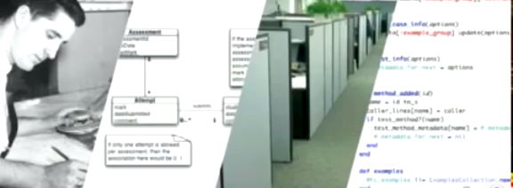
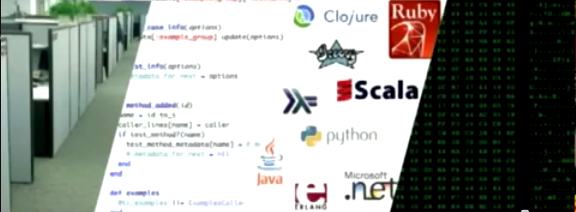

> "Si miras al software hoy en día, a través de los lentes de la
> historia de la ingeniería, ciertamente es un tipo de ingeniería,
> pero del tipo de ingeniería que hacía la gente que no conocía el
> concepto del arco.

> Mucho software hoy día es en cierta medida como una [pirámide
> egipcia](http://www.lnds.net/2008/01/el_misterio_de_las_piramides.html) con
> millones de piedras apiladas una encima de otra, sin integridad
> estructural, construido por fuerza bruta y miles de esclavos." \--
> Alan Kay

La discusión respecto a mi anterior post ([¡programa ctm!](/blog/2012/04/programa-ctm.html)) está muy
entretenida, pero me parece que tengo que aclarar algunas ideas, porque
no faltará el que piense que esto se trata de contratar programadores,
atarlos a sus sillas, sacar el látigo y tocar el tambor: "¡programen,
programen!



Bueno, si les resulta\...

**¡NO!**
========

Nunca he dicho que esto se trata de llegar y tirarse a "programar a lo
bestia",¡ joder!

Eso no funciona.

Lo que dije es lo siguiente: ¡*\*la única forma de desarrollar software
es programando, ctm! \**

**El problema son las metáforas ([otra vez](/blog/2010/12/metaforas.html))**

¡Ya!, asumamos por un rato la analogía de que la ingeniería de software
es como la ingeniería civil. Lo que hacen los  ingenieros civiles es
construir "obras civiles", ya saben, puentes, edificios, carreteras,
canales,ese tipo de cosas. Bien, esta es una super simplificación, pido
que me disculpen, pero sigamos adelante.

En una obra civil existen etapas super establecidas por siglos de
tradición, una tradición que ha llevado el arte de la construcción desde
el estado lamentable que menciona Alan Kay en la cita inicial de este
este post, a las maravillas modernas de los super rascacielos y torres
enormes  sin problemas de congestión vehicular (créanme, ¡hay países
donde la ingeniería civil ha llegado a ese nivel!).

Pues bien, esta metafora es incorrecta, y esa es la raiz del problema
fundamental de la llamada ingeniería de software, y es lo que Dijkstra
nos advirtió hace tiempo. Para explicar el problema voy citar [un
comentario](http://www.lnds.net/blog/2012/01/lbum-conceptual.html#comment-1839)
de  [Javier Rovegno](http://ideaschile.wordpress.com/) a un 
[post anterior](/blog/2012/01/lbum-conceptual.html#comment-1839):

> Estoy de acuerdo "la imagen del software como algo que se construye"
> es errada, pero la ingeniería civil no es muy distinta de la
> ingeniería de software.

La ingeniería civil desarrolla documentos y planos que serán
interpretados por personas para resolver problemas.

La ingeniería de software desarrolla código fuente que será interpretado
por computadores y personas para resolver problemas.

El problema es confundir la etapa de diseño (desarrollo) con la etapa de
construcción, es equivalente a confundir la etapa de desarrollo con la
etapa de computación de las instrucciones.

Pues en ese comentario está el germen para empezar a entender el
problema, que surge de esta distinción entre diseño e implementación, la
que está completamente equivocada con respecto al software. Sucede que
¡**el diseño del software es el código fuente**!

A ver\...¿cómo explico esto?\... les voy a poner un
[video](http://www.youtube.com/watch?v=taoPYaOg9Uc#t=33m20s) (lo
importante empieza en el minuto 33 con 20 segundos):

Para los que no pueden ver el video voy a transcribir parte de lo que
expone Glenn Vanderburg en su charla.

"La ingeniería de software nace como una analogía sobre disciplinas de
la ingeniería de lo físico, y esa analogía va  mas o menos así:"

"Tienes ingenieros, que se sientan con sus camisas blancas y sus
corbatas. Estos producen diseños. Y estos diseños se entregan a los
trabajadores, quienes usan este diseño para construir el producto
final."

"Por analogía, si queremos ver el mundo del desarrollo de software, y
queremos aprender de las disciplinas de ingeniería existentes deberíamos
hacer el software así:"

"Tenemos ingenieros de software (el mismo tipo, pero ahora re
capacitado), que produce un diseño, que luego es entregado a los
trabajadores en sus cubículos que producen el producto final".

Esta analogía es incorrecta, y todas las discusiones de la ingeniería de
software parten de esta analogía errónea. En los 90 Jack Reeves escribe
un artículo muy importante: "[What is software
design?](http://www.developerdotstar.com/mag/articles/reeves_design.html)"
donde plantea que toda esa analogía es propia de una persona que no sabe
nada de desarrollar software, porque la gran lección que todo
programador aprende con el tiempo y la práctica es la siguiente:

> "programming is not about building software; programming is about
> designing software"

"programar no se trata de construir software, programar es diseñar
software"

Entonces, ¡el diseño es el código fuente!

Claro, necesitamos diagramas, esquemas, dibujos, y modelos que nos
ayudan a visualizar nuestro diseño, pero el diseño finalmente es el
código. Los modelos son sólo otra forma de ver el código. Esos diagramas
con cajitas y flechas son visualizaciones de la única cosa importante:
el código fuente, y el código es el diseño. **Diseñar es programar, y
programar es diseñar software**. No son separables.

Entonces una analogía mejor sería: los programadores son los ingenieros,
su diseño es el código fuente, los trabajadores corresponden a los
compiladores, los lenguajes de programación y los frameworks. Y el
producto final es una solución a un problema ejecutándose en las
máquinas que los usuarios pueden usar.

Así que cuando decimos que la única manera de desarrollar software es
programando no estamos simplificando, ni exagerando, ni diciendo nada
que sea extraño, sólo estamos poniendo las cosas en su lugar.

Ahí está [el texto de Jack W. Reeves](http://www.developerdotstar.com/mag/articles/reeves_design.html),
[la presentación de Glenn Vanderburg](http://www.youtube.com/watch?v=taoPYaOg9Uc#t=33m20s)
(amablemente traducida por Javier Rovegno). Allí están los detalles de
que entendemos por programar. Hay que partir por esa definición. Si
usted sigue viendo al programador como un code monkey, un pica código,
un ser mediocre al que hay que indicarle en un diagrama de flujo los
pasos para implementar el código, entonces déjeme decirle que está muy
equivocado, mejor dedíquese a otra cosa.

La visión de que los programadores son unos autistas antisociales que
sólo pican el teclado produciendo código debe ser erradicada. Como 
[dije hace un tiempo](/blog/2008/11/cuidado-con-los-ensimismados.html):
"Desarrollar software es una labor social. No puedes construir buen
software con un conjunto de ingenieros con cero habilidades sociales."

Los programadores son personas inteligentes y brillantes, con mucho que
aportar. La pregunta interesante es cómo 
[canalizar toda esa inteligencia](/blog/2012/04/sobre-la-inteligencia-del-coyote.html).
Eso se llama administrar el desarrollo del software, y la respuesta la
vamos a  dejar para otro post.

Nota:

Jack W. Reeves [revisitó su texto 13 años después](http://www.developerdotstar.com/mag/articles/reeves_13yearslater.html),
donde revisa las críticas a  su postura, recomiendo también su lectura.
