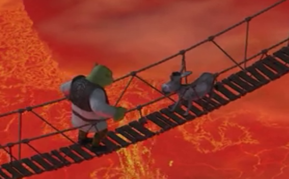
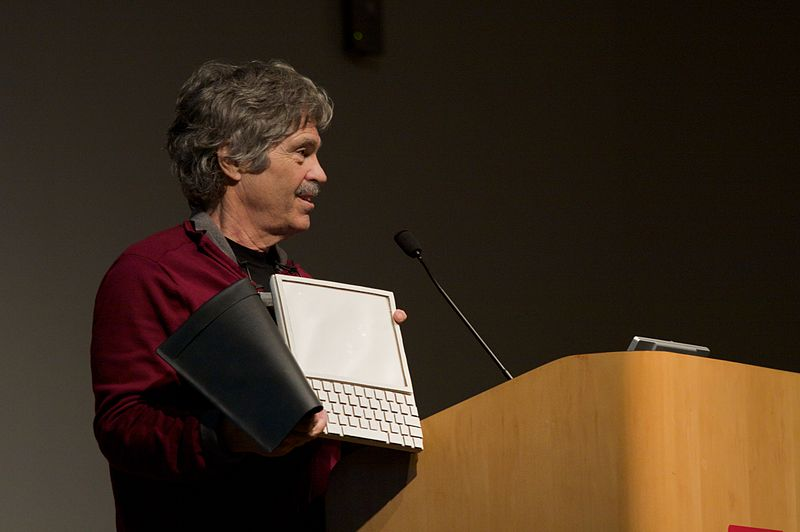

> [If] you think there's some sophisticated recipe for success, then
> I think you are doomed. You're making it too complicated.\
> -- Brad Bird

¡Ah!, ¿cómo lograr que sucedan las cosas? O como dicen en los estados
juntos: How to get things done.

También hablamos de cómo lograr que un proyecto sea exitoso. "Real
Artists Ship", decía Steve Jobs. "Las ideas son buenas, pero muchas
veces falla la ejecución", he escuchado decir.

¿Cómo lograr que pasen las cosas? Se pone mucho énfasis en que la
gerencia de una empresa se preocupe de la estrategia, el desarrollo del
liderazgo, y la innovación, pero que poco se considera la labor de
ejecución. Y eso es lo más importante: ¡hay que lograr que las cosas
pasen!

## El método de Shrek

> *"Sí se pudo, sí se pudo"* -- Shrek

¿Saben? una de las cosas que más me molesta escuchar es cuando la gente
dice: "no se puede", o peor, cuando te dicen: "no vas a poder, porque
esto y esto otro", o "nosotros lo hicimos, pero tuvimos todos estas
dificultades, y tu sabes como son en XXXX, te van a poner puros
problemas". ¡Ufff, no saben cuanto me molesta esa actitud!, ese afán de
encontrarle todos los peros a una idea, meterle miedo a la gente, o
simplemente plantarse en una actitud llena de excusas para simplemente
no hacer las cosas.

No hay que ponerse límites, todos debemos superar nuestros miedos, y
aceptar los desafíos. Y la verdad es que siempre se puede.

Mírenlos, ahí están Shrek y Burro, al borde del abismo, un frágil puente
colgante sobre un abismo con ardiente lava al fondo, ese es el obstáculo
a salvar, y ahí está burro, expresando sus temores. "No puedo cruzar
este puente", dice el Burro.

 ¿Y que hace Shrek? Lo motiva, lo anima, y le da una dirección:

> -- vamos a superar esto juntos,  caminando paso a pasito \
> --  ¿de veras? \
> -- ¡de veritas, de deveritas! \
> -- **No te detengas y no mires hacia abajo**

Y claro, Burro termina mirando hacia abajo y quiere volver, abandonar el
proyecto, los temores han vuelto:

Y la solución es *\*puro liderazgo. \**El rol de Shrek, digo del  lider,
es persistir con el objetivo, superar las oposiciones intermas, superar
las situaciones de conflictos, y dirigir, dirigir y dirigir. El burro
puede hacerlo, sólo que no cree en si mismo, no quiere hacerlo por que
no confía en sus capacidades, o le teme a las condiciones ambientales,
cree que los obstáculos son insuperables. Hay otros tipos de burros que
simplemente son burros, y no quieren hacer nada, pero esos burros no
valen la pena y es mejor dejarlos al otro lado del puente, no vale la
pena llevarlos al otro lado.

Finalmente el Burro pudo. "sí se pudo, sí se pudo", le dice Shrek, y
superada la prueba continúan con su aventura\...

# DOM

Yo hace un tiempo visualicé un modelo, que llamo DOM, que no tengo idea
si está documentado en alguna parte, tampoco es una cosa muy original,
pero es como creo yo que se deben hacer las cosas, y se los voy a
contar, a ver si me lo compran, en una de esas termino dando de esas
charlas de 2.000 dolares por persona :), el modelo es simple:

## **DOM**

**Dirección+Organización+Método**

Dirección {#direccin}
=========

> *"The worker is not the problem. The problem is at the top!
> Management!" -- W. Edwards Deming*

Para [W. Edwards Deming](http://en.wikipedia.org/wiki/W._Edwards_Deming)
el trabajo de la administración es dirigir los esfuerzos de todas las
componentes hacia el objetivo del sistema. El primer paso es la
clarificación, todos en la organización deben entender el objetivo y
como dirigir sus esfuerzos hacia este.

La dirección parte por entregar una visión clara y plantear los
objetivos de una forma precisa.

Les voy a dar uno de los mejores ejemplos que conozco de esto:

> "I believe that this nation should commit itself to achieving the goal,
before this decade is out, of landing a man on the Moon and returning
him safely to the Earth."

> "Creo que esta nación debería comprometerse a lograr la meta, antes de
que esta década termine, de poner un hombre en la Luna y retornarlo de
forma segura a la Tierra."

Este famoso discurso de John Kennedy plantea claramente **el
resultado**: "colocar un hombre en la Luna", pero también establece
**el plazo u oportunidad**: "al final de esta década", y **los
parámetros de calidad**: "y retornarlo de forma segura a la Tierra".

Cuantas veces vemos que se establece lo que se quiere, pero no para
cuando. O se ignoran los parámetros de calidad necesaria. ¿Se imaginan
si Kennedy no hubiera incluido la última frase: "retornarlo de forma
segura a la Tierra"? (Para ver un ejemplo les sugiero ver la película
de Boris Quercia, "Chile Puede").

Pero lo más notable es que Kennedy plantea por qué quiere este desafío:

> "We choose to go to the moon. We choose to go to the moon in this
> decade and do the other things, not because they are easy, but because
> they are hard, because that goal will serve to organize and measure
> the best of our energies and skills, because that challenge is one
> that we are willing to accept, one we are unwilling to postpone, and
> one which we intend to win, and the others, too."

> "Elegimos ir a la Luna en esta década y hacer las otras cosas, no
porque sean fáciles, sino porque son difíciles, porque la meta servirá
para **organizar** y medir lo mejor de nuestras energías y habilidades,
porque ese desafío es el que queremos aceptar, uno que no estamos
dispuestos a posponer, y uno al que pretendemos ganar, y los otros
también."

La dirección debe ofrecer una visión, clara y precisa, pero también un
desafío. Eso es el liderazgo, y a esta visión debe comprometerse la
organización, lograr este compromiso es el rol de lider. "Se puede",
ese debe ser nuestro mantra.

# Organización

A fines de los 90 Steve Jobs dijo: "The PC wars are
over. Done. Microsoft won a long time ago.", ¿significaba eso que se
había rendido? No, porque Steve Jobs tenía otra visión.

Alan Kay dijo: "la mejor forma de predecir el futuro es inventándolo".
En 1968 Kay había desarrollado el concepto del Dynabook. A la derecha
está la foto de la maqueta de ese dispositivo, por supuesto no era
posible realizar esto en esos años. Muchas cosas debieron desarrollarse
antes.

Steve Jobs quería realizar la visión de Kay. Cuando volvió a Apple su
objetivo era realizar esa visión, que terminó reflejada en el iPad. Pero
llegar a ese punto, cruzar ese puente colgante requería organizar las
habilidades y energías de Apple.

Jobs se enfocó en un primer objetivo, lograr que Apple fuera una empresa
rentable. Cuando él volvió la compañía tenía muchas lineas de productos.
Los canceló, fíjense que incluso canceló el
[Newton](http://en.wikipedia.org/wiki/Newton_(platform)), que era un
producto que se parecía a la visión de Jobs. Lo primero que hizo Jobs al
volver fue enfocar a Apple en 4 lineas de productos. Organizó todo
dándole un foco, volver a ser rentables.

Foco, eso es lo más importante. Concentrarse en una cosa a la vez,
caminaremos juntos paso a pasito. Eso es organización. ¿Cuál es nuestra
situación?, ¿cuál es nuestro objetivo?, ¿cuales son los pasos para ir
desde nuestra situación actual a la situación deseada? 
Establecer [un plan](/blog/2011/09/el-mejor-proceso-de-desarrollo-de-software.html),
la lista de todo lo que hay que hacer, y
[hacerlo](/blog/2011/03/hazlo.html)!

Y jobs tuvo que dar todos los pasos intermedios para salvar el puente
sobre el abismo: obtener dinero, desarrollar el iPod, luego el iPhone, y
por fin pudo sostener en sus manos su visión.



Lo importante en que el modo de organizar las cosas por parte de Jobs
fue enfocar a su equipo en las tareas necesarias, cada cosa a su tiempo,
cuando se supera una etapa se pasa a la siguiente, no antes, paso a
pasito.

¿Y cómo hacerlo? Bueno, como todo lo importante en la vida, el como lo
aprendimos cuando teníamos 5 años.

Método 
======

> **Hombre de Jengibre:** ¿Tu conoces a Pin Pon?\
> **Lord Farquat**: ¿Pin Pon?\
> **HdJ**:  ¡Sí, Pin Pon!\
> **LF**: Sí, es un muñeco muy guapo y de cartón\
> **HdJ**: Sí, se lava su carita con agua y con jabón\
> **LF**: ¡¡¡Con agua y con jabón!!!\
> **HdJ**: ¡¡¡Sí, se lava la carita!!!

Contaba [Jorge Guerra](/blog/2009/02/adios-pin-pon.html) que una vez
se le acercó una mujer en la calle, ella era abogada y le dijo que había
logrado sacar su carrera y tenía éxito en su vida por una canción que él
compuso, y que cantaba en su programa infantil caracterizado como el
muñeco [Pin Pon](https://www.pinpon.cl/).

Esa canción es esta:

> **Método**
>
> Método .. método\
Si quieres hacer algo bien necesitas mucho\
método, método, método, método, método.
>
> Si tenemos un problema\
con gran dificultad\
lo que hay que hacer primero\...\
es pensar.. es pensar \... es pensar.
>
> Pero como pensar?\
pero como pensar?\
pen-sar con\.....
>
> Método .. metodo\
Si quieres hacer algo bien necesitas mucho\
método método método metodo método.
>
> una vez que se ha pensado\
y encontrado solución\
lo segundo que se impone\
es la acción\... es la acción.. es la acción.
>
> Pero como actuar?\
pero como actuar?\
Actuar con \....
> 
> Método .. método\
Si quieres hacer algo bien necesitas mucho\
método método método método método.

Y si se dan cuenta todo esto que les cuento del DOM es un método :)

Todo es muy simple, como dice [Brad Bird](/blog/2007/07/ratatouille-lecciones-de-ingenieria-de-s.html),
"Si piensas que hay una receta sofisticada para el éxito, entonces creo
que estás condenado. Lo estás haciendo muy complicado."

Todo se reduce a pensar, encontrar la solución y luego la acción. Eso es
DOM, dirección, organización, y método.

Dirección para establecer la visión, plantear el problema, definiendo su
alcance, oportunidad y los parámetros de calidad requerido.
Organización, se debe analizar la situación actual, encontrar la
solución, establecer los pasos a ejecutar. Y Método, que es la manera de
ejecutar cada paso uno por uno.

Muchos líderes se quedan en la dirección, creen que con sólo plantear la
visión las cosas van a suceder. Es el estilo de muchos gobernantes que
hemos tenido, que van por el mundo creyéndose estadistas, que creen que
hicieron un buen gobierno, cuando sólo dieron bonitos discursos plagados
de buenas intenciones.

Hay otros que son incapaces de actuar cuando se requiere, o que no saben
organizar. Están los que se limitan a preguntar cómo van las cosas, pero
si ven que algo está mal se quedan allí, esperando que se resuelvan
solas. O los que  que presentan el plan y luego se encierran en sus
oficinas, sin interactuar con su equipo, sin controlar, ni dirigir. Y en
el otro extremo los que no confían en su equipo y terminan ellos
haciéndolo todo o micro controlando.

No, el liderazgo es  equilibro. Hay que entregar la visión, organizar y
entregar un método, pero la labor debe ser realizada por quienes deben
hacerla. Para eso está el equipo, y un buen lider se caracteriza porque
logra armar un buen equipo, que logra  llevar a cabo las tareas, un
equipo que hace que las cosas sucedan.

Es método, así es como se logra que las cosas pasen, y que los proyectos
salgan a tiempo y en el presupuesto, con método, método, método.

Y todo esto me lo enseño un muñeco muy guapo y de cartón, no sé para que
perdí tanto tiempo yendo a la universidad.

