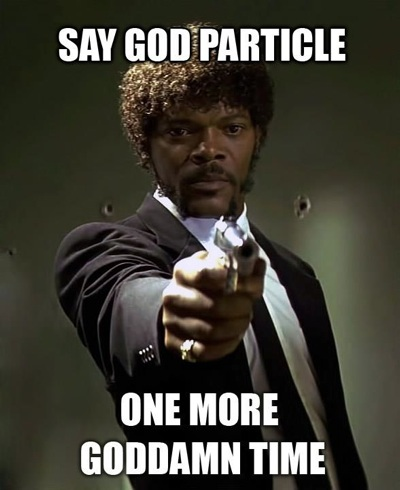

Mucha atención ha tenido el descubrimiento del Bosón de Higgs, la mal
llamada Partícula de Dios.

Pero hace unos meses se comprobó un efecto que nos trae de vuelta a uno
de los personajes favoritos de este blog: Ettore Majorana.

Recordarán la historia de Majorana, ¿cierto? ¿no?

Bueno, para todos ustedes niñitos con deficit atencional, acá va de
nuevo (en modo resumido):

Ettore Majorana era un joven y brillante físico italiano, discípulo de
Enrico Fermi, considerado uno de los más brillantes físicos de su
tiempo, admirado por todos, que desapareció misteriosamente el 25 de
marzo de 1938, cuando aborda un barco y nunca más se supo de él. Sus
ideas eran tan avanzadas para su tiempo que recién unos 20 años después
el premio Nobel Richard Feynmann re descubrió y reformuló varias de sus
ideas y pudieron ser  entendidas por el resto de la comunidad
científica. La leyenda dice que ha sido visto en Argentina en la década
de los 50 donde habría ejercido como humilde ingeniero. Hay más detalles
misteriorosos sobre los que escribí en [esta entrada](/blog/2012/04/el-extrano-caso-de-ettore-majorana.html),
así que vayan y léanla con atención yo los espero aquí.

(Pausa para que lean sobre Majorana\.....)



Bien, resulta que este joven científico predijo la existencia de una
partícula conocida como el Fermión de Majorana. En física de partículas
tenemos los Bosones y los Fermiones. Los Fermiones cumplen con el
[Principio de Exclusión de Pauli](http://es.wikipedia.org/wiki/Principio_de_exclusi%C3%B3n_de_Pauli),
los Bosones no, esto es un tanto complicado y se los explico otro día,
¿vale?

Pues bien, Majorana predijo que deben existir una clase de fermiones que
cumplen con la característica de ser ellos mismos sus propias
antipartículas (ya saben, los electrones tienen un anti electrón,
conocido como positrón, en el caso de los fermiones de Majorana la anti
partícula es la misma). Hasta ahora nadie ha podido encontrar un fermión
de Majorana, aunque sospechan que los neutrinos puedan ser uno, lo que
es una buena excusa para seguir ocupando esa maquinota que tenemos en el
CERN, o gastarse otros miles de millones de euros en otra, vamos a ver
que pasa\... :)

Ah, pero todo eso es muy complicado.

Lo importante es que si bien no han encontrado fermiones de Majorana, si
se ha logrado producir cuasi particulas con sus propiedades en ambientes
superconductores, lo que permitiría desarrollar 
[computadores cuánticos](http://es.wikipedia.org/wiki/Computaci%C3%B3n_cu%C3%A1ntica)
(no cuáticos, cuánticos).

Y como yo se que a muchos de ustedes los vuelve loco esto de los
computadores ~~cuáticos~~ cuánticos, les dejo esta charla de Roman
Lutchyn en Microsoft Research sobre Computación Cuántica Topológica
usando Fermiones de Majorana (¡chanfle!)

Esta charla es de septiembre de 2011, en abril de 2012 se pudo verificar
la existencia de estas cuasi partículas, así que ya existe factibilidad
para este tipo de computación, es cosa de tiempo\...
