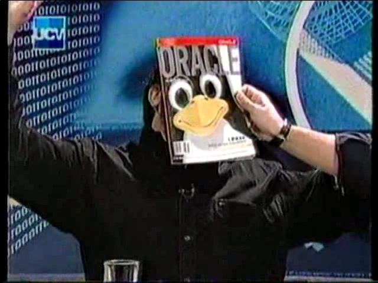

Soy afortunado, porque he tenido la oportunidad de convocar en este
aniversario a grandes bloggers chilenos, pero es la primera vez que
escribe en este blog una "celebridad".

Bueno, para mi al menos Franco Catrin es una celebridad, de esas que
sale en televisión, porque el realmente ha salido en la tele, en el
recordado
[TvNauta](http://www.youtube.com/watch?feature=player_embedded&v=yxhrpbV0xAU).
Franco es un referente para muchos desarrolladores nacionales, y es un
honor que haya aceptado participar con este post, bastante actual por lo
demás:

El Ritual 
=========

Eran las dos o tres de la mañana, ya no lo recuerdo muy bien, estaba
preparando una entrega de una aplicación y al mismo tiempo pensaba en
los próximos días: Se venía el ritual del upgrade. Ese ritual que
siempre evito hasta que ya no queda otra alternativa o hasta que ocurre
[algún desastre](http://franco.arealinux.cl/2005/08/oportuncrisis-frinki-con-ubuntu/).
Como usuario de Ubuntu Linux migraba a la nueva versión cuando ésta ya
casi llevaba un año publicada, pero esta vez mi espera ya iba para el
año y medio. ¿Por qué tanta espera? Porque cuando se trata de un equipo
para trabajar, no puedo arriesgarme a que algún problema exótico me deje
sin mi principal herramienta de trabajo, por eso siempre esperaba a que
todos los problemas fueran conocidos o tuvieran alguna solución, o bien
esperaba una ventana de tiempo para hacer las pruebas de rigor para
comprobar que todo mi entorno de desarrollo funcionara correctamente.
Aun así, no recuerdo haber tenido problemas serios de upgrade alguna
vez, pero nunca se sabe.

Esta vez había una dificultad adicional, porque también necesitaba un
upgrade de hardware. Aquel Pentium Dual Core de 1.6Ghz que sobraba para
la web y escuchar música, ahora se quedaba corto para desarrollar
software (Java/GWT/VM's, etc). Al ritual del upgrade ahora se agregaba
el ritual de las cotizaciones: Buscar reviews, consultar con amigos, ver
lo disponible en el mercado local, comparar precios y en el fondo
asegurarme de que todo quedara mejor que antes. Como usuario de Linux
esa búsqueda además implicaba comprobar que el hardware estuviese bien
soportado, que las salidas de video funcionaran correctamente, que no
tuviera problemas con el uso de energía, etc etc. Esa búsqueda no es tan
complicada cuando se trata de un portátil, basta con buscar algún
usuario de Linux que tenga el mismo equipo y listo, pero cuando se trata
de un equipo desktop como el que yo buscaba, ya no era tan simple.

No quería volver a pasar por todo eso.

Fue así como -- mientras seguía dando los últimos toques a la
aplicación, y con algo de alcohol en el cuerpo -- alguien me dijo que
Joel Iturra andaba en yankeelandia y que traía algunos tablets a unos
amigos. Lo contacté y esperando una respuesta negativa le pregunté si me
podía traer un Mac Mini. Cuando me dijo que no tenía ningún problema
vino el conflicto.

Un Mac Mini tenía la potencia suficiente para mis tareas, solucionaba en
gran parte los problemas del ritual del upgrade no sólo esta vez, sino
que también en el futuro, y por si esto fuera poco, en yankeelandia
costaba casi lo mismo que el upgrade que yo necesitaba. Ya antes había
probado OSX en mi desktop y funcionaba suficientemente bien, las
herramientas de desarrollo típicas estaban disponibles. Como era un
equipo adicional podía probarlo y al mismo tiempo seguir usando mi
desktop de desarrollo, y en el peor de los casos lo podía vender si me
arrepentía. La decisión de compra era bastante fácil, a menos que... te
llames Franco Catrin.

Algunos de mis amigos creerán que es una exageración, pero me complicaba
dejar de usar Linux como escritorio principal por varios motivos :
Varios proyectos en los que estaba trabajando estaban directamente
relacionados con Linux, y para ellos una máquina virtual no sirve, por
otra parte alejarme del uso diario también significaba quedarme atrás
respecto a nuevos desarrollos en torno a Linux, una de las cosas que me
distinguía entre los usuarios normales. Y peor aún, el hecho de migrar
de Linux a Mac OSX para mi sonaba como saltar a los botes huyendo de una
plataforma que pareciera no haber despegado, aunque en realidad yo sabía
que no era así.

Lo que me tranquilizaba era saber que muchos desarrolladores del
ambiente Linux / Código Abierto estaban usando equipos de Apple, con y
sin Linux. Si ellos, que estaban mucho más involucrados que yo podían
hacerlo ¿ Por qué yo no? Es más, justamente ayer Miguel de Icaza publicó
un artículo sobre cómo [ya no se sentía culpable por usar Mac OS X en
vez de Linux](http://tirania.org/blog/archive/2012/Aug-29.html), y él es
el fundador de GNOME y Mono.

Fast Forward a la historia y aquí estoy, escribiendo desde Mac OS X
Lion, mi escritorio principal desde hace casi un año. La adaptación
desde Linux no fue sufrida, pero tampoco fue sencilla, esa historia da
para un extenso articulo, algo que tengo reservado para mi blog que aún
se aloja en el dominio [arealinux.cl](http://franco.arealinux.cl). Sólo
puedo adelantar que la muy cacareada facilidad de uso no lo es tanto, y
que incluso algunas cosas son mucho más fáciles en Linux que en este
sistema, algo que para mí habla muy bien de los que aún trabajan
mejorando Linux como sistema de escritorio.

He pensado en volver a Linux con este mismo hardware, dado que el
notebook de mi señora con hardware más modesto funciona mucho mejor con
Linux que este Mac Mini con OS X Lion. Ya he dado tantos saltos que
quizás ni siquiera importa, pocos saben que antes de usar Linux era un
conocido usuario/desarrollador defensor de Windows en los newsgroups.
Quizás algún día querré volver al ritual del upgrade, por ahí entre las
2 y 3 de la mañana con un poco de alcohol.
