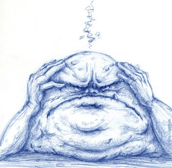

La frustración es ese sentimiento que surge cuando no logramos nuestro
deseos, cuando no cumplimos nuestras expectativas.

No es un problema tener este sentimiento, el problema no surge del dolor
ni de la frustración que vivimos, el problema es nuestra actitud frente
a estos sentimientos.

Baja tolerancia a la frustración, el gran problema de nuestro tiempo de
búsqueda del "éxito" permanente.

Tolerar la frustración significa enfrentar nuestros problemas y
limitaciones, a pesar de las molestias, e incomodidades que nos
provocan.

La baja tolerancia a la frustración proviene de que tenemos una
percepción equivocada, o exagerada de la situación que estamos viviendo,
y de la creencia de que lo que experimentamos es horrible, y no lo
queremos vivir ni aguantar.

La frustración es parte de la vida, es imposible evitarla, pero debemos
aprender a manejarla y superarla. Hay gente que tolera poco la
frustración, y terminan desmotivados, abandonando metas y proyectos.

Lo que corresponde es aprender, entender, y enmendar. Son aquellos que
toman su frustración, la manejan, aprenden de sus errores, y realizan
las mejoras los que superan esta
[locura](/blog/2011/03/locura.html), y logran el
éxito. El éxito no es que todo salga bien y a la primera, o en forma
perfecta, el éxito es superar los escollos y lograr vivir una 
[vida plena](/blog/2011/09/vida-plena.html).
