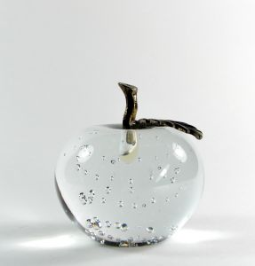

Finalmente me compré un macbook, desde el cual estoy escribiendo esta
nota. Esto puede sorprender a varios, y seguramente alguno me
enrrostrará algún post de hace algunos años, pero como dice Unamuno,
sólo el que no dice nada no se contradice.



Somos seres irracionales, finalmente estos aparatos terminan
seduciéndote, y cuando ves en las conferencias y a tus amigos que todos
están usando macbooks empiezas a dudar de tu cordura. 
Hay [un truco en todo eso](/blog/2010/12/todo-esta-en-tu-cabeza.html),
es un efecto viral, estudiado, planificado por ese gran diseñador que
fue Steve Jobs. Se ríe de nosotros en su tumba, finalmente pudo
controlar nuestras cabezas.

A mi me atrajo el ambiente operativo, es Unix finalmente, con todas las
ventajas que significa contar con un Unix que funciona, sigue siendo el
mejor ambiente de trabajo para un desarrollador de software. Pero hay
que reconocer que el factor de estilo es muy importante. Esas manzanita
que brilla, o el teclado retroiluminado es muy cool, y el producto
apunta a nuestro ego, finalmente queremos tenerlo.

Steve Jobs reconocía esto, y por eso insistía tanto en controlarlo todo.
Dentro de todas sus habilidades estaba este famoso campo distorsionador
de la realidad, que usaba para seducir a sus clientes, a los miles de
fans y compradores de sus productos, y que usaba para manipular a los
equipos técnicos.

En [palabras de Jaron Lanier](http://othmanelmoulatblog.wordpress.com/2011/11/25/the-most-ancient-marketing-december-2011-communications-of-the-acm/),
lo que hizo Steve Jobs es aprender el oficio de Gurú, y aplicarlo.

Probablemente estoy bajo el efecto del campo distorsionador de realidad
de Jobs, probablemente he comido una manzana encantada, pero siento que
mi macbook pro es el mejor computador que he tenido hasta la fecha, y he
tenido (tengo) varios.

Hay que reconocer el sentido estético y la calidad de su construcción.
He estado estas semanas jugando y acostumbrándome a este notebook y hay
cosas que me gustan mucho, que hacen que la experiencia de uso sea muy
agradable.

Sin embargo, sigo considerando que el precio no es el adecuado,
probablemente es un computador mejor que los demás, pero no se si valga
lo que piden por él. Pero el mercado parece decir que sí lo vale, y
mientras eso no cambie, y sigamos en el efecto de distorsión de la
realidad deberá seguir así.

Han pasado un par de  semanas en que no escribo en este blog, la verdad
es que empecé mis vacaciones hace unos días y estaba muy cansado, sin
ganas de escribir. Pronto volveré, sólo quería dejarles esta notita con
novedades, espero que en las próximas semanas retomemos nuestro
contacto. Estoy leyendo un par de libros muy interesantes que creo que
inspirarán muchos escritos este año.

Durante los próximos días, como es costumbre, reciclaré algunos textos,
espero que les gusten. Disftuten sus vacaciones.

